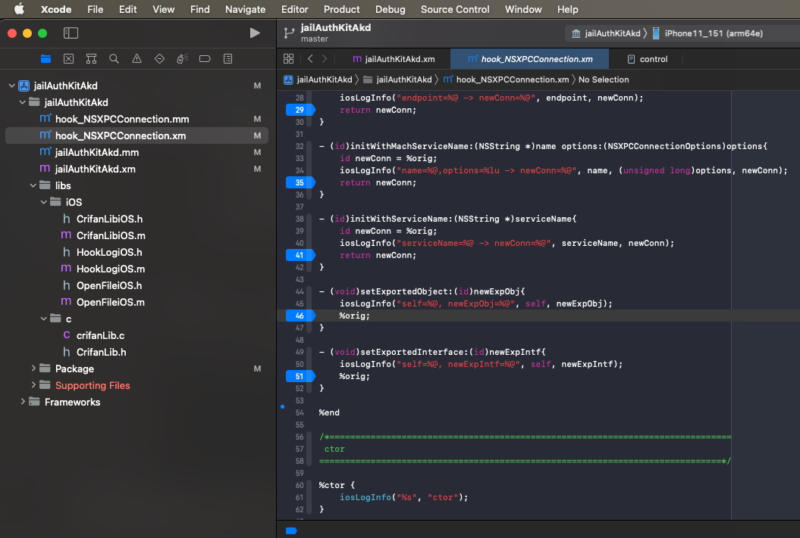
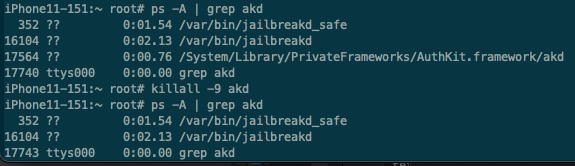
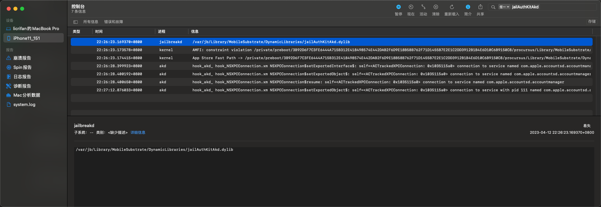

# hook代码没生效

* 调试心得：
  * 对于去调试二进制进程来说：
    * 对于（iOSOpenDev改动了hook代码，重新编译并）安装了新版本插件，去测试新版插件时
    * 需要先杀掉现有的二进制进程，重新（手动或触发）启动进程，才能加载到新版插件dylib，才能使得新版代码生效
  * 举例
    * 【未解决】iOS逆向akd：动态调试
    * 期间，当iOSOpenDev的Xcode重新改动hook代码
      * 
    * 重新编译安装jailAuthKitAkd插件到iPhone中（jailAuthKitAkd.dylib）后，需要去
    * ssh中去杀掉旧的akd的进程
      * 方式1：killall
        * `killall -9 akd`
          * 
      * 方式2：
        * `ps -A | grep akd`
          * 找到akd的PID
        * `kill -9 <akd_PID>`
    * 然后此处（采用触发方式去重新）启动akd进程
      * 利用iOS的app：Preferences中，点击Apple账号登录按钮，可以触发akd的进程重新启动
    * 然后才能看到插件jailAuthKitAkd.dylib重新加载
      * 才能重新调试，新改动的hook代码逻辑
        * 
