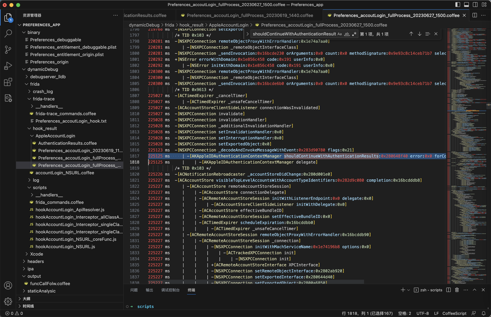

# 必要时hook多个目标

* iOS逆向心得：**找逆向函数时，记得hook研究多个目标**

【找逆向函数时，记得hook研究多个目标 举例 】

* 研究Apple账号登录过程，找（以PET结尾的长密码计算的）关键点函数
  * 除了要（`frida-trace`去追踪）hook研究：`Preferences`
    * 系统设置的app=包名：`com.apple.Preferences`
  * 还要想得起来，去（`frida-trace`去追踪）hook研究：`akd`
    * =AuthKit的daemon守护进程=服务进程=二进制文件

详细过程：

之前已经用`frida-trace`去追踪了`Preferences`中，Apple账号登录的全过程：

【记录】iOS逆向Apple账号：重新用frida-trace追踪带NSXPCConnection的Apple账号的完整登录过程

核心命令：

```bash
frida-trace -U -F com.apple.Preferences -O Preferences_accoutLogin_hook.txt
```

另外配合之前的调试：

* Xcode+iOSOpenDev的插件的动态调试

找到了，首次出现，以`PET`结尾的长密码字符串

`AppleStore/Preferences_app/dynamicDebug/frida/hook_result/AppleAccountLogin/AuthenticationResults.coffee`

```bash
    AKPassword = "GdJJ3P1jNh ... VQWu/It0OM503Ik7Fk3QY=PET";
```

的来源是：

* `shouldContinueWithAuthenticationResults`
    * `-[AKAppleIDAuthenticationContextManager shouldContinueWithAuthenticationResults:error:forContextID:completion:]`



但是最后追踪下去，感觉进入了死胡同：

始终找不到，到底是谁，作为client，去调用了，NSXPCConnection相关的

`-[__NSXPCInterfaceProxy_AKAppleIDAuthenticationDaemonProtocol shouldContinueWithAuthenticationResults:error:forContextID:completion:]`

从而无法找到到底是哪里去计算PET密码的地方了。

最后突然想到：

frida-trace追踪Preferences的结果中，竟然找不到：

* AKAppleIDAuthenticationService

这个，之前见过的，被调用过的，关键函数之一

* 比如
  * `-[AKAppleIDAuthenticationService authenticateWithContext:completion:]`
  * `-[AKAppleIDAuthenticationService _authenticateWithContext:completion:]`

所以后来才想到，是不是漏了什么。

所以才想到：

另外，单独再去研究akd=AuthKit的daemon程序

其中就是对应着之前早就知道的：

* `NSXPCConnection`
  * Client端：`Preferences`
  * Server端：`akd`

之前多数NSXPCConnection，都是Preferences发送给akd的

此处计算密码字符串等相关Authenticate=认证的过程也是一样的。

所以最后去用：

frida-trace追踪akd的全过程，最后发现了：

* 是有：`AKAppleIDAuthenticationService`
  * 是有：
    * `-[AKAppleIDAuthenticationService authenticateWithContext:completion:]`
* 还有，其他很多之前看别人分析的（类似的）关键函数：
    * `-[AKSRPContext configureWithParameters:]`
    * `+[AKSRPOperation performWithURL:SRPContext:error:]`

然后就有机会去继续分析：

以PET结尾的长密码字符串，到底是如何计算的了。
