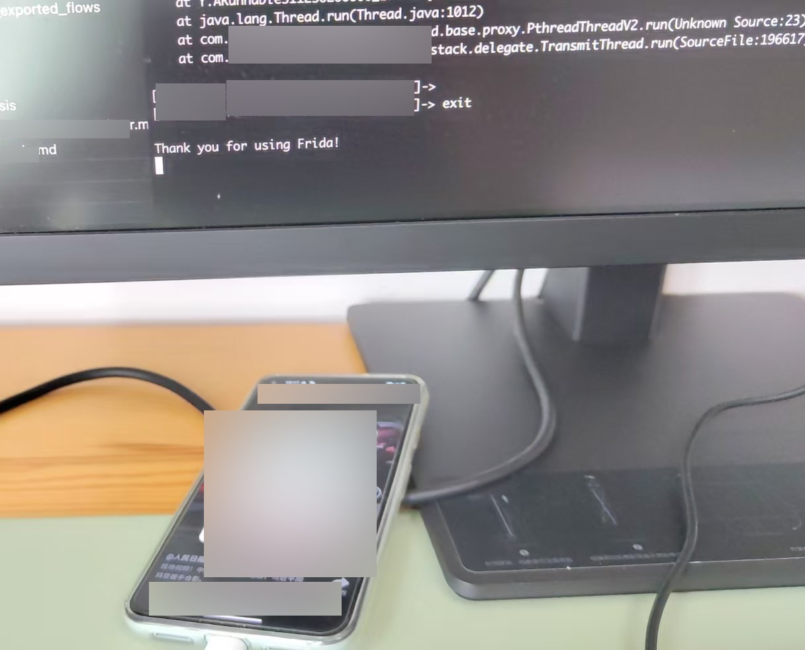

# hook导致很慢和卡死

* 不论是iOS的逆向还是安卓的逆向，如果给底层函数做了hook
  * 比如
    * 安卓中，用Frida给HashMap加上hook
    * iOS中，iOSOpenDev加上hook代码
  * 尤其是还加上参数过滤
* 会严重影响和拖慢原先程序运行的速度，极大地降低代码运行效率
  * -》从而表现出，app程序本身：启动和运行速度很慢
    * 有时候甚至看起来像是卡死一样

## 举例

### Frida去hook了Java的HashMap

之前用用Frida去hook某app，自加上Java的HashMap的hook（且加上过滤参数后）

导致app启动很慢：


后来，退出Frida的hook后，app启动速度正常，很快进入主页了：



然后后来才想起来，才明白，原来是：

由于Frida中，加上了hook，但是是给HashMap加的hook：

本身HashMap是Java中，最常用的最基础的类之一：

会有大量的Java代码调用到HashMap的操作

且此时，hook了：

* `HashMap`的3个函数：
  * `get`
  * `put`
  * `putAll`

且还给get和put做了参数过滤

代码如下：

```js
  static HashMap(callback_isPrintStack_put=null, callback_isPrintStack_putAll=null, callback_isPrintStack_get=null) {
    /******************** java.util.HashMap ********************/
    var className_HashMap = "java.util.HashMap"
    // FridaAndroidUtil.printClassAllMethodsFields(className_HashMap)

    var cls_HashMap = Java.use(className_HashMap)
    console.log("cls_HashMap=" + cls_HashMap)
    // var instance_HashMap = cls_HashMap.$new()
    // console.log("instance_HashMap=" + instance_HashMap)

    // public java.lang.Object java.util.HashMap.put(java.lang.Object,java.lang.Object)
    // var func_HashMap_put = cls_HashMap.put('java.lang.Object', 'java.lang.Object')
    // var func_HashMap_put = instance_HashMap.put('java.lang.Object', 'java.lang.Object')
    var func_HashMap_put = cls_HashMap.put
    console.log("func_HashMap_put=" + func_HashMap_put)
    if (func_HashMap_put) {
      func_HashMap_put.implementation = function (keyObj, valueObj) {
        var funcName = "HashMap.put(key,val)"
        var funcParaDict = {
          "keyObj": keyObj,
          "valueObj": valueObj,
        }

        if (null != keyObj) {
          // console.log("keyObj=" + keyObj)
          // console.log("keyObj.value=" + keyObj.value)
          var isPrintStack = false

          // isPrintStack = HookApp_SomeUrl.HashMap(keyObj, valueObj)
          if (null != callback_isPrintStack_put){
            isPrintStack = callback_isPrintStack_put(keyObj, valueObj)
          }

          if (isPrintStack) {
            FridaAndroidUtil.printFunctionCallAndStack(funcName, funcParaDict)
          }
        }

        return this.put(keyObj, valueObj)
      }
    }

    // public void java.util.HashMap.putAll(java.util.Map)
    // var func_HashMap_putAll = cls_HashMap.putAll('java.util.Map')
    var func_HashMap_putAll = cls_HashMap.putAll
    console.log("func_HashMap_putAll=" + func_HashMap_putAll)
    if (func_HashMap_putAll) {
      func_HashMap_putAll.implementation = function (newMap) {
        var funcName = "HashMap.putAll(map)"
        var funcParaDict = {
          "newMap": newMap,
        }
        // console.log("newMap=" + newMap)
        var isPrintStack = false
        if (null != callback_isPrintStack_putAll){
          isPrintStack = callback_isPrintStack_putAll(newMap)
        }
        if (isPrintStack){
          console.log("newMapStr=" + FridaAndroidUtil.mapToStr(newMap))
          FridaAndroidUtil.printFunctionCallAndStack(funcName, funcParaDict)
        }
        return this.putAll(newMap)
      }
    }

    // https://docs.oracle.com/javase/8/docs/api/java/util/HashMap.html#get-java.lang.Object-
    // public V get(Object key)
    var func_HashMap_get = cls_HashMap.get
    console.log("func_HashMap_get=" + func_HashMap_get)
    if (func_HashMap_get) {
      func_HashMap_get.implementation = function (keyObj) {
        var funcName = "HashMap.get(key)"
        var funcParaDict = {
          "keyObj": keyObj,
        }

        var isPrintStack = false
        if (null != callback_isPrintStack_get){
          isPrintStack = callback_isPrintStack_get(keyObj)
        }

        if (isPrintStack){
          FridaAndroidUtil.printFunctionCallAndStack(funcName, funcParaDict)
        }

        var retValObj = this.get(keyObj)
        if (isPrintStack){
          console.log("retValObj=" + retValObj)
        }
        return retValObj
      }
    }

  }

...
class HookApp_SomeUrl {
  static BodyPara_KeyList = [
    "xxx",
    "yyy",
  ]

  constructor() {
    console.log("HookApp_SomeUrl constructor")
  }

  static HashMap_put(keyObj, valueObj){
    var isPrintStack = false

    var keyStr = keyObj.toString()
    // console.log("keyStr=" + keyStr)

    if (HookApp_SomeUrl.BodyPara_KeyList.includes(keyStr)){
      // console.log("keyStr=" + keyStr)

      isPrintStack = true
    }

    return isPrintStack
  }

  static HashMap_get(keyObj){
    // console.log("HashMap_get: keyObj=" + keyObj)
    var isPrintStack = false

    if(null != keyObj) {
      var keyStr = keyObj.toString()
      if (HookApp_SomeUrl.BodyPara_KeyList.includes(keyStr)){
        isPrintStack = true
      }  
    }

    return isPrintStack
  }
...

  HookJava.HashMap(HookApp_SomeUrl.HashMap_put, null, HookApp_SomeUrl.HashMap_get)
...
```

导致每次调用到`HashMap.get`、`HashMap.put`

都要去判断和过滤参数是否满足条件（满足条件才打印堆栈调用）

从而严重影响原先的Java代码的运行效率和速度

导致看起来app启动和运行速度非常非常慢

（就类似于之前iOS逆向期间，也是hook了基础的底层函数，尤其是再加上过滤：也会导致iOS的app运行速度非常非常慢，以为是卡死了呢）
