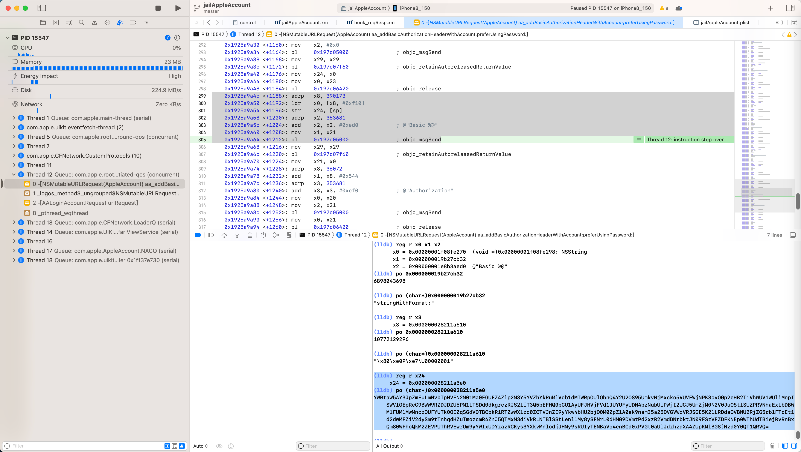

# 特殊的参数传递

* 概述
  * NSString、os_log去格式化参数时，待格式化的参数的传递逻辑
    * 基本上确定就是：通过堆栈的方式传递
      * 而具体保存的地址
        * 比如
          * `NSString`中见过的 `[sp]`、`[sp+8]`等地址
          * `os_log`的底层实现函数`_os_log_impl`的`x4`寄存器所指示的地址，比如 `[x29 - 0x90]`等地址

总之，可以确定的是：

`NSString`、`os_log`这种支持**不定长度的参数**的格式化，其参数传递的方式：

* 是通过`Stack`=**栈**  
  * 而不是（默认的）寄存器
    * ARM的
      * 32位：`x0`~`x3`
      * 64位：`x0`~`x7`

## 详解

### NSString stringWithFormat

此处调试发现个心得：

对于：

```objc
+[NSString stringWithFormat: @"Basic %@",
    xxx
]
```

这种，NSString字符串格式化，带额外的（待格式化的）参数的话

其参数传递：

不是传统的(x64的)x0~x7，而是：stack栈

对应此处ARM汇编代码是：

```asm
    0x1925a9a4c <+1188>: adrp   x8, 390173
    0x1925a9a50 <+1192>: ldr    x0, [x8, #0xf10]
    0x1925a9a54 <+1196>: str    x24, [sp]
    0x1925a9a58 <+1200>: adrp   x2, 353681
    0x1925a9a5c <+1204>: add    x2, x2, #0xed0            ; @"Basic %@"
    0x1925a9a60 <+1208>: mov    x1, x21
    0x1925a9a64 <+1212>: bl     0x197c05000              ; objc_msgSend
```

此处除了传统的x0、x1、x2之外，还有个：

```asm
    0x1925a9a54 <+1196>: str    x24, [sp]
```



即把x24，存入到了：sp=堆栈中

具体过程过程是：

```bash
(lldb) reg r x0 x1 x2
      x0 = 0x00000001f08fe270  (void *)0x00000001f08fe298: NSString
      x1 = 0x000000019b27cb32  
      x2 = 0x00000001e8b3aed0  @"Basic %@"
(lldb) po 0x000000019b27cb32
6898043698

(lldb) po (char*)0x000000019b27cb32
"stringWithFormat:"
```

以为要格式化的内容是放在x3中呢，所以去看看：

```bash
(lldb) reg r x3
      x3 = 0x000000028211a610
(lldb) po 0x000000028211a610
10772129296

(lldb) po (char*)0x000000028211a610
"\x80\xe0P\xe7\U00000001"
```

发现不像，不是。

后来才注意到，前面还有个sp保存了x24
所以去看看x24的值

```bash
(lldb) reg r x24
     x24 = 0x000000028211a5e0
(lldb) po (char*)0x000000028211a5e0
YWRtaW5AY3JpZmFuLmNvbTpHVEN2M01Ma0FGUFZ4Zlp2M3Y5YVZhYkRuMlVob1dMTWRpOUlObnQ4Y2U2OS95UmkvNjMxcko5VUVEWjNPK3ovOGp2eHB2T1VhWUV1WUliMnpISWVlOEpReC9BWW9RZDJDZU5PM1lTSDd0dkgrczRJS2liT3Q5bEFHQ0pCU1AyUFJHVjFVd1JUYUFyUDN4bzNubUlPWjI2UGJ5UmZjM0N2V0JuOStlSUZPRVNhaExLbDBWMlFUM1MwMnczOUFYUTk0OEZqSGdVQTBCbkR1RTZwWXlzd0ZCTVJnZE9yYkw4bHU2bjQ0M0ZpZlA0ak9namI5a25DVGVWdVRJSGE5K21LRDdaQVBNU2RjZG5rblFTcEt1d2dwMFZiV2dySm9tTnhqdHZuTmozcmR4ZnJ5QTMxM3diVkRLNTBlSStLenl1My8ySFNrL0dHMG9DVmtPd2xzR2VmdDNrbktJN09FSzVFZDFKNEp0WThUdTBiejRvRnBxQm80WFhoQkM2ZEVPUThRVEwrUm9yYWIxUDYzazRCKys3YXkvMnlodjJHMy9sRUIyTENBaVo4enBCd0xPVGt0aUlJdzhzdXA4ZUpKMlBGSjNzd0Y0QT1QRVQ=
```

果然就是要格式化的字符串。

所以才看出：

对于（`NSString`，以及之前见过的`os_log`等函数，支持）参数格式化时，额外的待格式化的参数，由于个数不确定

所以无法直接全部通过传统的寄存器（ARM中，32位的x0~x3，64位的x0~x7）去传递待格式化的参数

而是：改用Stack栈传递待格式化的参数

此处具体表现就是：

```asm
    0x1925a9a54 <+1196>: str    x24, [sp]
```

这类写法，参数以此存放到当前Stack中：

* 参数1：`[sp + 0x00]`
* 参数2：`[sp + 0x08]`
* 参数3：`[sp + 0x10]`

以此类推。

