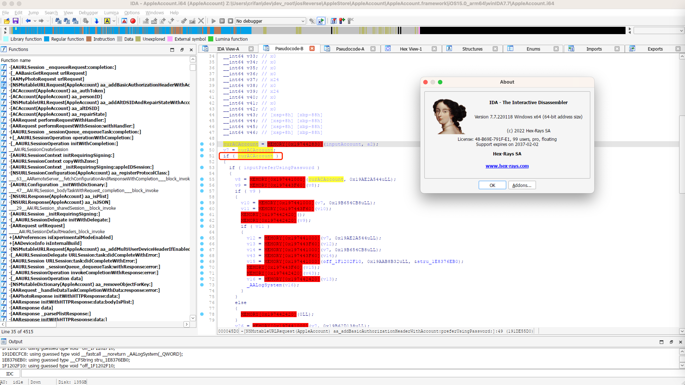
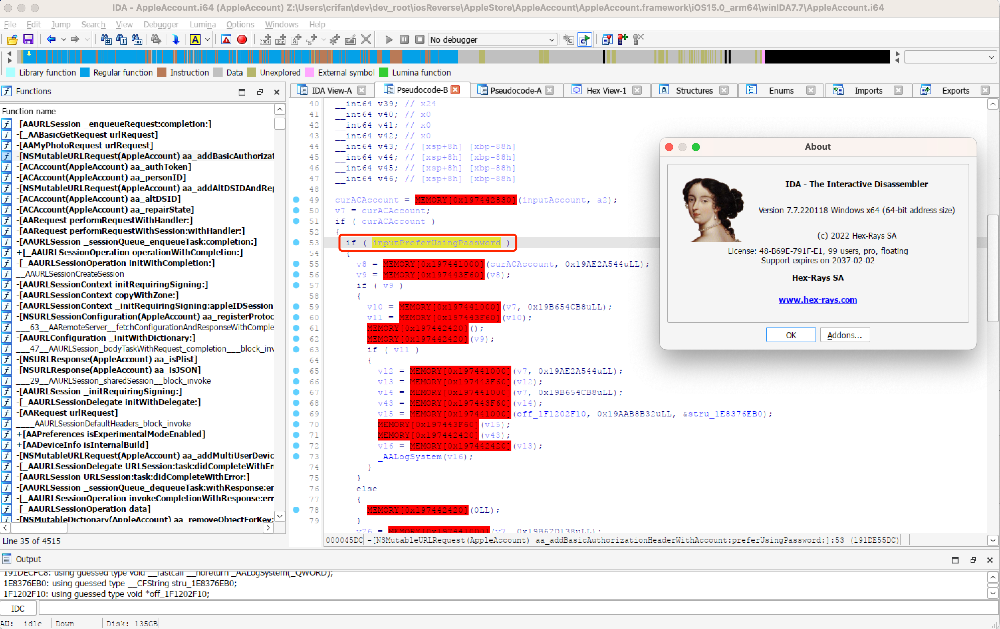
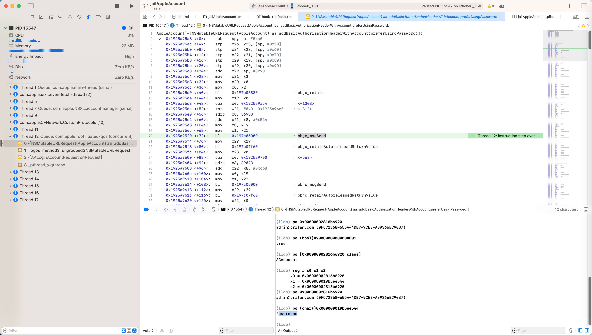

# 从汇编反推代码逻辑

iOS逆向期间，对于（静态分析或动态调试）ARM汇编代码时，直接看ARM汇编代码，肯定是很难搞定代码逻辑的，尤其是代码很多的时候。

但是，如果熟悉ARM汇编指令本身，和一些常见的逻辑，则可以：

对于部分简单的逻辑，还是能看出来的

此处以具体例子来解释说明

对于Xcode去调试iOS的ObjC函数：

```asm
AppleAccount`-[NSMutableURLRequest(AppleAccount) aa_addBasicAuthorizationHeaderWithAccount:preferUsingPassword:]:
->  0x1925a95a8 <+0>:    sub    sp, sp, #0xa0
    0x1925a95ac <+4>:    stp    x26, x25, [sp, #0x50]
    0x1925a95b0 <+8>:    stp    x24, x23, [sp, #0x60]
    0x1925a95b4 <+12>:   stp    x22, x21, [sp, #0x70]
    0x1925a95b8 <+16>:   stp    x20, x19, [sp, #0x80]
    0x1925a95bc <+20>:   stp    x29, x30, [sp, #0x90]
    0x1925a95c0 <+24>:   add    x29, sp, #0x90
    0x1925a95c4 <+28>:   mov    x21, x3
    0x1925a95c8 <+32>:   mov    x20, x0
    0x1925a95cc <+36>:   mov    x0, x2
    0x1925a95d0 <+40>:   bl     0x197c06830              ; objc_retain
    0x1925a95d4 <+44>:   mov    x19, x0
    0x1925a95d8 <+48>:   cbz    x0, 0x1925a9ac4          ; <+1308>
    0x1925a95dc <+52>:   tbz    w21, #0x0, 0x1925a96e0    ; <+312>
    0x1925a95e0 <+56>:   adrp   x8, 36933
    0x1925a95e4 <+60>:   add    x21, x8, #0x544
    0x1925a95e8 <+64>:   mov    x0, x19
    0x1925a95ec <+68>:   mov    x1, x21
    0x1925a95f0 <+72>:   bl     0x197c05000              ; objc_msgSend
    0x1925a95f4 <+76>:   mov    x29, x29
    0x1925a95f8 <+80>:   bl     0x197c07f60              ; objc_retainAutoreleasedReturnValue
    0x1925a95fc <+84>:   mov    x23, x0
...
    0x1925a96e0 <+312>:  adrp   x8, 38984
    0x1925a96e4 <+316>:  add    x21, x8, #0x138
    0x1925a96e8 <+320>:  mov    x0, x19
    0x1925a96ec <+324>:  mov    x1, x21
    0x1925a96f0 <+328>:  bl     0x197c05000              ; objc_msgSend
```

先分别介绍，局部的，部分的，ARM汇编代码，对应的原始的ObjC的代码的逻辑。

介绍具体逻辑之前，先贴出传入参数：

```bash
(lldb) reg r x0 x1 x2 x3
      x0 = 0x0000000282da0150
      x1 = 0x000000019bc11ada  
      x2 = 0x00000002816b6920
      x3 = 0x0000000000000001
(lldb) po 0x0000000282da0150
<NSMutableURLRequest: 0x282da0150> { URL: https://setup.icloud.com/setup/signin/v2/login }

(lldb) po (char*)0x000000019bc11ada
"aa_addBasicAuthorizationHeaderWithAccount:preferUsingPassword:"

(lldb) po 0x00000002816b6920
xxx@yyy.zzz (0F...-655A-4DE7-9CEE-A3...7)
(lldb) po [0x00000002816b6920 class]
ACAccount

(lldb) po (bool)0x0000000000000001
true
```

其对应着，iOS中ObjC代码的调用：

```objc
objc_msgSend(
    <NSMutableURLRequest: 0x282da0150> { URL: https://setup.icloud.com/setup/signin/v2/login },
    "aa_addBasicAuthorizationHeaderWithAccount:preferUsingPassword:",
    <ACAccount: xxx@yyy.zzz (0F...-655A-4DE7-9CEE-A3...7)>
    true
)
```

其中的：

```asm
    0x1925a95c4 <+28>:   mov    x21, x3
    0x1925a95c8 <+32>:   mov    x20, x0
```

是去保存传入的参数：

* `x3` = `x21` = `0x1` = `true`
* `x0` = `x20` = `<NSMutableURLRequest: 0x282da0150> { URL: https://setup.icloud.com/setup/signin/v2/login }`


```asm
    0x1925a95cc <+36>:   mov    x0, x2
```

意思是：

* `x0` = `x2` = `<ACAccount: xxx@yyy.zzz (0F...8-655A-4DE7-9CEE-A...7)>`


```asm
    0x1925a95d0 <+40>:   bl     0x197c06830              ; objc_retain
    0x1925a95d4 <+44>:   mov    x19, x0
```

意思是：

```objc
objc_retain(<ACAccount: xxx@yyy.zzz (0F...8-655A-4DE7-9CEE-A...7)>)
=> x0 = x19 = retain后的ACAccount
```

-》原始代码逻辑，暂时可以写成类似的意思：

```objc
curACAccount = objc_retain(inputACAccount)
```

尤其是，下面这句：

```asm
    0x1925a95d8 <+48>:   cbz    x0, 0x1925a9ac4          ; <+1308>
```

其实容易看出是：

cbz = Compare and Branch on Zero = 去比较，如果是0，就跳转

此处意思是：

去比较x0=retain后的ACAccount，即传入的参数ACAccount，是否是0，如果是，则就跳转

-》则此时，就容易反推出，原始的（iOS的ObjC）代码的逻辑，就是：

去判断传入参数ACAccount，是否是空

-》写成伪代码，C代码，就类似于：

```objc
curACAccount = objc_retain(inputACAccount)
if (curACAccount) {
    // next line = <+52>: do normal process account
} else {
    // <+1308>: report error or some other process
}
```

类似的，IDA Pro (v7.7)中，反编译后的代码=伪代码，也是类似的写法：



如此，就可以：

一点点反推出，原始代码的逻辑和含义了。

而其实可以继续分析原始代码逻辑：

```asm
    0x1925a95dc <+52>:   tbz    w21, #0x0, 0x1925a96e0    ; <+312>
```

ARM汇编代码本意：

tbz=TBZ=Test bit and Branch if Zero = 测试某个位，看看是否是0，如果是0，就跳转

注：此处突然明白，此处也是去判断 某个内容，是否为0，为何没用上面的：

* cbz = Compare and Branch on Zero

而非要用另外一个汇编指令：

* tbz=TBZ=Test bit and Branch if Zero

其中的区别点在于：

* cbz是Compare，普通的内容
* tbz=Test bit，是测试比较某个bit位
  * 对应着此处代码中，用的寄存器是w21
  * 根据之前经验，X是64位寄存器写法，比如X21
    * 而如果改用w的32位寄存器写法，则往往意味着：此时的原始代码变量是个bool布尔变量了
      * bool变量的底层实现，就可以：只用1个bit位，即可表示
        * 所以此处用tbz，而不是用cbz

所以，此处w21 = 是个bool变量 = 前面的x21 = x3 = 传入参数的：0x1=true

所以此处含义就是：

```objc
if(inputPreferUsingPassword) {
    // next line=<+56>: some logic like: login using password
} else {
    // jump to line <+312>: some logic like: login not using password = using auth or something else
}
```

如此，即可反推出，原始的代码的逻辑了。

类似的，IDA中的伪代码，其实就是如此一点点反推出原始代码的逻辑，然后实现反编译的

此处IDA Pro v7.7的反编译结果，也就是上述推测出的逻辑和写法：



此处贴出，这部分代码的对应的，IDA Pro的伪代码：

```c
void __cdecl -[NSMutableURLRequest(AppleAccount) aa_addBasicAuthorizationHeaderWithAccount:preferUsingPassword:](
        id a1,
        SEL a2,
        id inputAccount,
        bool inputPreferUsingPassword)
{
  __int64 curACAccount; // x0
...
  curACAccount = MEMORY[0x197442830](inputAccount, a2);
  v7 = curACAccount;
  if ( curACAccount )
  {
    if ( inputPreferUsingPassword )
    {
      v8 = MEMORY[0x197441000](curACAccount, 0x19AE2A544uLL);
...
    }
    else
    {
      v17 = MEMORY[0x197441000](curACAccount, 0x19B62D138uLL);
...
    }
...
  }
...
}
```

如此，从ARM汇编代码中，熟悉ARM汇编指令的语法，配合iOS的ObjC的（objc_msgSend、Block等）底层知识，其实可以：

静态分析，和 动态调试，看懂大部分的代码逻辑

特殊：

当然，还有其他逻辑，是无法直接看出来的，比如上面的：

```c
  curACAccount = MEMORY[0x197442830](inputAccount, a2);
...
      v8 = MEMORY[0x197441000](curACAccount, 0x19AE2A544uLL);
```

就属于通过静态分析，查看IDA反编译的伪代码，无法看懂具体的逻辑

需要的动态调试，就可以看懂具体逻辑了

比如此处：

```c
  curACAccount = MEMORY[0x197442830](inputAccount, a2);
```

其实是：

```c
  curACAccount = objc_retain(inputAccount);
```

而：

```c
      v8 = MEMORY[0x197441000](curACAccount, 0x19AE2A544uLL);
```

通过Xcode的动态调试：

```asm
    0x1925a95dc <+52>:   tbz    w21, #0x0, 0x1925a96e0    ; <+312>
    0x1925a95e0 <+56>:   adrp   x8, 36933
    0x1925a95e4 <+60>:   add    x21, x8, #0x544
    0x1925a95e8 <+64>:   mov    x0, x19
    0x1925a95ec <+68>:   mov    x1, x21
    0x1925a95f0 <+72>:   bl     0x197c05000              ; objc_msgSend
```



```bash
(lldb) reg r x0 x1 x2
      x0 = 0x00000002816b6920
      x1 = 0x000000019b5ee544  
      x2 = 0x00000002816b6920
(lldb) po 0x00000002816b6920
xxx@yyy.zzz (0F...8-655A-4DE7-9CEE-A...7)

(lldb) po (char*)0x000000019b5ee544
"username"
```

得知，其实是：

```c
objc_msgSend(curACAccount, "username")
```

如此，即可一点点的，通过汇编代码，反推，搞懂，原始代码逻辑。
