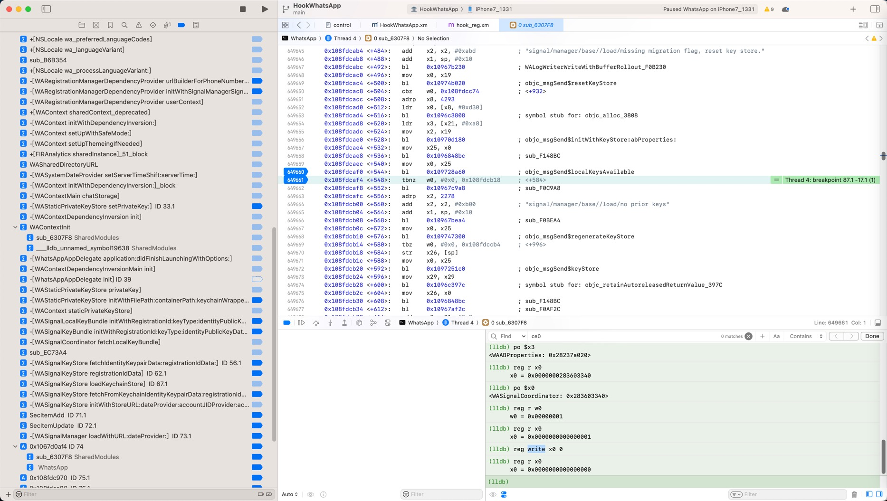
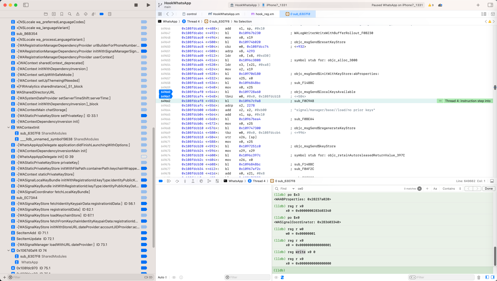

# 修改寄存器值走期望的分支

此处通过举例说明：

如何修改寄存器的值，使得改变程序原有运行逻辑，跳转到我们所期望分支：

折腾：

【未解决】iOS逆向WhatsApp：-[WASignalManager loadWithURL:dateProvider:]

期间，此处Xcode汇编代码：

```asm
    0x108fdcaec <+540>:   mov    x0, x25
    0x108fdcaf0 <+544>:   bl     0x109728a60              ; objc_msgSend$localKeysAvailable
    0x108fdcaf4 <+548>:   tbnz   w0, #0x0, 0x108fdcb18     ; <+584>
    0x108fdcaf8 <+552>:   bl     0x10967c9a8              ; sub_F0C9A8
    0x108fdcafc <+556>:   adrp   x2, 2278
    0x108fdcb00 <+560>:   add    x2, x2, #0xb00            ; "signal/manager/base//load/no prior keys"
    0x108fdcb04 <+564>:   add    x1, sp, #0x10
    0x108fdcb08 <+568>:   bl     0x10967bea4              ; sub_F0BEA4
    0x108fdcb0c <+572>:   mov    x0, x25
    0x108fdcb10 <+576>:   bl     0x109747300              ; objc_msgSend$regenerateKeyStore
    0x108fdcb14 <+580>:   tbz    w0, #0x0, 0x108fdccb4     ; <+996>
    0x108fdcb18 <+584>:   str    x26, [sp]
    0x108fdcb1c <+588>:   mov    x0, x25
    0x108fdcb20 <+592>:   bl     0x1097251c0              ; objc_msgSend$keyStore
```

当前PC在：

```asm
    0x108fdcaf4 <+548>:   tbnz   w0, #0x0, 0x108fdcb18     ; <+584>
```

此时：

```asm
(lldb) reg r w0
      w0 = 0x00000001
(lldb) reg r x0
      x0 = 0x0000000000000001
```

即：

代码逻辑中：`localKeysAvailable=True`

所以走后续的逻辑

对应着，Xcode汇编中的：

```asm
    0x108fdcb18 <+584>:   str    x26, [sp]
    0x108fdcb1c <+588>:   mov    x0, x25
    0x108fdcb20 <+592>:   bl     0x1097251c0              ; objc_msgSend$keyStore
...
```

对应着IDA伪代码：

```c
    isLocalKeysAvailable = (__int64)objc_msgSend_localKeysAvailable_8A60(curWASignalCoordinator, str_localKeysAvailable);
    if ( (isLocalKeysAvailable & 1) != 0
      || (v82 = sp10tox0_x0tozero_F0C9A8(isLocalKeysAvailable, (__int64)v79, v80, v81),
          sub_F0BEA4(v82, v140, "signal/manager/base//load/no prior keys"),
          v84 = (__int64)objc_msgSend_regenerateKeyStore_7300(curWASignalCoordinator, v83),
          (v84 & 1) != 0) )
    {
      v87 = objc_msgSend_keyStore(curWASignalCoordinator, v79, v59);
      ...
```

中的：

```c
      v87 = objc_msgSend_keyStore(curWASignalCoordinator, v79, v59);
      ...
```

部分

然后此处为了调试需要：

想要程序走：

`objc_msgSend_regenerateKeyStore_7300`

的部分代码

所以去改变寄存器值：

```asm
(lldb) reg write x0 0
```

修改后，read查看确认：

```asm
(lldb) reg r x0
      x0 = 0x0000000000000000
```

然后继续执行：

程序的确执行了，另外的分支了：




可以使得程序运行，暂时走我们要的分支了：

```c
(v82 = sp10tox0_x0tozero_F0C9A8(isLocalKeysAvailable, (__int64)v79, v80, v81),
          sub_F0BEA4(v82, v140, "signal/manager/base//load/no prior keys"),
          v84 = (__int64)objc_msgSend_regenerateKeyStore_7300(curWASignalCoordinator, v83)
```

->

```asm
    0x108fdcaf8 <+552>:   bl     0x10967c9a8              ; sub_F0C9A8
    0x108fdcafc <+556>:   adrp   x2, 2278
    0x108fdcb00 <+560>:   add    x2, x2, #0xb00            ; "signal/manager/base//load/no prior keys"
    0x108fdcb04 <+564>:   add    x1, sp, #0x10
    0x108fdcb08 <+568>:   bl     0x10967bea4              ; sub_F0BEA4
    0x108fdcb0c <+572>:   mov    x0, x25
    0x108fdcb10 <+576>:   bl     0x109747300              ; objc_msgSend$regenerateKeyStore
    0x108fdcb14 <+580>:   tbz    w0, #0x0, 0x108fdccb4     ; <+996>
```



-》

```asm
(lldb) reg r x0
      x0 = 0x0000000283603340
(lldb) po $x0
<WASignalCoordinator: 0x283603340>
```

是对的，即可去调用：

* `regenerateKeyStore`

了，是我们要的逻辑。

