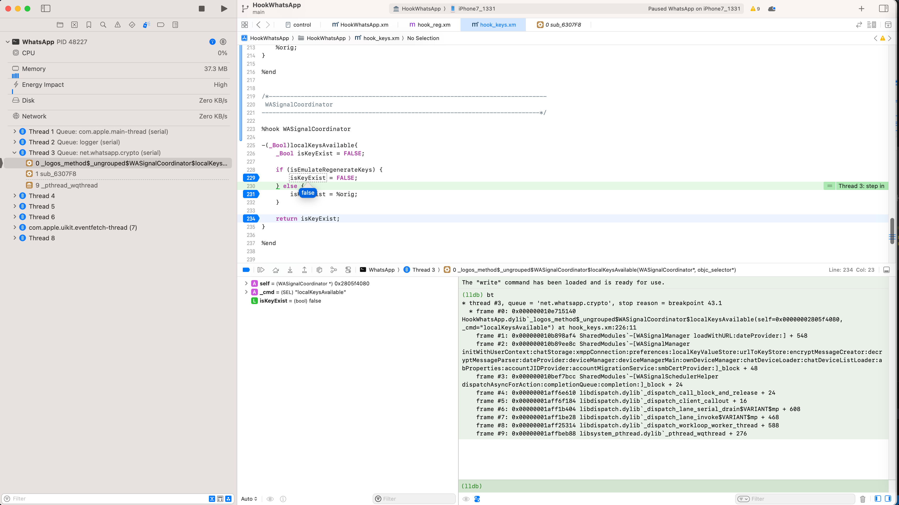
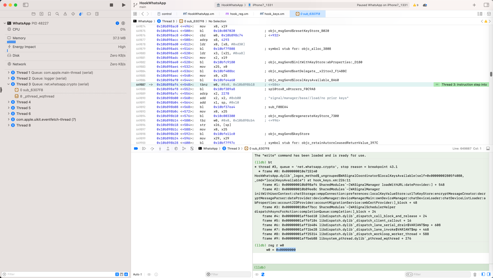
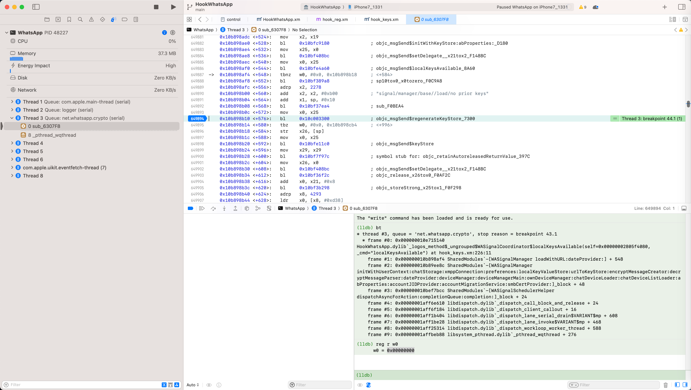

# hook函数返回值

对于之前的：

[修改寄存器值](../../../dynamic_debug/debug_logic/change_logic/edit_reg_value.md)

从调试的角度来说，如果每次都要改变对应分支逻辑，而要每次都去改变寄存器值去实现此目的，则：调试效率比较低

想要提高效率，可以考虑改用别的方式

比如，去hook对应的返回值

此处就是：

直接hook函数，返回False，更省事

具体步骤：

hook代码：

```c
%hook WASignalCoordinator

//bool isEmulateRegenerateKeys = FALSE;
bool isEmulateRegenerateKeys = TRUE;

-(_Bool)localKeysAvailable{
    _Bool isKeyExist = FALSE;

    if (isEmulateRegenerateKeys) {
        isKeyExist = FALSE;
    } else {
        isKeyExist = %orig;
    }

    return isKeyExist;
}

%end
```

调试后，生效了

触发到此处调用：



函数调用堆栈：

```c
(lldb) bt
* thread #3, queue = 'net.whatsapp.crypto', stop reason = breakpoint 43.1
  * frame #0: 0x000000010e715140 HookWhatsApp.dylib`_logos_method$_ungrouped$WASignalCoordinator$localKeysAvailable(self=0x00000002805f4080, _cmd="localKeysAvailable") at hook_keys.xm:226:11
    frame #1: 0x000000010b898af4 SharedModules`-[WASignalManager loadWithURL:dateProvider:] + 548
    frame #2: 0x000000010b89ee8c SharedModules`-[WASignalManager initWithUserContext:chatStorage:xmppConnection:preferences:localKeyValueStore:urlToKeyStore:encryptMessageCreator:decryptMessageParser:dateProvider:deviceManager:deviceManagerMain:ownDeviceManager:chatDeviceLoader:chatDeviceListLoader:abProperties:accountJIDProvider:accountMigrationService:smbCertProvider:]_block + 48
    frame #3: 0x000000010bef7bcc SharedModules`-[WASignalSchedulerHelper dispatchAsyncForAction:completionQueue:completion:]_block + 24
    frame #4: 0x00000001aff6e610 libdispatch.dylib`_dispatch_call_block_and_release + 24
    frame #5: 0x00000001aff6f184 libdispatch.dylib`_dispatch_client_callout + 16
    frame #6: 0x00000001aff1b404 libdispatch.dylib`_dispatch_lane_serial_drain$VARIANT$mp + 608
    frame #7: 0x00000001aff1be28 libdispatch.dylib`_dispatch_lane_invoke$VARIANT$mp + 468
    frame #8: 0x00000001aff25314 libdispatch.dylib`_dispatch_workloop_worker_thread + 588
    frame #9: 0x00000001affbeb88 libsystem_pthread.dylib`_pthread_wqthread + 276
```

后续是

w0=0

而不是之前的：

w0=1

了：



代码走了另外分支：



达到我们的期望了：

通过hook代码：

* `-[WASignalCoordinator localKeysAvailable]`
  * 返回：`False`=`0`

实现代码走另外分支。

而无需每次去修改寄存器了。
