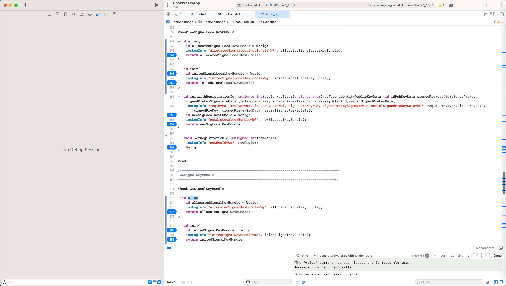
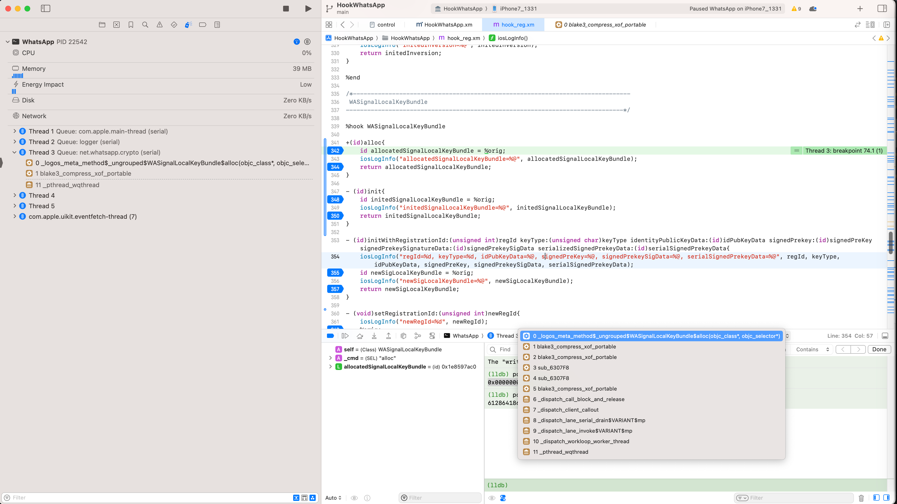
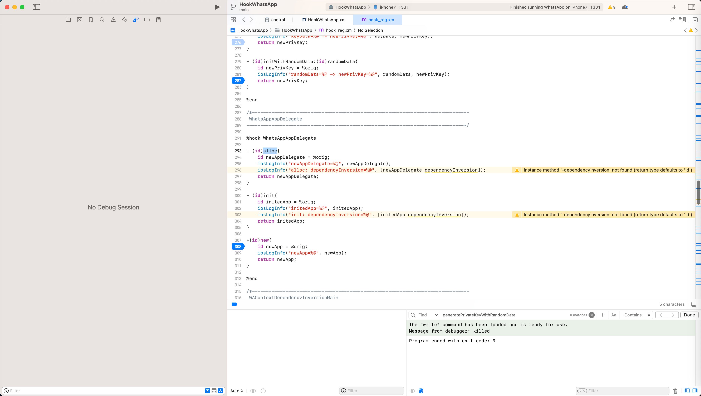
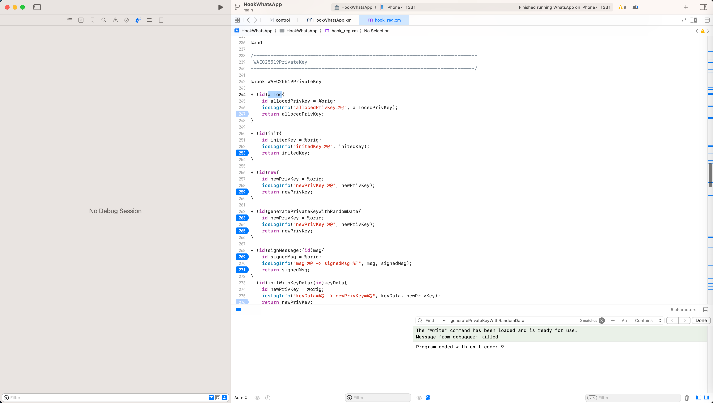

# hook类的函数：alloc、init、new

## 背景
iOS逆向，找函数调用逻辑，已知iOS的ObjC的函数了。但是写了hook代码，调试却没触发到。

此时，就很麻烦：找不到函数被调用的时机，没触发函数，就没法继续调试，找被调用时候的相关逻辑了。

此时，有个新思路：

**去hook类的`alloc`+`init`函数（甚至`new`函数），看看是否触发**

则往往：能触发，即可顺利找到，相关的类被alloc和init的被初始化的地方，就容易继续找到相关处理逻辑了

## 举例

### WASignalLocalKeyBundle和WASignalKeyBundle

【已解决】iOS逆向WhatsApp：研究注册URL中baseParams参数来源和逻辑：e_keytype

的：

```c
%hook WASignalLocalKeyBundle

+(id)alloc{
    id allocatedSignalLocalKeyBundle = %orig;
    iosLogInfo("allocatedSignalLocalKeyBundle=%@", allocatedSignalLocalKeyBundle);
    return allocatedSignalLocalKeyBundle;
}

- (id)init{
    id initedSignalLocalKeyBundle = %orig;
    iosLogInfo("initedSignalLocalKeyBundle=%@", initedSignalLocalKeyBundle);
    return initedSignalLocalKeyBundle;
}

%end

%hook WASignalKeyBundle

+(id)alloc{
    id allocatedSignalKeyBundle = %orig;
    iosLogInfo("allocatedSignalKeyBundle=%@", allocatedSignalKeyBundle);
    return allocatedSignalKeyBundle;
}

- (id)init{
    id initedSignalKeyBundle = %orig;
    iosLogInfo("initedSignalKeyBundle=%@", initedSignalKeyBundle);
    return initedSignalKeyBundle;
}

%end
```



以及通过加上对应断点：

* `+[WASignalLocalKeyBundle alloc]`

而找到触发的地方了：




从而可以找到被调用的地方，继续研究调用和生成逻辑了。

### WAContextDependencyInversionMain

* 【未解决】iOS逆向WhatsApp：-[WAContextDependencyInversionMain init]
* 【未解决】iOS逆向WhatsApp：研究WhatsAppAppDelegate的dependencyInversion的来源和生成逻辑

的

```c
%hook WAContextDependencyInversionMain

+ (id)alloc{
    id newInversion = %orig;
    iosLogInfo("newInversion=%@", newInversion);
    return newInversion;
}

- (id)init{
    id initedInversion = %orig;
    iosLogInfo("initedInversion=%@", initedInversion);
    return initedInversion;
}

%end

%hook WhatsAppAppDelegate

+ (id)alloc{
    id newAppDelegate = %orig;
    iosLogInfo("newAppDelegate=%@", newAppDelegate);
    iosLogInfo("alloc: dependencyInversion=%@", [newAppDelegate dependencyInversion]);
    return newAppDelegate;
}

- (id)init{
    id initedApp = %orig;
    iosLogInfo("initedApp=%@", initedApp);
    iosLogInfo("init: dependencyInversion=%@", [initedApp dependencyInversion]);
    return initedApp;
}

+(id)new{
    id newApp = %orig;
    iosLogInfo("newApp=%@", newApp);
    return newApp;
}

%end
```



### WAEC25519PrivateKey

* 【未解决】iOS逆向WhatsApp：类WAEC25519PrivateKey

的

```c
%hook WAEC25519PrivateKey

+ (id)alloc{
    id allocedPrivKey = %orig;
    iosLogInfo("allocedPrivKey=%@", allocedPrivKey);
    return allocedPrivKey;
}

- (id)init{
    id initedKey = %orig;
    iosLogInfo("initedKey=%@", initedKey);
    return initedKey;
}

+ (id)new{
    id newPrivKey = %orig;
    iosLogInfo("newPrivKey=%@", newPrivKey);
    return newPrivKey;
}

%end
```

