# 重装和spawn方式

## 背景

研究iOS逆向期间，需要找某些iOS的ObjC函数的调用的时机和地方

以便于研究代码逻辑。

但是有时候，虽然找到并给函数写了hook代码，但是却没有触发

所以需要想办法，找函数被触发调用的时机

后来有了新思路：

* 该函数很可能是：app初始化时，仅允许一次
  * 所以后续调试，无法再次触发
* 如何触发
  * 模拟环境入手：重新安装app
    * 且用Spawn方式启动，模拟重新安装后首次启动
      * 或许就能触发
  * 从代码调用入手：借助于IDA的交叉引用xref，references to，继续向上找函数调用的地方
    * （虽然往往也很复杂，不好找，但）往往最后也是你能找到调用的地方的

## 举例

### -[WASignalKeyStore saveToKeychainIdentityKeypairData:registrationIdData:]

想要寻找函数：

* `-[WASignalKeyStore saveToKeychainIdentityKeypairData:registrationIdData:]`

的调用逻辑，何时被调用的，就遇到了：

写了hook代码：

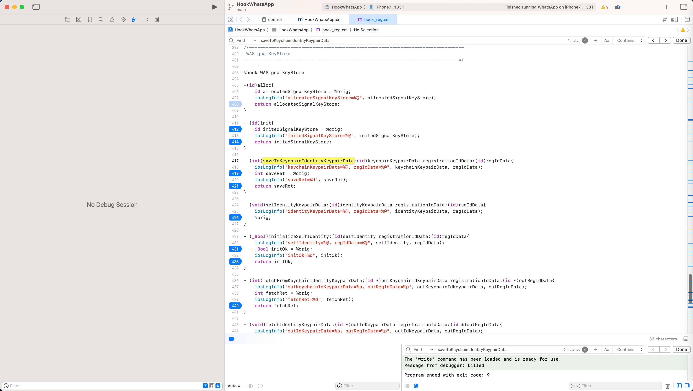

但是却没触发

然后继续寻找其是如何被调用的

而后是：

借助于=主要用到了：

IDA中的：

* `List cross references to`
  * 从别的哪里调用到此处函数的
* `Jump to xref to operand`
  * 其他哪里有，互相的交叉引用

如此，一点点向上层，去找调用到此处代码的地方，去找更上层的调用

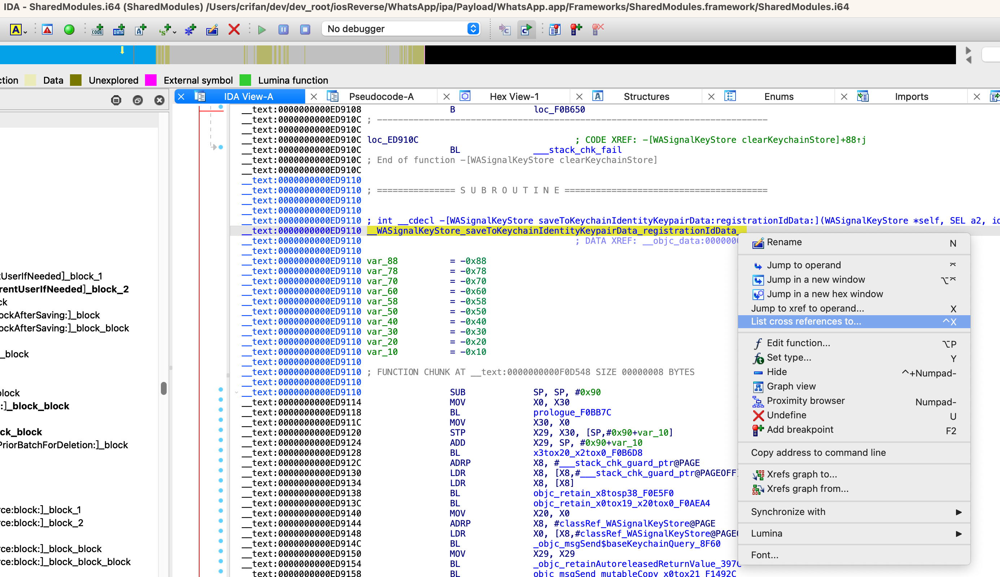

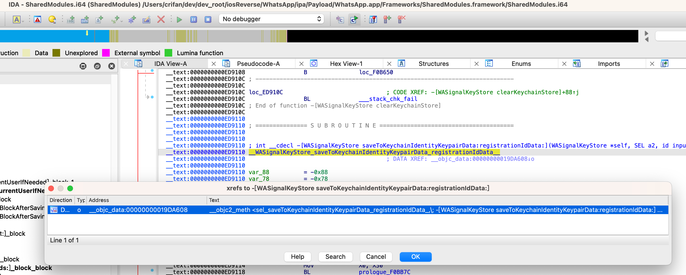

```asm
Down    o    __objc_data:00000000019DA608    __objc2_meth <sel_saveToKeychainIdentityKeypairData_registrationIdData_,\; -[WASignalKeyStore saveToKeychainIdentityKeypairData:registrationIdData:] ...
```

-》

```asm
__objc_data:00000000019DA608                 __objc2_meth <sel_saveToKeychainIdentityKeypairData_registrationIdData_,\ ; -[WASignalKeyStore saveToKeychainIdentityKeypairData:registrationIdData:] ...
__objc_data:00000000019DA608                               aI32081624, \
__objc_data:00000000019DA608                               __WASignalKeyStore_saveToKeychainIdentityKeypairData_registrationIdData__>
```

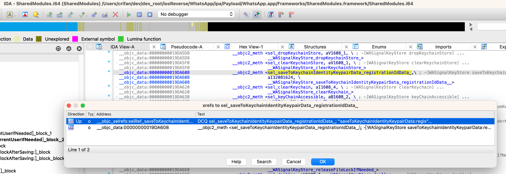

```asm
__objc_selrefs:0000000001911B78 selRef_saveToKeychainIdentityKeypairData_registrationIdData_ DCQ sel_saveToKeychainIdentityKeypairData_registrationIdData_
__objc_selrefs:0000000001911B78                                         ; DATA XREF: _objc_msgSend$saveToKeychainIdentityKeypairData_registrationIdData_↑o
__objc_selrefs:0000000001911B78                                         ; _objc_msgSend$saveToKeychainIdentityKeypairData_registrationIdData_+4↑r
__objc_selrefs:0000000001911B78                                         ; "saveToKeychainIdentityKeypairData:regis"...
```

-》

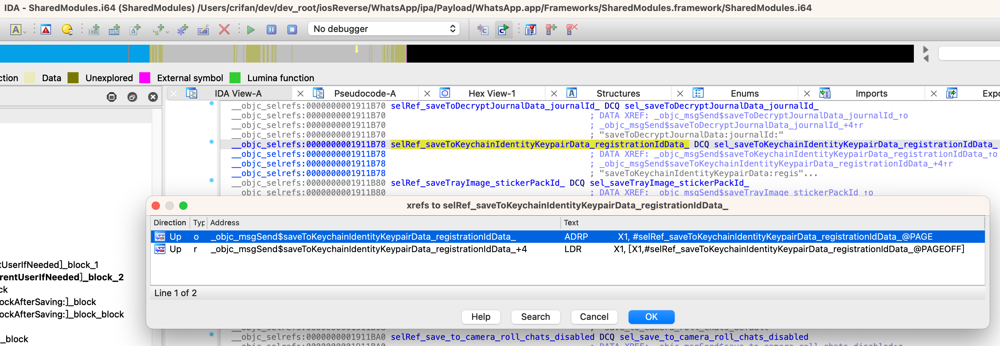

```asm
Up    o    _objc_msgSend$saveToKeychainIdentityKeypairData_registrationIdData_    ADRP            X1, #selRef_saveToKeychainIdentityKeypairData_registrationIdData_@PAGE
Up    r    _objc_msgSend$saveToKeychainIdentityKeypairData_registrationIdData_+4    LDR             X1, [X1,#selRef_saveToKeychainIdentityKeypairData_registrationIdData_@PAGEOFF]
```

-》

```asm
__objc_stubs:0000000000FDD7A0 _objc_msgSend$saveToKeychainIdentityKeypairData_registrationIdData_
__objc_stubs:0000000000FDD7A0                                         ; CODE XREF: -[WASignalKeyStore setIdentityKeypairData:registrationIdData:]+4C↑p
__objc_stubs:0000000000FDD7A0                                         ; -[WASignalKeyStore fetchFromKeychainIdentityKeypairData:registrationIdData:]+128↑p
__objc_stubs:0000000000FDD7A0                 ADRP            X1, #selRef_saveToKeychainIdentityKeypairData_registrationIdData_@PAGE
__objc_stubs:0000000000FDD7A4                 LDR             X1, [X1,#selRef_saveToKeychainIdentityKeypairData_registrationIdData_@PAGEOFF]
__objc_stubs:0000000000FDD7A8                 ADRP            X16, #_objc_msgSend_ptr@PAGE
__objc_stubs:0000000000FDD7AC                 LDR             X16, [X16,#_objc_msgSend_ptr@PAGEOFF]
__objc_stubs:0000000000FDD7B0                 BR              X16
__objc_stubs:0000000000FDD7B0 ; End of function _objc_msgSend$saveToKeychainIdentityKeypairData_registrationIdData_
```

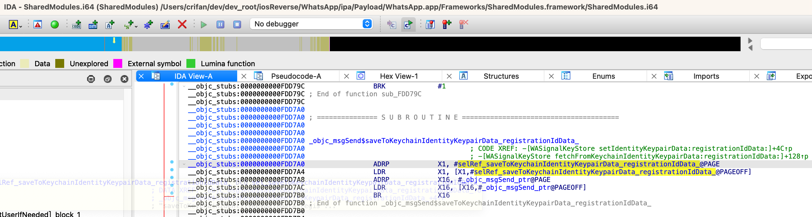

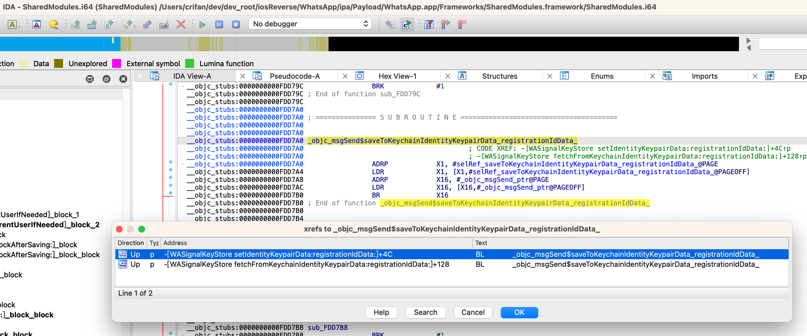

```asm
Up    p    -[WASignalKeyStore setIdentityKeypairData:registrationIdData:]+4C    BL              _objc_msgSend$saveToKeychainIdentityKeypairData_registrationIdData_

Up    p    -[WASignalKeyStore fetchFromKeychainIdentityKeypairData:registrationIdData:]+128    BL              _objc_msgSend$saveToKeychainIdentityKeypairData_registrationIdData_
```

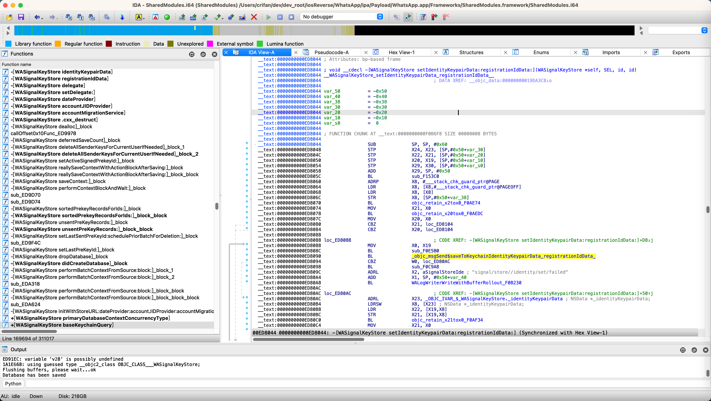

至此，找到了，上层的调用：

* `-[WASignalCoordinator setIdentityKeyPair:signedPreKey:registrationID:]`
* `-[WASignalKeyStore initializeSelfIdentity:registrationIdData:]`

继续向上找：

从：

`-[WASignalCoordinator setIdentityKeyPair:signedPreKey:registrationID:]`

继续找：

`objc_msgSend_setIdentityKeyPair_signedPreKey_registrationID__8120`

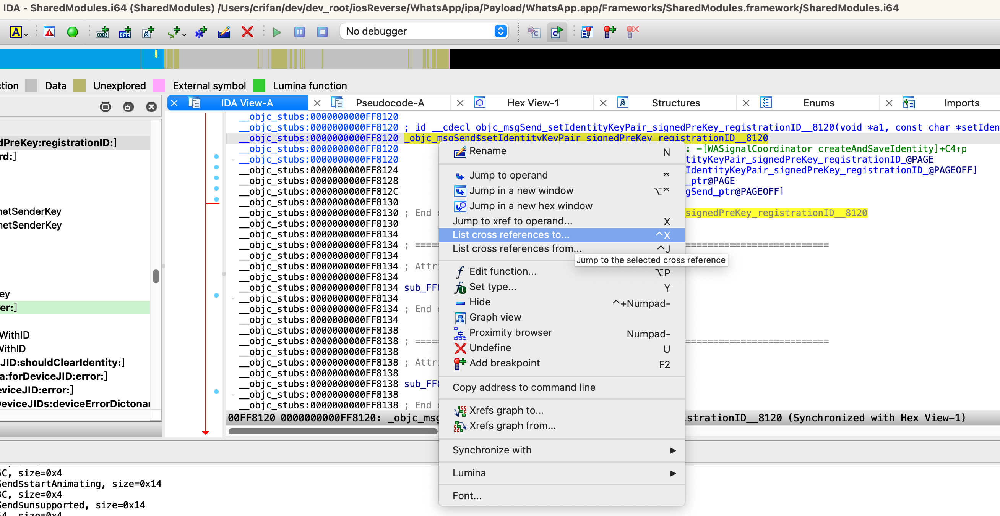

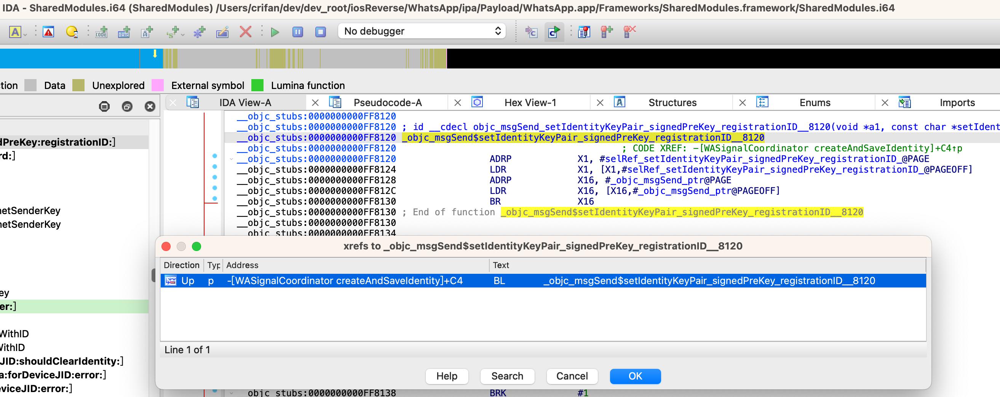

最后找到了：

`-[WASignalCoordinator createAndSaveIdentity]`

其中的：

```c
bool __cdecl -[WASignalCoordinator createAndSaveIdentity](WASignalCoordinator *self, SEL a2)
{
...
      if ( (signal_protocol_key_helper_generate_registration_id_BF8C(&a1, 1LL) & 0x80000000) != 0 )
...
      else
      {
        v12 = (void *)x20tox0_x19tox2_F0B95C();
        v17 = (unsigned int)objc_msgSend_setIdentityKeyPair_signedPreKey_registrationID__8120(
                              v12,
                              str_setIdentityKeyPair_signedPreKey_registrationID_,
                              identityKeyPair,
                              signedPreKey,
                              registrationID)
...
}
```

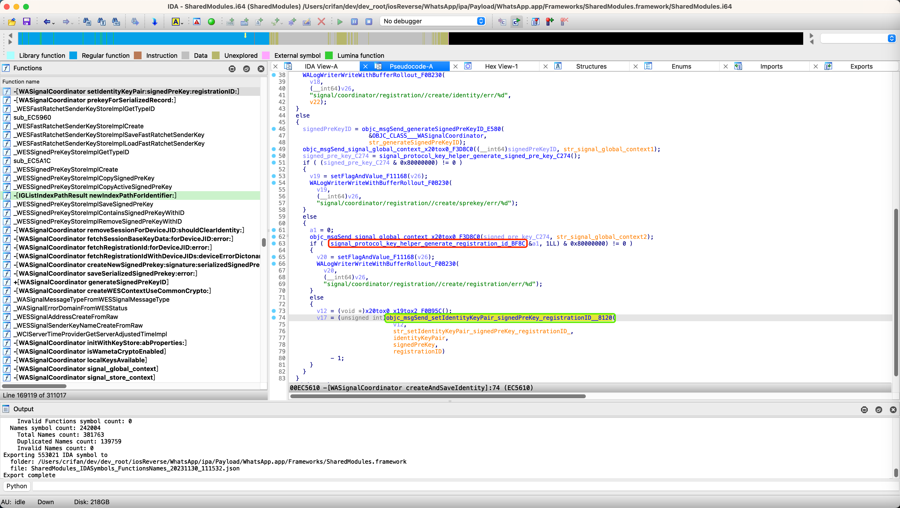

中的：

* `signal_protocol_key_helper_generate_registration_id`
  * 后优化改名为：`signal_protocol_key_helper_generate_registration_id_BF8C`

就很像是我们要找的代码逻辑：

用于初始化生成`RegistrationId`=`regId`=`RegistrationIdData`的函数

最后经过深入研究：

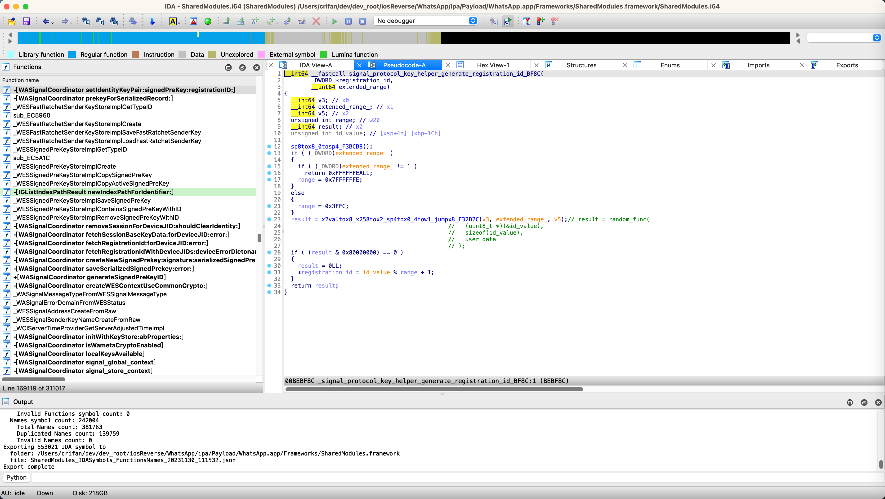

和实际调试确认，的确就是的我们要找的逻辑。

具体过程详见：

* 【未解决】iOS逆向WhatsApp：-[WASignalKeyStore saveToKeychainIdentityKeypairData:registrationIdData:]
* 【未解决】iOS逆向WhatsApp：-[WASignalCoordinator createAndSaveIdentity]
* 【未解决】iOS逆向WhatsApp：signal_protocol_key_helper_generate_registration_id

注：

期间模拟代码首次运行，还涉及到：

修改寄存器，让代码走另外分支

详见：

* [修改寄存器值走期望的分支](../../../dynamic_debug/lldb/edit_reg_value.md)
