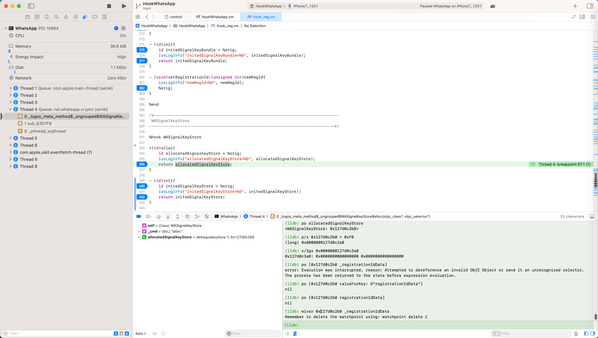
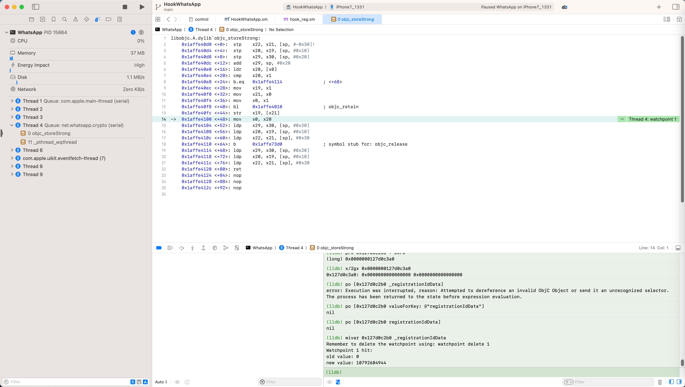
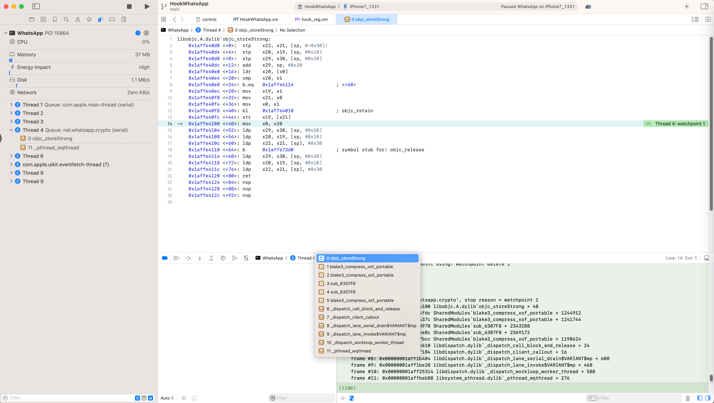

# 寻找变量改动时机

寻找变量赋值=变量值改动的时机

## 背景

如果找不到某个变量值被改动的地方

比如某个类的属性的值被初始化了某个值

思路：用watchpoint寻找变量值被改动 初始化的地方

具体实现：

* `lldb`的`watchpoint`
* `chisel`的`wivar`

此处举例说明：

iOS逆向WhatsApp时，Xcode调试函数：

```asm
SharedModules`-[WASignalKeyStore fetchIdentityKeypairData:registrationIdData:]:
->  0x10ba50124 <+0>:     stp    x22, x21, [sp, #-0x30]!
```

发现此时registrationIdData已经有值了：

```bash
(lldb) po [0x112994040 valueForKey: @"_registrationIdData"]
<45534916>
```

希望找到，哪里赋值的

但是找了各个疑似设置了该值的函数，去hook后：

```c
%hook WASignalKeyStore

+(id)alloc{
    id allocatedSignalKeyStore = %orig;
    iosLogInfo("allocatedSignalKeyStore=%@", allocatedSignalKeyStore);
    return allocatedSignalKeyStore;
}

- (id)init{
    id initedSignalKeyStore = %orig;
    iosLogInfo("initedSignalKeyStore=%@", initedSignalKeyStore);
    return initedSignalKeyStore;
}

- (_Bool)initializeSelfIdentity:(id)selfIdentity registrationIdData:(id)regIdData{
    iosLogInfo("selfIdentity=%@, regIdData=%@", selfIdentity, regIdData);
    _Bool initOk = %orig;
    iosLogInfo("initOk=%d", initOk);
    return initOk;
}

- (int)fetchFromKeychainIdentityKeypairData:(id *)outKeychainIdKeypairData registrationIdData:(id *)outRegIdData{
    iosLogInfo("outKeychainIdKeypairData=%p, outRegIdData=%p", outKeychainIdKeypairData, outRegIdData);
    int fetchRet = %orig;
    iosLogInfo("fetchRet=%d", fetchRet);
    return fetchRet;
}

- (void)fetchIdentityKeypairData:(id *)outIdKeypairData registrationIdData:(id *)outRegIdData{
    iosLogInfo("outIdKeypairData=%p, outRegIdData=%p", outIdKeypairData, outRegIdData);
    %orig;
}

-(void)setRegistrationIdData:(id)newRegIdData{
    iosLogInfo("newRegIdData=%@", newRegIdData);
    %orig;
}

%end
```

却都没有触发

后来就想到：

去加上watchpoint，看看何时设置的该值

而具体watchpoint的用法，应该是：

思路：找到对应ObjC对象的实例的指针，找到对应的属性_registrationIdData的偏移量，再去给该地址加上watchpoint的write的监视

不过，用于监视某个类的属性变量值，另外有个更方便的工具：

lldb的插件：`chisel`，中有个命令`wivar`

在安装了chisel后：

【已解决】M2 Max Mac中安装lldb插件：chisel

去使用：

```bash
(lldb) po allocatedSignalKeyStore
<WASignalKeyStore: 0x127d0c2b0>

(lldb) wivar 0x127d0c2b0 _registrationIdData
Remember to delete the watchpoint using: watchpoint delete 1
```



后续继续运行，即可触发：



对应的函数调用堆栈：

```bash
(lldb) bt
* thread #4, queue = 'net.whatsapp.crypto', stop reason = watchpoint 1
  * frame #0: 0x00000001affe4100 libobjc.A.dylib`objc_storeStrong + 48
    frame #1: 0x0000000107024fdc SharedModules`blake3_compress_xof_portable + 1244912
    frame #2: 0x000000010702437c SharedModules`blake3_compress_xof_portable + 1241744
    frame #3: 0x00000001069b8970 SharedModules`sub_6307F8 + 2343288
    frame #4: 0x00000001069bee8c SharedModules`sub_6307F8 + 2369172
    frame #5: 0x0000000107017bcc SharedModules`blake3_compress_xof_portable + 1190624
    frame #6: 0x00000001aff6e610 libdispatch.dylib`_dispatch_call_block_and_release + 24
    frame #7: 0x00000001aff6f184 libdispatch.dylib`_dispatch_client_callout + 16
    frame #8: 0x00000001aff1b404 libdispatch.dylib`_dispatch_lane_serial_drain$VARIANT$mp + 608
    frame #9: 0x00000001aff1be28 libdispatch.dylib`_dispatch_lane_invoke$VARIANT$mp + 468
    frame #10: 0x00000001aff25314 libdispatch.dylib`_dispatch_workloop_worker_thread + 588
    frame #11: 0x00000001affbeb88 libsystem_pthread.dylib`_pthread_wqthread + 276
```



如此，即可继续调试研究，此处是如何设置值的了。
