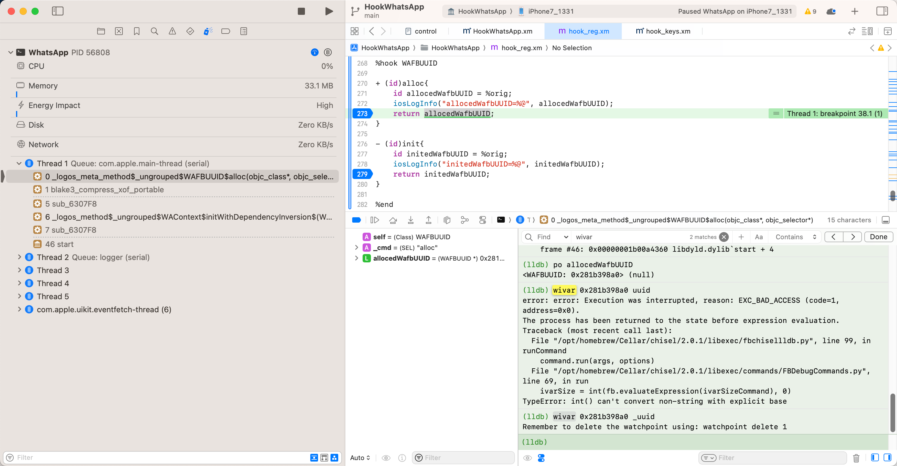

# chisel的wivar

## 心得

* 只能给（带下划线的）内置属性加上监视
  * 无法给（不带下划线的）property属性加上监视

举例：

对于定义：

`WhatsApp/headers/WhatsApp_v23.20.79_headers_SharedModules/WAUUID.h`

```c
@interface WAUUID : NSObject
{
    NSUUID *_uuid;
...
}
...
@property(readonly, nonatomic) NSUUID *uuid; // @synthesize uuid=_uuid;
```

具体现象：

* 可以给 内置属性 下划线开头的：_uuid 加上监视
  ```bash
  (lldb) po allocedWafbUUID
  <WAFBUUID: 0x281b398a0> (null)

  (lldb) wivar 0x281b398a0 _uuid
  Remember to delete the watchpoint using: watchpoint delete 1
  ```
* 无法给（不带下划线的）property属性加上监视
  ```bash
  (lldb) wivar 0x281b398a0 uuid
  error: error: Execution was interrupted, reason: EXC_BAD_ACCESS (code=1, address=0x0).
  The process has been returned to the state before expression evaluation.
  Traceback (most recent call last):
    File "/opt/homebrew/Cellar/chisel/2.0.1/libexec/fbchisellldb.py", line 99, in runCommand
      command.run(args, options)
    File "/opt/homebrew/Cellar/chisel/2.0.1/libexec/commands/FBDebugCommands.py", line 69, in run
      ivarSize = int(fb.evaluateExpression(ivarSizeCommand), 0)
  TypeError: int() can't convert non-string with explicit base
  ```
  * 
