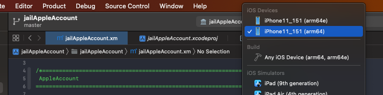
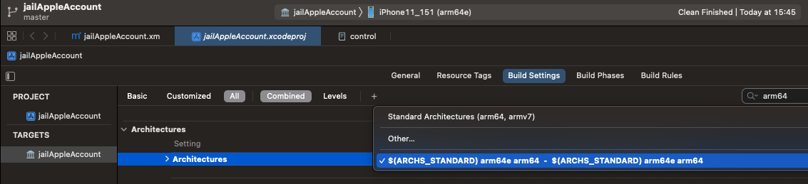

# 2个调试目标：arm64和arm64e

* 现象：Xcode的目标调试iOS设备出现2个：一个是arm64一个是arm64e
* 结论：不是问题，无需解决

## 细节

此处：

* Xcode中，目标调试设备出现2个
  * 本身只连接了一个iPhone设备：`iPhone11_151`
  * 但是却出现了2个调试目标：
    * 
      * `iPhone11_151 (arm64e)`
      * `iPhone11_151 (arm64)`

的原因：

基本上确定是：

是由于之前给Architectures中，加了`arm64`（和`arm64d`）：

而导致的此处现象。

此现象：

* 原以为：是有问题的
  * 以为同一iPhone设备，出现2个调试目标，会影响调试
    * 尤其是影响此处的：iOSOpenDev项目Profiling后无法自动安装deb插件了
    * 实际上是另外原因导致的，详见：
      * 【已解决】iOSOpenDev的Xcode中Profiling编译后无法自动安装deb插件到目标设备iPhone11中
* 现在基本确认：是没有问题的
  * 且按道理，不论选择那个目标：iPhone11_151 (arm64) 还是 iPhone11_151 (arm64e)，都可以正常调试的
    * 原因是：此处编译出的iOS插件动态库文件jailAppleAccount.dylib，是FAT格式的，支持2种架构：arm64和arm64e
      * 既可以在arm64的设备上运行，也可以在arm64e的设备（比如此处的iPhone11）上运行
    * 之前就是选择了iPhone11_151 (arm64)，虽然和iPhone11（是A12，是arm64）不一致，但是都可以正常调试

---

* 补充说明

而之所以要额外加arm64e，则是由于：

为了解决libsubstrate.dylib能在arm64的A12的iPhone11中，不能正常运行的问题：

iOSOpenDev自带的libsubstrate.dylib，只支持arm64，不支持arm64e，所以：

换了FAT格式的libsubstrate.dylib，支持2种架构：arm64和arm64e

同时给Architectures中额外加了arm64e

具体详见：

【已解决】iOSOpenDev的插件dylib注入iPhone11失败：mach-o file but is an incompatible architecture have arm64 need arm64e
