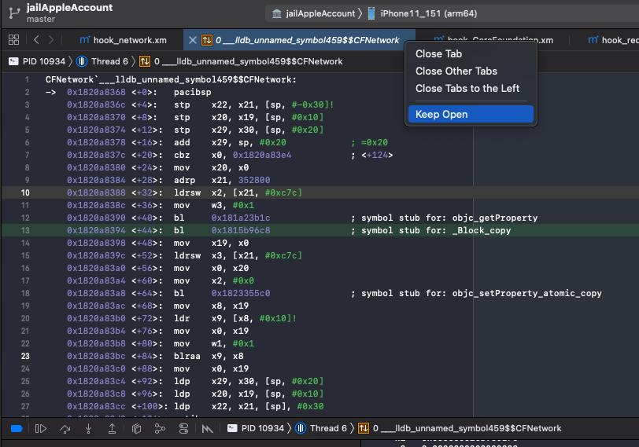
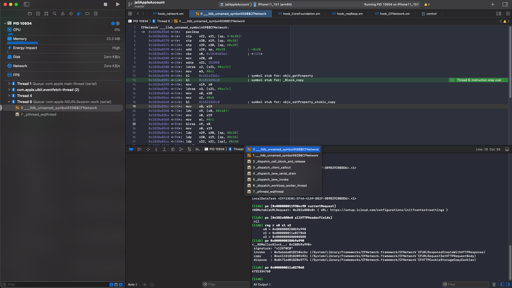

# 汇编代码窗口保持打开状态

给汇编代码窗口保持打开状态不关闭

对于iOS逆向期间，去调试部分函数时，函数窗口当时是打开的。

但是一旦停止调试，窗口就关闭没有了。

而希望实现：

始终打开，供后续参考和研究。

即使停止调试了，也能查看该窗口中的汇编代码，供研究。

而后来无意间发现：

Xcode中，打开的窗口，有个`Keep Open`的功能：

* 右键-》`Keep Open`

注意：在此之前，tab窗口中函数名是斜体的 -》表示临时的窗口？

点击后：

tab窗口中函数字体就变成了 非斜体，普通的字体：

且`Keep Open`是灰色了。
