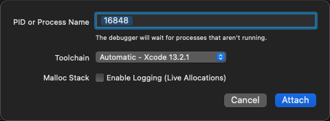
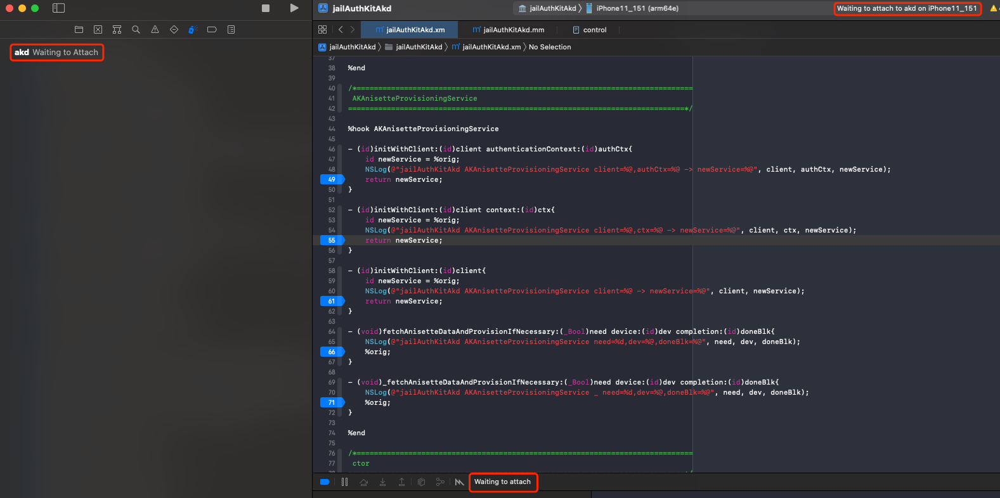
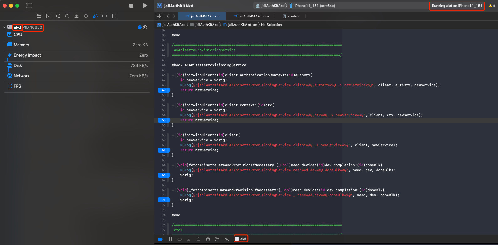

# Attach调试

## Xcode去Attach挂载调试app或二进制：通过PID或进程名

至此，目前还是和之前一样：

* 对于Xcode
  * 去Attach调试（iOS的）
    * 操作步骤：`Xcode`-》`Debug`-》`Attach to Process by PID or Name` -》`PID or Process Name`
    * 调试内容：
      * app=Application=应用=程序
        * 结论：只能用PID，而无法用Name
        * 举例
          * 设置=`Preferences`
            * 相关信息
              * 包名：`com.apple.Preferences`
              * 二进制位置：`/Applications/Preferences.app/Preferences`
            * 结论：无法通过`com.apple.Preferences`或`Preferences`的Name去Attach调试
              * 只能通过（`ps -A | grep Preferences` 找到的）`PID`值，去Attach调试
      * Executables=可执行文件=binary=二进制
        * 结论：可以用Name（二进制名称）
        * 举例
          * akd
            * 二进制位置：`/System/Library/PrivateFrameworks/AuthKit.framework/akd`
            * 结论：可以用akd直接去调试二进制
              * 而无需用PID值（先用`ps`查看到PID，再输入PID值）
    * 成功调试时的现象
      * PID or Process Name在输入PID值/Name后
        * 图
          * 
          * 
        * 此处要稍等等待一会（大概几十秒）
      * 然后会出现提示：`Waiting to attach`
        * PID值/Name
          * 
          * 
      * 再稍等一下（大概几秒），就会显示正常的提示：
        * PID值/Name
          * 具体现象
            * 右下角：调试窗口：显示出进程PID值/Name
            * 右上角：状态信息显示：`Running PID值/Name on iPhone`
            * 左上角：Debug Navigator中显示出PID值/Name和当前硬件信息：CPU、Memory等等
          * 图
            * 
            * 
