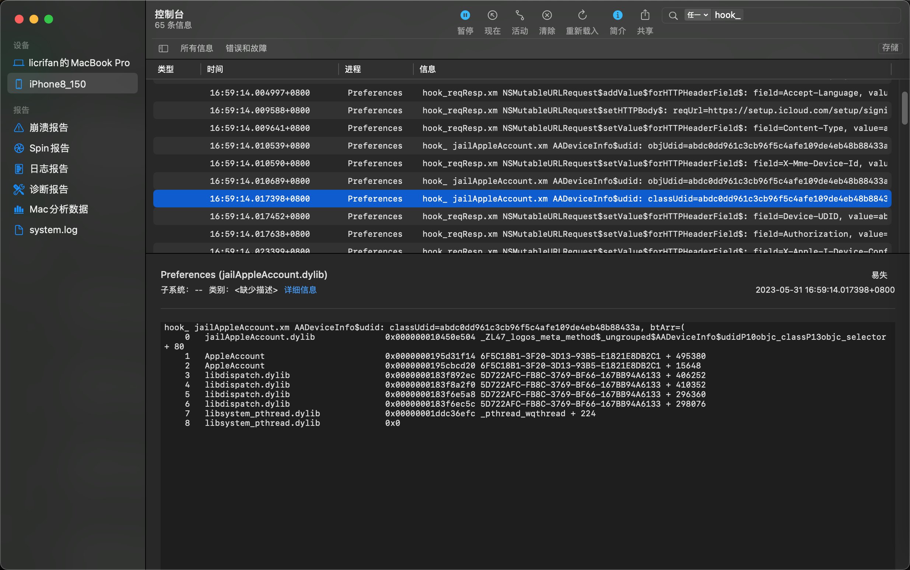

# 函数调用堆栈

* 查看函数调用堆栈
  * 已知的传统手段：`Xcode`/`lldb`中，用命令：`bt`
  * 新的手段：tweak插件的hook代码中，调用：`[NSThread callStackSymbols]`

## `[NSThread callStackSymbols]`效果举例

代码：

```objc
NSArray *btArr = [NSThread callStackSymbols];
```

输出函数调用堆栈的信息：

```bash
btArr=(
    0   jailAppleAccount.dylib              0x000000010450e504 _ZL47_logos_meta_method$_ungrouped$AADeviceInfo$udidP10objc_classP13objc_selector + 80
    1   AppleAccount                        0x0000000195d31f14 6F5C18B1-3F20-3D13-93B5-E1821E8DB2C1 + 495380
    2   AppleAccount                        0x0000000195cbcd20 6F5C18B1-3F20-3D13-93B5-E1821E8DB2C1 + 15648
    3   libdispatch.dylib                   0x0000000183f892ec 5D722AFC-FB8C-3769-BF66-167BB94A6133 + 406252
    4   libdispatch.dylib                   0x0000000183f8a2f0 5D722AFC-FB8C-3769-BF66-167BB94A6133 + 410352
    5   libdispatch.dylib                   0x0000000183f6e5a8 5D722AFC-FB8C-3769-BF66-167BB94A6133 + 296360
    6   libdispatch.dylib                   0x0000000183f6ec5c 5D722AFC-FB8C-3769-BF66-167BB94A6133 + 298076
    7   libsystem_pthread.dylib             0x00000001ddc36efc _pthread_wqthread + 224
    8   libsystem_pthread.dylib             0x0
```



说明：只不过，是不带符号的，只有地址。不容易看出具体细节信息。
