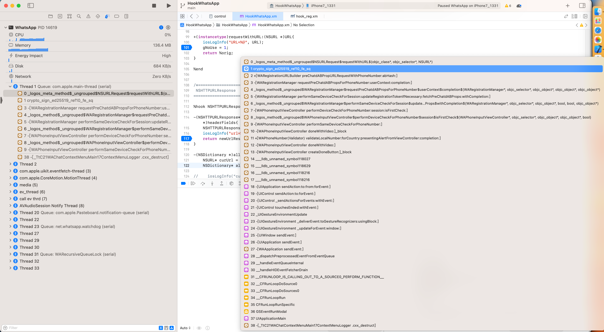

# 函数名不一致

心得：Xcode中UI看到的函数调用堆栈中的函数，未必准确，有时候是在bt中才能看到真正的函数

举例：

看到的是：

* `crypto_sign_ed25519_ref10_fe_sq`



切换过去，但是当前窗口没变化：没有切换到：`crypto_sign_ed25519_ref10_fe_sq`的汇编代码窗口

而回头才注意到：

其实bt中的函数调用堆栈：

```bash
(lldb) bt
* thread #1, queue = 'com.apple.main-thread', stop reason = breakpoint 20.1
  * frame #0: 0x000000010a411ca8 HookWhatsApp.dylib`_logos_meta_method$_ungrouped$NSURLRequest$requestWithURL$(self=NSMutableURLRequest, _cmd="requestWithURL:", URL="https://v.whatsapp.net/v2/reg_onboard_abprop?cc=1&in=8784650468&rc=0&ab_hash=2mnxZr") at HookWhatsApp.xm:101:12
    frame #1: 0x00000001088e6798 SharedModules`+[NSMutableURLRequest(Additions) wa_requestWithURL:attribution:] + 28
    frame #2: 0x0000000104bd05c4 WhatsApp`+[WARegistrationURLBuilder preChatdABPropURLRequestWithPhoneNumber:abHash:] + 56
    frame #3: 0x0000000104bd75c4 WhatsApp`-[WARegistrationManager requestPreChatdABPropsForPhoneNumber:userContext:completion:] + 112
...
```

其实是：

* `    frame #1: 0x00000001088e6798 SharedModules`+[NSMutableURLRequest(Additions) wa_requestWithURL:attribution:] + 28`

即：真正的函数是：`+[NSMutableURLRequest(Additions) wa_requestWithURL:attribution:]`等相关调用
