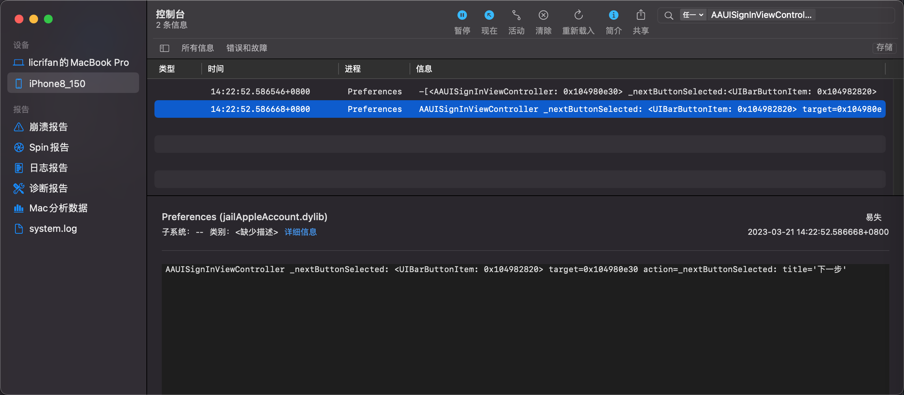
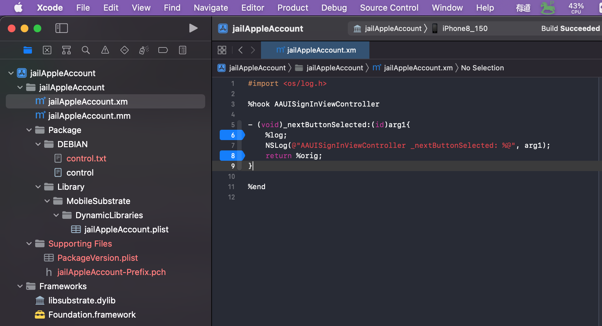
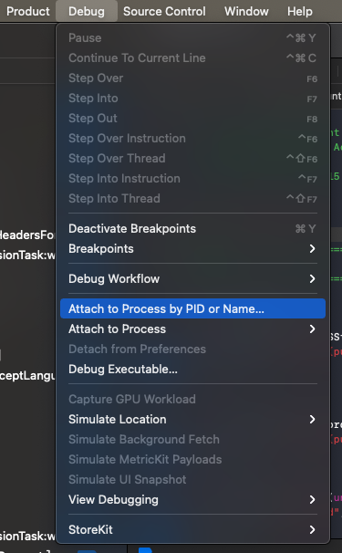
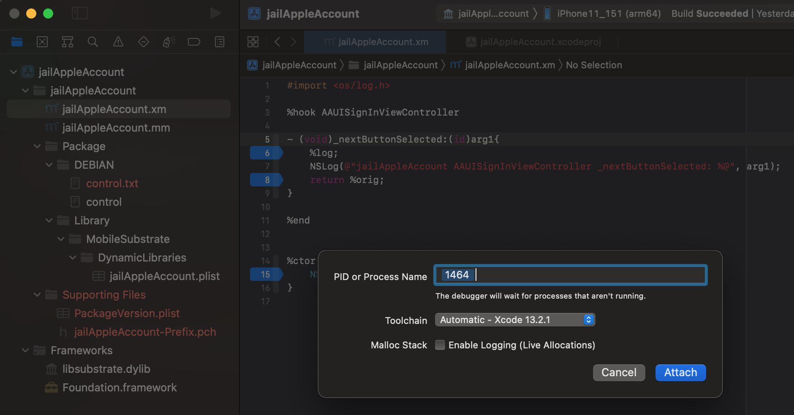
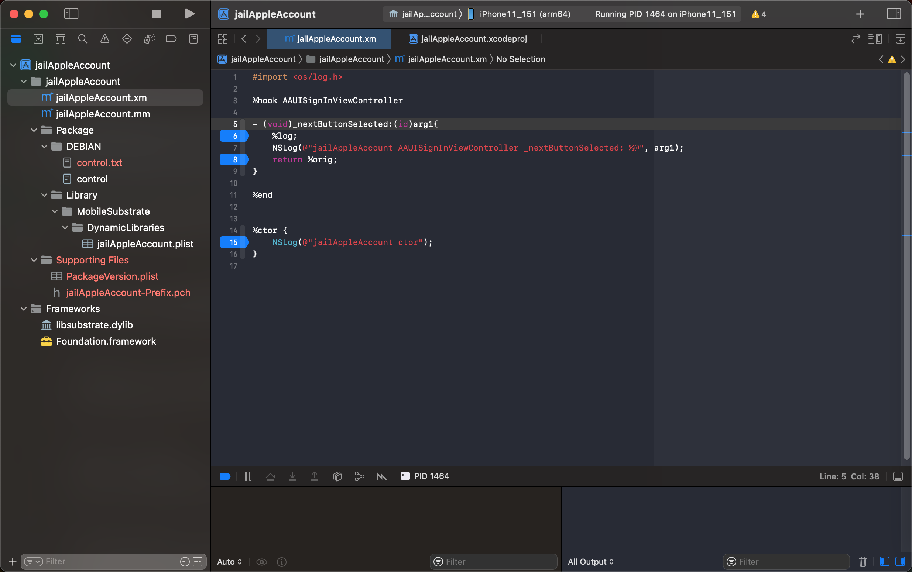
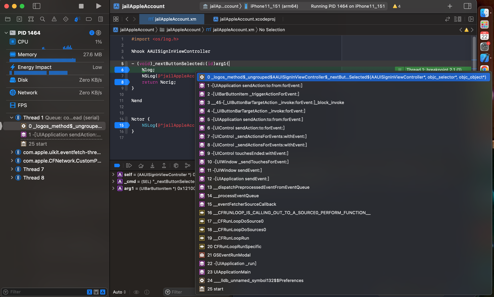

# 实时调试hook代码

* 背景
  * 想要调试iOS的程序：`设置`=`Preferences`
  * 对于设备
    * iPhone8
      * A11，iOS 15.0，palera1n普通越狱
    * iPhone11
      * A12，iOS 15.1，XinaA15的rootless越狱
  * 之前都没有很好的效果：
    * frida
      * 之前偶尔还能调试
      * 现在始终会崩溃Process terminated
    * Xcode调试
      * 只能iPhone11中才能调试
        * 但是也只是Attach上去调试，无法加hook代码的
      * 但是又和iPhone8中的逻辑，未必完全对的上，因为iOS版本不完全一样（15.0和15.1）
* 需求
  * 想要在Xcode中实时调试iOSOpenDev的hook插件代码
    * 优点：Xcode中调试会比Frida稳定多了（不会经常崩溃退出）

## 具体步骤

### 新建iOSOpenDev的hook插件项目

具体可参考：

[普通的插件开发流程 · iOS逆向开发：iOSOpenDev开发插件 (crifan.org)](https://book.crifan.org/books/ios_re_iosopendev_tweak/website/normal_tweak_process/)

确保完成基本的环境：

* 新建iOSOpenDev的Xcode项目
* 写hook代码
* 编译
* 安装插件
* 确认插件生效
  * 

### Xcode中给代码加上断点

Xcode中，写好hook代码

```c
%hook AAUISignInViewController

- (void)_nextButtonSelected:(id)arg1{
     %log;
    NSLog(@"AAUISignInViewController _nextButtonSelected: %@", arg1);
     return %orig;
}
```

给代码加上断点：



### Attach挂载进程

先确保进程是可以被调试的

然后去Xcode中，挂载进程：

找到要被调试的二进制=服务=进程=此处的：`Preferences`



注，此处

* 其他方式都不行
  * `Xcode`->`Debug`->`Attach to Process`->`Getting Process List`
    * 找不到Preferences的进程
  * `Xcode`->`Debug`->`Attach to Process by PID or Name`->`PID or Process Name`
    * 用name也都不行
      * `Preferences`
      * `com.apple.Preferences`
* 只好换：`PID`
  * `Xcode`->`Debug`->`Attach to Process by PID or Name`->`PID or Process Name`
    * 
  * 说明
    * PID的值：可以通过ssh的命令去查找到
      ```bash
      ps -A | grep Preferences
      ```
      * 此处输出：
        ```bash
        iPhone11-151:~ root# ps -A | grep Preferences
          72 ??         0:00.15 /System/Library/PrivateFrameworks/NanoPreferencesSync.framework/nanoprefsyncd -companion
          157 ??         0:01.29 /System/Library/PrivateFrameworks/IntlPreferences.framework/Support/localizationswitcherd
        1464 ??         0:06.02 /Applications/Preferences.app/Preferences
        1720 ttys000    0:00.01 grep Preferences
        ```
      * 得到：`Preferences`的PID是：`1464`

显示 PID 和 Running了 -> 表示Attach上了：



### 触发断点

此处，去app中操作页面，触发到被hook的代码的逻辑

具体此处操作是：设置中点击登录的下一步，触发到此处代码逻辑

即可触发断点：



函数调用堆栈：

```bash
(lldb) bt
* thread #1, queue = 'com.apple.main-thread', stop reason = breakpoint 2.1
  * frame #0: 0x00000001077cfe60 jailAppleAccount.dylib`_logos_method$_ungrouped$AAUISignInViewController$_nextButtonSelected$(self=0x0000000107015610, _cmd="_nextButtonSelected:", arg1=0x000000012100b280) at jailAppleAccount.xm:6:2 [opt]
    frame #1: 0x0000000183ba6bf0 UIKitCore`-[UIApplication sendAction:to:from:forEvent:] + 100
    frame #2: 0x0000000183e85b80 UIKitCore`-[UIBarButtonItem _triggerActionForEvent:] + 180
    frame #3: 0x0000000183e6f880 UIKitCore`__45-[_UIButtonBarTargetAction _invoke:forEvent:]_block_invoke + 40
    frame #4: 0x0000000183e6f730 UIKitCore`-[_UIButtonBarTargetAction _invoke:forEvent:] + 204
    frame #5: 0x0000000183ba6bf0 UIKitCore`-[UIApplication sendAction:to:from:forEvent:] + 100
    frame #6: 0x0000000183cd2a4c UIKitCore`-[UIControl sendAction:to:forEvent:] + 128
    frame #7: 0x0000000183a4e2c8 UIKitCore`-[UIControl _sendActionsForEvents:withEvent:] + 352
    frame #8: 0x0000000183a4e318 UIKitCore`-[UIControl _sendActionsForEvents:withEvent:] + 432
    frame #9: 0x0000000183d7d7c0 UIKitCore`-[UIControl touchesEnded:withEvent:] + 536
    frame #10: 0x000000018385107c UIKitCore`-[UIWindow _sendTouchesForEvent:] + 980
    frame #11: 0x0000000183882a84 UIKitCore`-[UIWindow sendEvent:] + 4456
    frame #12: 0x0000000183a32318 UIKitCore`-[UIApplication sendEvent:] + 828
    frame #13: 0x0000000183855c30 UIKitCore`__dispatchPreprocessedEventFromEventQueue + 7904
    frame #14: 0x000000018384aa1c UIKitCore`__processEventQueue + 6760
    frame #15: 0x000000018384fec8 UIKitCore`__eventFetcherSourceCallback + 172
    frame #16: 0x00000001812f3020 CoreFoundation`__CFRUNLOOP_IS_CALLING_OUT_TO_A_SOURCE0_PERFORM_FUNCTION__ + 28
    frame #17: 0x0000000181303ce0 CoreFoundation`__CFRunLoopDoSource0 + 208
    frame #18: 0x000000018123dfe8 CoreFoundation`__CFRunLoopDoSources0 + 268
    frame #19: 0x00000001812437f4 CoreFoundation`__CFRunLoopRun + 820
    frame #20: 0x00000001812573b8 CoreFoundation`CFRunLoopRunSpecific + 600
    frame #21: 0x000000019cbe738c GraphicsServices`GSEventRunModal + 164
    frame #22: 0x0000000183bf76a8 UIKitCore`-[UIApplication _run] + 1100
    frame #23: 0x00000001839767f4 UIKitCore`UIApplicationMain + 2092
    frame #24: 0x000000010489cc0c Preferences`___lldb_unnamed_symbol132$$Preferences + 60
    frame #25: 0x00000001049d5a24 dyld`start + 520
```

如此，即可愉快的：

用Xcode+iOSOpenDev，去实时的动态的调试iOS的app的代码逻辑了。

总体效果：

虽然有点麻烦：

* 每次改动插件代码后：
  * 不能像MonkeyDev那么直接启动调试
  * 而是要：重新编译并安装插件，再去Attach，才能调试

但是UI界面的调试，比之前的：

* 没有插件代码
* 只有frida的js脚本
  * 且很容易崩溃

的效率要高多了

## 总结

此处目前是：

* iPhone11
  * iOS 15.1
  * XinaA15越狱
    * 其自动重签名了debugserver，使得Xcode可以Attach挂载调试任意进程

可以去：

* Xcode+iOSOpenDev编译安装deb插件到iPhone11
* 手动启动Preferences设置后，Xcode去Attach挂载到Preferences的进程
  * 在PID  or Process Name中输入：PID值

设置页面中，正常去操作：

输入账号，点击下一步按钮

-》最终可以触发到Xcode中插件的hook代码的断点的

-》后续可以进一步去调试逻辑了。
