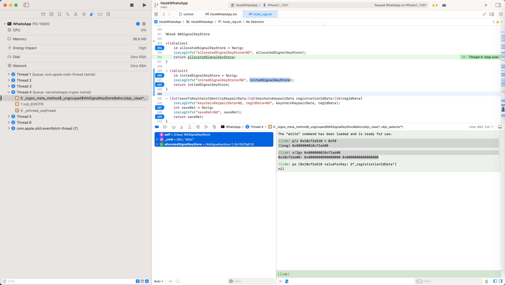
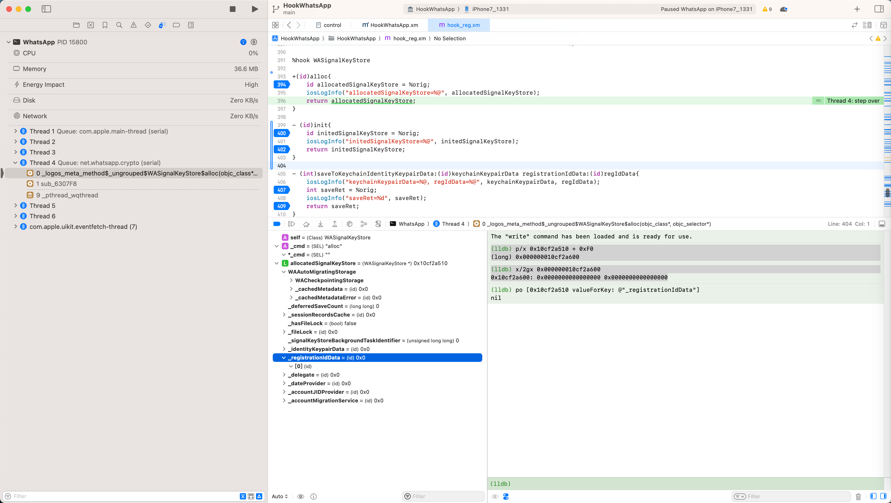
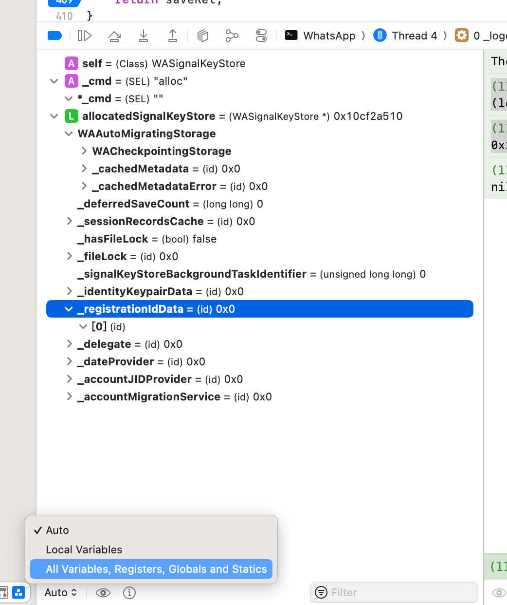
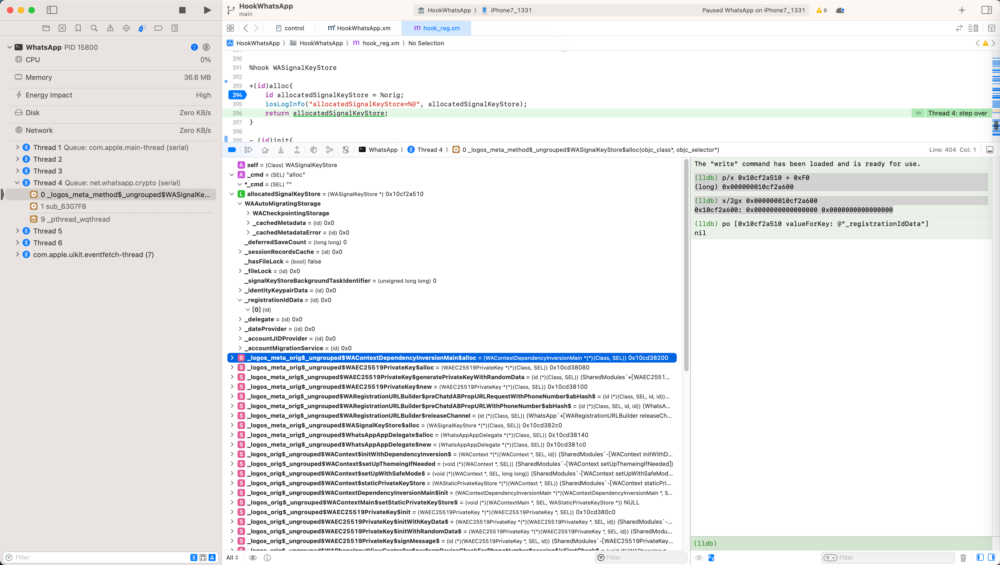
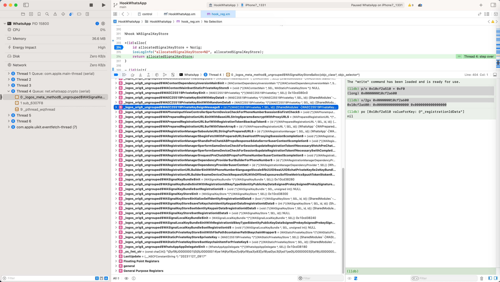
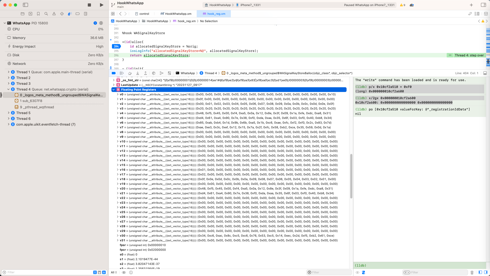
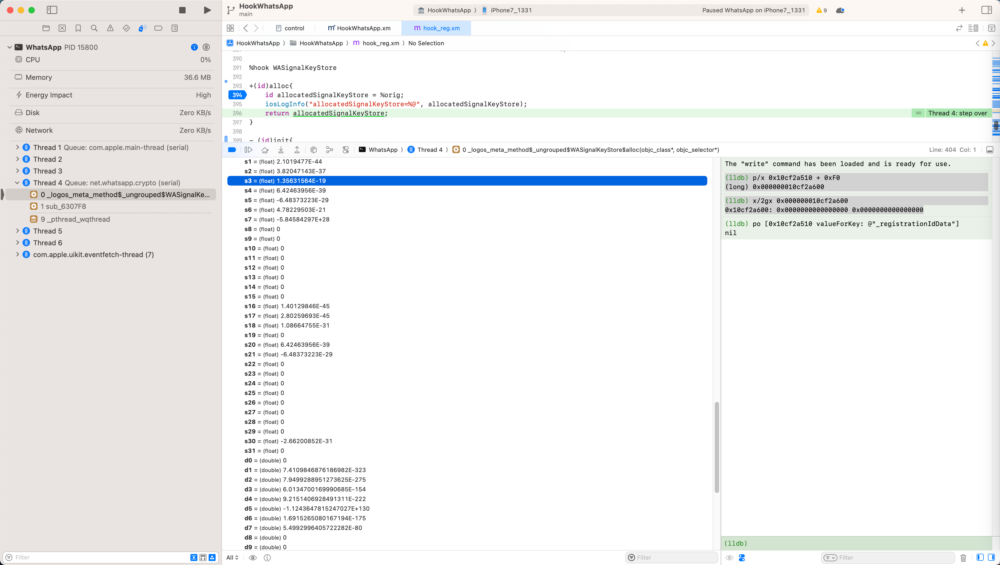
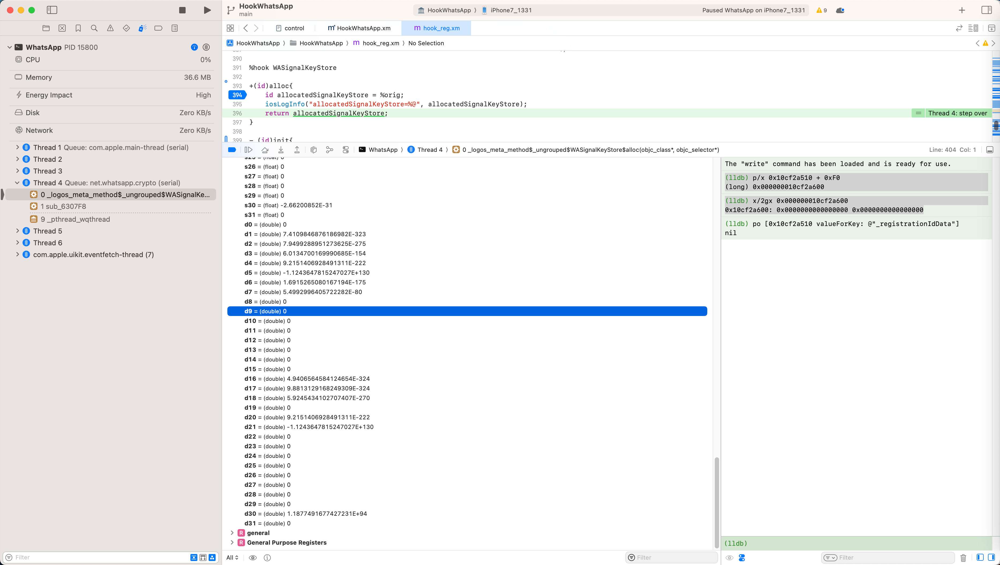
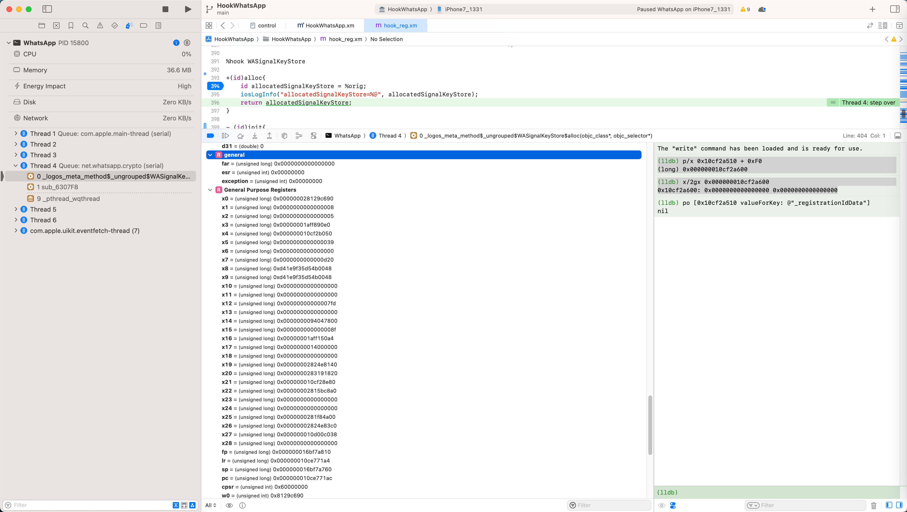
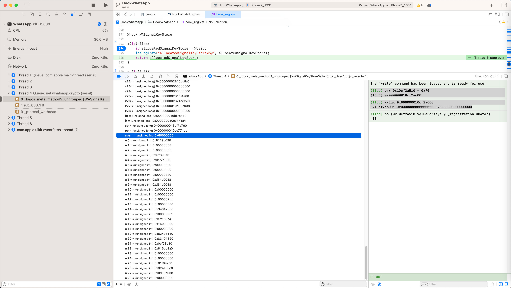

# 查看当前所有变量值

Xcode调试期间，正常来说，左下角可以查看到当前变量值：



如果想要查看属性值，点击大于号>，去展开：



而此处发现个更好用的：

如果想要查看：

全部变量值 = 除了当前局部变量值之外，也显示全局变量值等等

可以点击下面的Auto，切换为：

* All Variables, Registers, Globals and Statics
  * 

可以显示：

更多的，全局变量，寄存器、静态变量等等值：





点击展开：

* Floating Point Registers

可以查看到：

更多的浮点寄存器值







展开：

* General

可以看到：

* far
* esr
* exception

的值：



以及：

* 通用寄存器 General Purpose Registers

的值：




如此：

可以更加方便的调试程序了：

不需要经常的用：

```bash
reg r
```

去查看所有寄存器的值了

直接从此处窗口即可查看变量值

不过也有小缺点：显示太多值，好像会拖慢调试速度。

如果如果经常频繁调试，貌似：也不太适合始终打开和显示这么多值。
