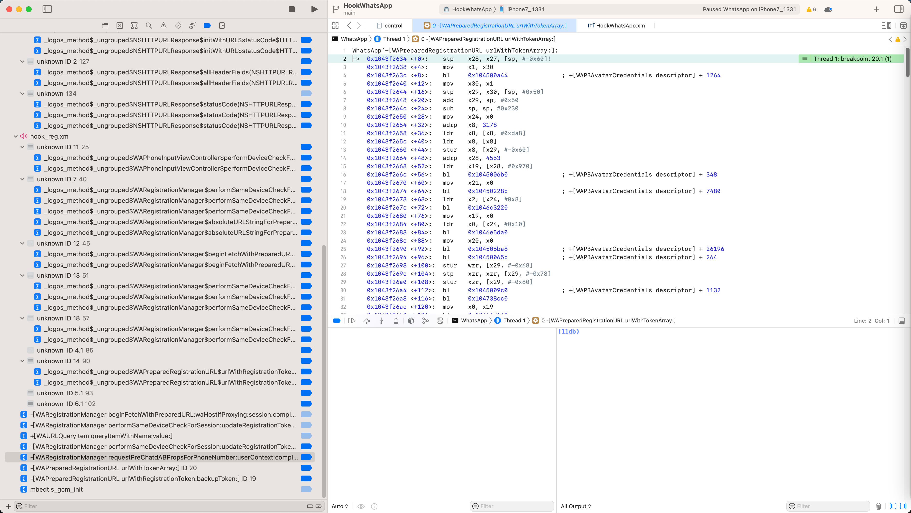

# xm文件无法定位到源代码位置

Xcode调试iOSOpenDev的xm文件无法定位到源代码位置

## 现象

之前用Xcode去调试iOSOpenDev的Logos插件代码时，遇到一个问题：

部分断点

比如：

```c
%hook WARegistrationManager

- (void)performSameDeviceCheckForSession:(id)session updateRegistrationTokenIfNecessary:(_Bool)isUpdateRegToken withCompletion:(id)doneBlk{
    iosLogInfo("session=%@, isUpdateRegToken=%s, doneBlk=%@", session, boolToStr(isUpdateRegToken), doneBlk);
    %orig;
}
```

的`%orig`的断点：


虽然触发了，但是触发时，没有定位到xm源代码文件的对应源代码位置

而是只是显示打开了xm文件，但是是空的显示：


## 尝试解决的过程

此时拷贝出函数调用堆栈的第一行，是：

```bash
#0    0x0000000109aabc08 in _logos_method$_ungrouped$WARegistrationManager$performSameDeviceCheckForSession$updateRegistrationTokenIfNecessary$withCompletion$(WARegistrationManager*, objc_selector*, objc_object*, bool, objc_object*) at /xxx/WhatsApp/dynamicDebug/iOSOpenDev_WhatsApp/HookWhatsApp/HookWhatsApp/hook_reg.xm:51
```

此时，只能切换到项目源码显示tab窗口：


然后右键该文件：`hook_reg.xm`


Open As->Source Code


才能显示出：

真正的代码所在的行数

而此问题：

之前以为是：`.xm`的`%orig`，内部对应着的具体实现：`.mm`文件

而.mm文件中的代码，是多行：


```c
static void _logos_method$_ungrouped$WARegistrationManager$performSameDeviceCheckForSession$updateRegistrationTokenIfNecessary$withCompletion$(_LOGOS_SELF_TYPE_NORMAL WARegistrationManager* _LOGOS_SELF_CONST __unused self, SEL __unused _cmd, id session, _Bool isUpdateRegToken, id doneBlk){
    iosLogInfo("session=%@, isUpdateRegToken=%s, doneBlk=%@", session, boolToStr(isUpdateRegToken), doneBlk);
    _logos_orig$_ungrouped$WARegistrationManager$performSameDeviceCheckForSession$updateRegistrationTokenIfNecessary$withCompletion$(self, _cmd, session, isUpdateRegToken, doneBlk);
}
```

不好映射会.xm中，所导致的

所以后续去加上了，单独的一行代码：

```c
    gNoUse = 1;
```

变成：

```c
- (void)performSameDeviceCheckForSession:(id)session updateRegistrationTokenIfNecessary:(_Bool)isUpdateRegToken withCompletion:(id)doneBlk{
    iosLogInfo("session=%@, isUpdateRegToken=%s, doneBlk=%@", session, boolToStr(isUpdateRegToken), doneBlk);
    gNoUse = 1;
    %orig;
}
```

此时，加断点的地方，也不给%orig加断点了，而给新加的独立的一行加断点


如此，再去调试，以为就解决问题了

但是发现并没有，而是：问题依旧


难道是：

注意到了一个细节：

* 最开始，各种断点，都是可以正常显示的
  * 包括普通代码简单的行的断点
    * 
  * 和此处复杂的，带%orig的断点
    * 
* 但是后来触发过：汇编代码的断点
  * 

然后就回来找不到，不容易匹配到：源代码（.xm文件）中的断点了？

那去试试：

把之前的2个汇编断点，临时禁用掉：


注：剩下断点全部都只是iOSOpenDev的Logos代码，.xm文件中的断点了

看看效果：

还真的可以了：


此处代码：

可以触发到了：

```c
- (void)performSameDeviceCheckForSession:(id)session updateRegistrationTokenIfNecessary:(_Bool)isUpdateRegToken withCompletion:(id)doneBlk{
    iosLogInfo("session=%@, isUpdateRegToken=%s, doneBlk=%@", session, boolToStr(isUpdateRegToken), doneBlk);
    gNoUse = 1;
    %orig;
}
```

中的：

* `gNoUse = 1;`


这一行代码的断点了。

而没有显示文件类型错误

至此，再去恢复之前几个断点：


触发后续汇编代码：




-》果然，就又出现之前问题了：


再触发过：断点，显示过 汇编代码后

再去触发断点，要显示.xm中的断点的代码时

`.xm`文件被识别为音频`Audio`

无法打开

之前再去切换过去：

源码方式显示


才能正常代码

且也没有显示 深蓝色的底色的断点的效果。

那此处，总不能不加断点，不显示汇编代码界面啊
所以此处暂时是：知道了原因，但是没有解决方案

另外，怀疑是：

此处`.xm`文件被误判为`Audio`音频文件

能否通过彻底：

去掉此处Xcode识别.xm为音频文件，而规避问题，让此处.xm直接显示源码，永远不显示Audio图标了？

现在去找找

所以转去：
【未解决】Xcode中如何更改.xm文件默认文件类型为不是Audio音频文件改为Objc的C++源码文件

突然想到是：

前面的，显示汇编代码后

之前的，给.xm设置的文件类型ObjC的C++，就失效了，.xm就被识别为，默认的文件类型：Audio了

-》所以问题根源是：

为何，显示汇编代码后，就会冲突掉之前给.xm自定义设置的文件类型（ObjC的C++）？

最终问题依旧，无法解决。

### 规避办法

后来在：

【未解决】iOS逆向WhatsApp：-[WAContext initWithDependencyInversion:]

期间，又遇到此问题

不过另外，摸索出一个，相对来说稍微快一点点的，不用切换到项目文件列表的，手动修复方式：

对于显示为空的内容，去点击右上角：显示文件属性：


点击 Type，切换一下

比如，从当前的`Objective-C Source`，切换成：`Objective-C++ Source`


此时即可以源码 源代码方式显示文件了：


此时，再去点击左边的 Thread的最新一行 == 函数调用堆栈中当前的代码：


即可，跳转代码到，触发断点的这一行。

总体虽然麻烦点，但还算能接受。

注：只能说是是规避办法，还是无法彻底解决。
