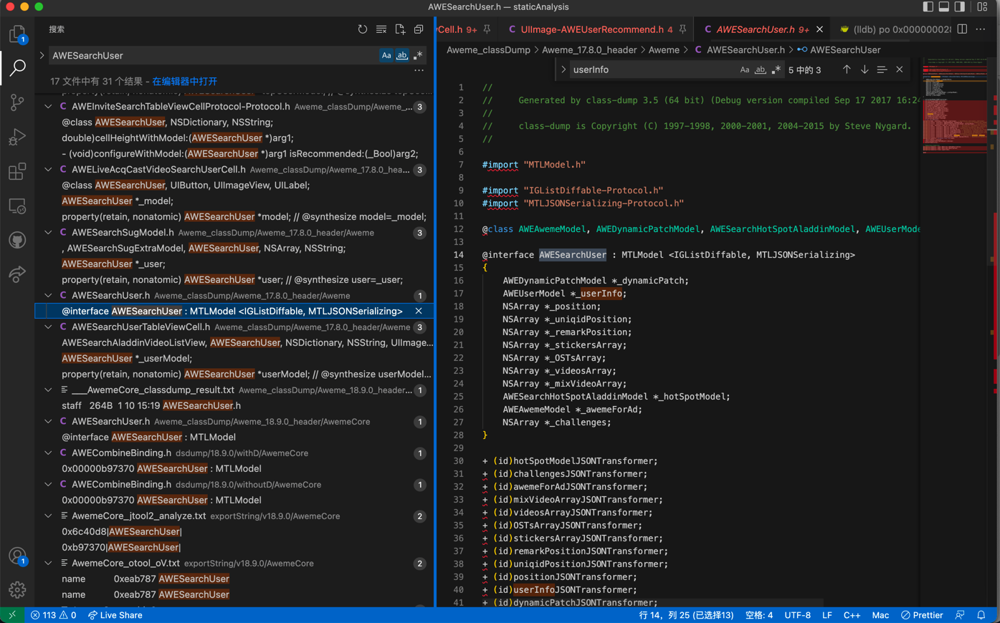
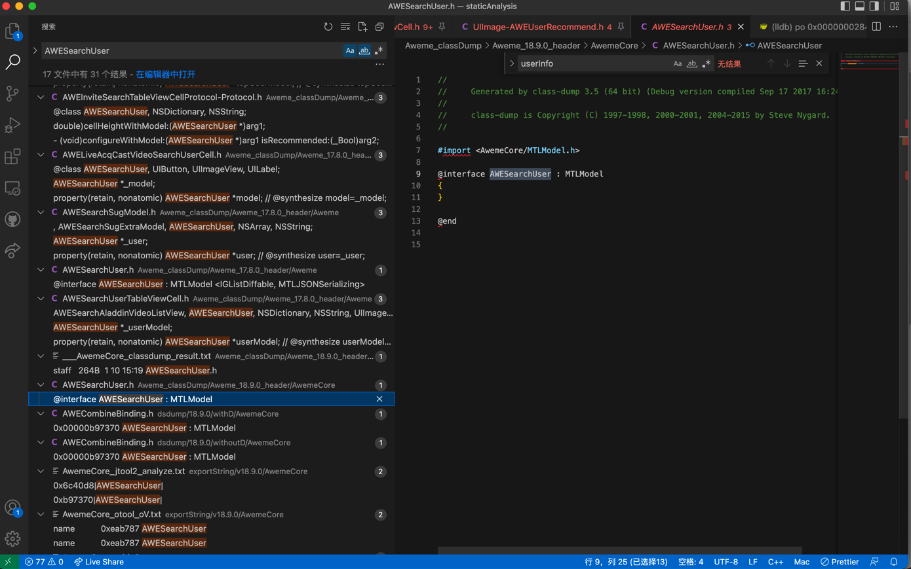

# 试试新旧不同版本

* iOS逆向心得：新版导出头文件是空时，可以**试试旧版本**或许可以导出有价值的类的定义

比如抖音的逆向

之前旧版本：`17.8.0`

后来新版本，比如：`18.9.0`

其中都是去做了：

砸壳得到ipa，从ipa的二进制去用class-dump导出头文件

结果发现，虽然导出的头文件中的文件个数，类名，基本没变化

但是：

* 旧版：往往都能看到类的细节
  * `Aweme_classDump/Aweme_17.8.0_header/Aweme/AWESearchUser.h`
    * 
* 新版：看不到任何类的细节
  * `Aweme_classDump/Aweme_18.9.0_header/AwemeCore/AWESearchUser.h`
    * 

-》由此反推：

抖音的新版本，做了更强的反破解的逻辑

使得class-dump导出头文件，虽然有类，但类的定义（属性、函数等）都是空的

-》以及平时调试期间，更多的可以去：

使用（导出了更多的类的属性、函数等细节的）旧版本

作为调试的依旧，毕竟新版本很多类的信息都是空，无从下手

-》总之，核心思路是：

需要时，除了新版本外，也去试试，旧版本的，导出的头文件，有利于找到更多有价值的资料和思路，提高逆向分析和调试的效率
