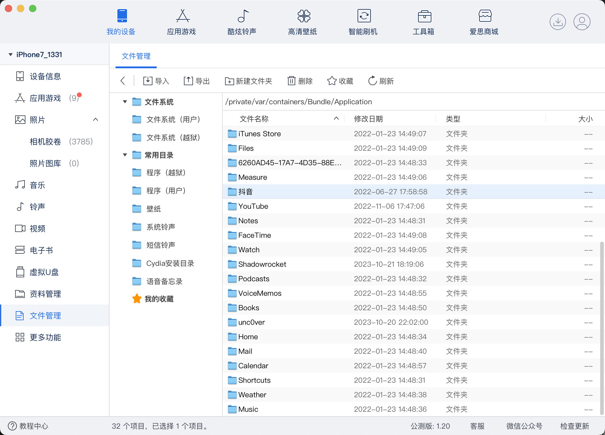
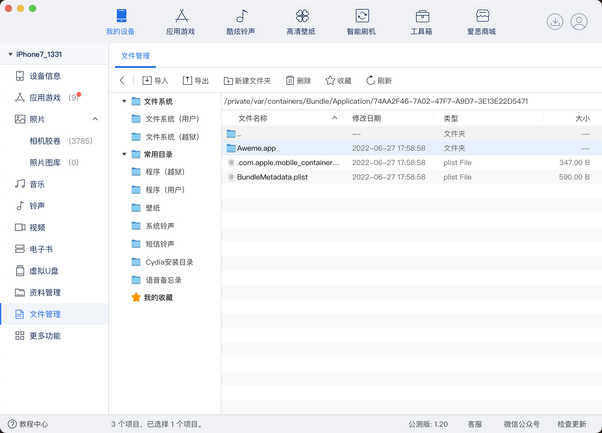
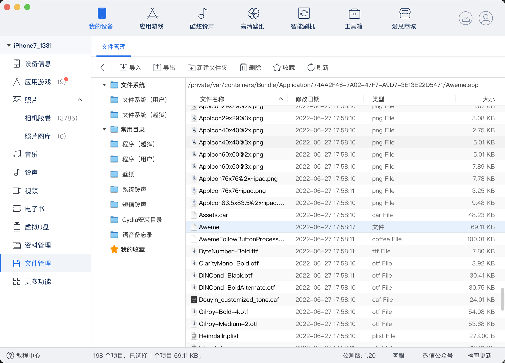
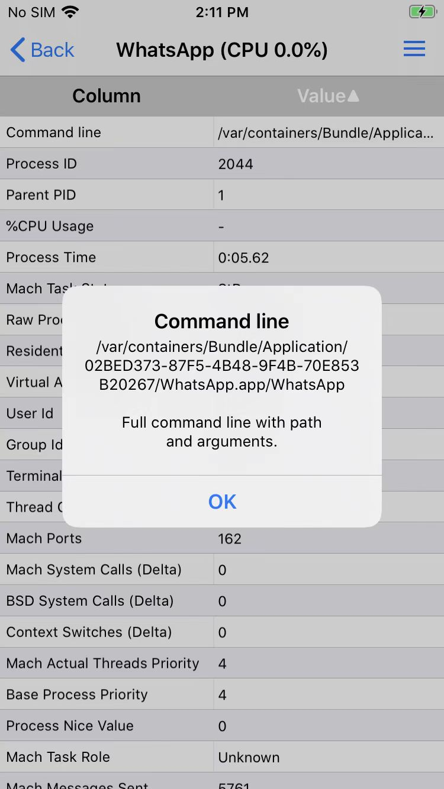

# 二进制文件路径

动态调试iOS的app：核心二进制=主二进制 之前，往往要知道：

iOS的主二进制，在iPhone中的完整路径

即：获取iOS的app的主二进制=核心二进制=入口二进制，在iPhone中的完整路径

* iOS的app的核心二进制=主二进制=入口二进制
  * 完整路径
    * `/var/containers/Bundle/Application/yyyy/xxx.app/xxx`
      * 举例
        * WhatsApp
          * `/var/containers/Bundle/Application/2BE964D4-8DF0-4858-A06D-66CA8741ACDC/WhatsApp.app/WhatsApp`

## 查看方式

* 查看方式
  * 概述
    * 爱思助手：文件系统（越狱）-》`/var/containers/Bundle/Application/` -》能看到解析后的app的名字-》点击进去-》底部会显示路径
    * CocoaTop：运行app-》查看进程信息-》Command Line
    * lldb命令行：`image list -o -f`的第一个
  * 详解
    * 方式1：通过爱思助手，查看已安装的app的相关路径
      * 抖音：`/private/var/containers/Bundle/Application/74AA2F46-7A02-47F7-A9D7-3E13E22D5471/Aweme.app/Aweme`
        * `爱思助手`->`文件管理`->`文件系统`->`文件系统（越狱）`
          * 
          * 
          * 
    * 方式2：通过前面的Attach模式调试期间，通过`image list -o -f`查看得到
      * 举例
        * `WhatsApp`：`/private/var/containers/Bundle/Application/CCFD22D2-32EE-4F23-9C81-226663100D40/WhatsApp.app/WhatsApp`
          * Attach模式调试时可查看到
            ```bash
            (lldb) image list -o -f
            [  0] 0x0000000004c6c000 /private/var/containers/Bundle/Application/CCFD22D2-32EE-4F23-9C81-226663100D40/WhatsApp.app/WhatsApp(0x0000000104c6c000)
            ...
            ```
    * 方式3：（app正在运行时）通过`CocoaTop`查看进程详情中的`Command Line`可以看到二进制完整路径
      * 举例
        * WhatsApp
          * 
