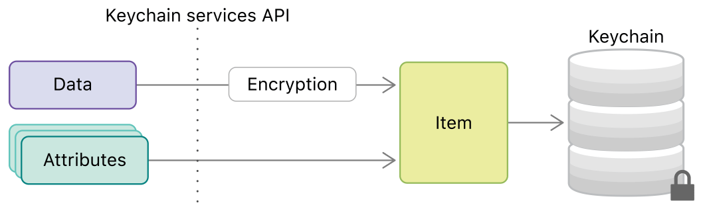

# Keychain数据库

## 背景

iOS逆向调试，后来遇到了：Keychain数据库

去整理相关内容

## Keychain数据库

* Keychain数据库
  * `Keychain`=中文：`钥匙链`
  * 是什么：Apple中（iOS/Mac）用来保存加密等相关安全方面的数据的
* iOS中的Keychain数据库
  * 位置：`/var/Keychains/keychain-2.db`
    * 
  * 内部格式：`SQLite3`
  * 如何打开：
    * Mac中的工具：`DB Browser for SQLite`
      * 效果
        * 
  * 读写Keychain数据库的相关函数
    * 写入
      * SecItemAdd
        * [SecItemAdd | Apple Developer Documentation](https://developer.apple.com/documentation/security/1401659-secitemadd?language=objc)
    * 读取
      * SecItemCopyMatching
        * [SecItemCopyMatching | Apple Developer Documentation](https://developer.apple.com/documentation/security/1398306-secitemcopymatching?language=objc)
    * 更新
      * SecItemUpdate
        * [SecItemUpdate | Apple Developer Documentation](https://developer.apple.com/documentation/security/1393617-secitemupdate?language=objc)
    * 删除
      * SecItemDelete
        * [SecItemDelete | Apple Developer Documentation](https://developer.apple.com/documentation/security/1395547-secitemdelete?language=objc)
  * 相关文档
    * [Keychain items | Apple Developer Documentation](https://developer.apple.com/documentation/security/keychain_services/keychain_items?language=objc)
      * 
      * [Item class keys and values | Apple Developer Documentation](https://developer.apple.com/documentation/security/keychain_services/keychain_items/item_class_keys_and_values?language=objc)
    * [Keychain services | Apple Developer Documentation](https://developer.apple.com/documentation/security/keychain_services?language=objc)
      * 
    * [Using the keychain to manage user secrets | Apple Developer Documentation](https://developer.apple.com/documentation/security/keychain_services/keychain_items/using_the_keychain_to_manage_user_secrets?language=objc)
    * [TN3137: On Mac keychain APIs and implementations | Apple Developer Documentation](https://developer.apple.com/documentation/technotes/tn3137-on-mac-keychains?language=objc)

## 举例

### WhatsApp

#### Keychain读写相关

WhatsApp中，就有很多代码，与Keychain读写相关：

* 【未解决】iOS逆向WhatsApp：-[WASignalCoordinator regenerateKeyStore]
* 【未解决】iOS逆向WhatsApp：-[WASignalKeyStore saveToKeychainIdentityKeypairData:registrationIdData:]
  * 保存写入IdentityKeypairData、registrationIdData等值到Keychain数据库
  * 其中会调用到SecItemAdd、SecItemUpdate等函数
    ```c
    int __cdecl -[WASignalKeyStore saveToKeychainIdentityKeypairData:registrationIdData:](
            WASignalKeyStore *self,
            SEL a2,
            id inputIdentityKeypairData,
            id inputRegistrationIdData)
    {
    ...
      if ( SecItemAdd_2494(baseKeychainQueryToAdd, addResult) )
      {
    ...
        saveResult = SecItemUpdate(newDictToAdd, addResult1);
    ...
    ```

#### SecItem相关代码输入和输出结果

【未解决】iOS逆向WhatsApp：-[WASignalKeyStore fetchFromKeychainIdentityKeypairData:registrationIdData:]

中：

代码：

IDA伪代码：

```c
      queryRet1 = SecItemCopyMatching_24A0((CFDictionaryRef)baseKeychainQuery2, result);
```

Xcode汇编代码：

```asm
    0x10ba8d3cc <+168>:   bl     0x10bb064a0              ; symbol stub for: SecItemCopyMatching
    0x10ba8d3d0 <+172>:   mov    x28, x0
```

此时输入参数：

```bash
(lldb) reg r x0 x1
      x0 = 0x00000002816ee300
      x1 = 0x000000016b2da558
(lldb) po 0x00000002816ee300
{
    acct = Axolotl;
    agrp = "group.net.whatsapp.WhatsApp.shared";
    class = genp;
    "r_Attributes" = 1;
    svce = Axolotl;
}
(lldb) x/2gx 0x000000016b2da558
0x16b2da558: 0x0000000000000000 0x00000002827ddd70
```

相关字段含义解释：

* 要去获取的Class类是：kSecClassGenericPassword
  * 获取其中的属性
    * kSecAttrService
    * kSecAttrAccount
    * kSecAttrAccessGroup

-》

* class = genp
  * class = 要访问的类
    * 值：genp=GENeric Password = kSecClassGenericPassword
* 访问该类的这3个属性
  * acct = Axolotl;
    * acct = ACCounT = kSecAttrAccount
      * 值：Axolotl
  * agrp = "group.net.whatsapp.WhatsApp.shared"
    * agrp = Acces GRouP = kSecAttrAccessGroup
      * 值：group.net.whatsapp.WhatsApp.shared
  * svce = Axolotl
    * svce=SerViCE = kSecAttrService
      * 值：Axolotl
* 后续新增的：
  * "r_Attributes" = 1;
    * 返回属性值 = dict字典
  * "r_Data" = 1;
    * 返回Data数据=NSData

运行后，输出结果：

```bash
(lldb) reg r x0
      x0 = 0x0000000000000000
(lldb) x/2gx 0x000000016b2da558
0x16b2da558: 0x00000002803a1800 0x00000002827ddd70
(lldb) po 0x00000002803a1800
{
    accc = "<SecAccessControlRef: cku>";
    acct = Axolotl;
    agrp = "group.net.whatsapp.WhatsApp.shared";
    cdat = "2023-10-19 03:12:17 +0000";
    gena = {length = 4, bytes = 0x45534916};
    mdat = "2023-10-19 03:12:17 +0000";
    musr = {length = 0, bytes = 0x};
    pdmn = cku;
    persistref = {length = 0, bytes = 0x};
    sha1 = {length = 20, bytes = 0xf77dab924958c4e14725ca4be09ee78d1a1e48c3};
    svce = Axolotl;
    sync = 0;
    tomb = 0;
}
```


其中：之前我们所要找的数据就是：

* `gena = {length = 4, bytes = 0x45534916};`
  * 中的：
    * 16进制：的`0x45534916` == 10进制的：`1163086102`

对应Keychain数据中genp表中gena的值：


保存的值，不是明文，而是SHA1加密后的值


## 附录

### /var/Keychains目录中的内容

* `/var/Keychains`目录中的内容
  * ssh命令行查看效果
    ```bash
    iPhone7-1331:/var/Keychains root# ls -lh
    total 45M
    drwxrwxr-x 29 _securityd wheel  928 Aug 22  2022 Analytics/
    -rw-------  1 _securityd wheel    2 Nov 23 08:08 SOSAccountSettings.pb
    drwx--x--x  6 _securityd wheel  192 Nov 28 09:27 SupplementalsAssets/
    -rw-------  1 _securityd wheel  24K Oct 17 08:25 TrustStore.sqlite3
    -rw-------  1 _securityd wheel  28K Oct 13 04:51 caissuercache.sqlite3
    -rw-------  1 _securityd wheel    0 Jan 23  2022 com.apple.security.exception_reset_counter.plist
    -rw-r--r--  1 root       wheel  80K Aug 17  2022 com.apple.security.keychain-defaultContext.TrustedPeersHelper.db
    -rw-r--r--  1 root       wheel  32K Nov 21 10:21 com.apple.security.keychain-defaultContext.TrustedPeersHelper.db-shm
    -rw-r--r--  1 root       wheel 2.6M Nov 27 22:21 com.apple.security.keychain-defaultContext.TrustedPeersHelper.db-wal
    drwx--x--x  5 _securityd wheel  160 Nov 28 12:07 crls/
    -rw-------  1 root       wheel  17M Nov 28 10:51 keychain-2.db
    -rw-------  1 _securityd wheel  32K Nov 21 10:21 keychain-2.db-shm
    -rw-------  1 _securityd wheel 1.1M Nov 28 10:54 keychain-2.db-wal
    -rw-------  1 _securityd wheel  17M Nov 28 08:19 keychain-2.db_orig
    -r--------  1 root       wheel 1.2M Nov 27 13:44 keychain-ota-backup.plist
    -rw-------  1 _securityd wheel 116K Nov 21 21:04 ocspcache.sqlite3
    -rw-------  1 _securityd wheel  32K Nov 21 10:21 ocspcache.sqlite3-shm
    -rw-------  1 _securityd wheel 2.2M Nov 28 11:48 ocspcache.sqlite3-wal
    -rw-------  1 _securityd wheel 272K Oct 10 21:16 pinningrules.sqlite3
    ```
  * 爱思助手查看效果
    * 
