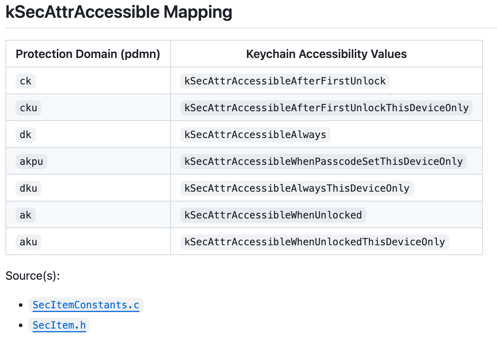

# Keychain数据库字段含义

概述：

* [SecItemConstants.c (apple.com)](https://opensource.apple.com/source/Security/Security-55471/sec/Security/SecItemConstants.c.auto.html)
  * `SEC_CONST_DECL (kSecAttrGeneric, "gena");`
* [Useful resources for working with iOS/ macOS Keychain API (github.com)](https://gist.github.com/0xmachos/5bcf2ad0085e09f3b553a88bb0e0574d)
  * `pdmn` = `Protection Domain`
    * `ck` = `kSecAttrAccessibleAfterFirstUnlock`
    * `cku` = `kSecAttrAccessibleAfterFirstUnlockThisDeviceOnly`
    * `ak` = `kSecAttrAccessibleWhenUnlocked`
    * `aku` = `kSecAttrAccessibleWhenUnlockedThisDeviceOnly`
  * 几个表
    * `genp` = `kSecClassGenericPassword`
    * `inet` = `kSecClassInternetPassword`
    * `cert` = `kSecClassCertificate`
    * `key` = `kSecClassKey`

---

详解：

* [SecItemConstants.c (apple.com)](https://opensource.apple.com/source/Security/Security-55471/sec/Security/SecItemConstants.c.auto.html)

```c
/* String constant declarations */

#define SEC_CONST_DECL(k,v) CFTypeRef k = (CFTypeRef)(CFSTR(v));

/* Class Key Constant */
SEC_CONST_DECL (kSecClass, "class");

/* Class Value Constants */
SEC_CONST_DECL (kSecClassGenericPassword, "genp");
SEC_CONST_DECL (kSecClassInternetPassword, "inet");
SEC_CONST_DECL (kSecClassAppleSharePassword, "apls");
SEC_CONST_DECL (kSecClassCertificate, "cert");
SEC_CONST_DECL (kSecClassKey, "keys");
SEC_CONST_DECL (kSecClassIdentity, "idnt");

/* Attribute Key Constants */
SEC_CONST_DECL (kSecAttrAccessible, "pdmn");
SEC_CONST_DECL (kSecAttrAccessGroup, "agrp");
SEC_CONST_DECL (kSecAttrCreationDate, "cdat");
SEC_CONST_DECL (kSecAttrModificationDate, "mdat");
SEC_CONST_DECL (kSecAttrDescription, "desc");
SEC_CONST_DECL (kSecAttrComment, "icmt");
SEC_CONST_DECL (kSecAttrCreator, "crtr");
SEC_CONST_DECL (kSecAttrType, "type");
SEC_CONST_DECL (kSecAttrLabel, "labl");
SEC_CONST_DECL (kSecAttrIsInvisible, "invi");
SEC_CONST_DECL (kSecAttrIsNegative, "nega");
SEC_CONST_DECL (kSecAttrAccount, "acct");
SEC_CONST_DECL (kSecAttrService, "svce");
SEC_CONST_DECL (kSecAttrGeneric, "gena");
SEC_CONST_DECL (kSecAttrSecurityDomain, "sdmn");
SEC_CONST_DECL (kSecAttrServer, "srvr");
SEC_CONST_DECL (kSecAttrProtocol, "ptcl");
SEC_CONST_DECL (kSecAttrAuthenticationType, "atyp");
SEC_CONST_DECL (kSecAttrPort, "port");
SEC_CONST_DECL (kSecAttrPath, "path");
SEC_CONST_DECL (kSecAttrVolume, "volm");
SEC_CONST_DECL (kSecAttrAddress, "addr");
SEC_CONST_DECL (kSecAttrAFPServerSignature, "afps");
SEC_CONST_DECL (kSecAttrAlias, "alis");
SEC_CONST_DECL (kSecAttrSubject, "subj");
SEC_CONST_DECL (kSecAttrIssuer, "issr");
SEC_CONST_DECL (kSecAttrSerialNumber, "slnr");
SEC_CONST_DECL (kSecAttrSubjectKeyID, "skid");
SEC_CONST_DECL (kSecAttrPublicKeyHash, "pkhh");
SEC_CONST_DECL (kSecAttrCertificateType, "ctyp");
SEC_CONST_DECL (kSecAttrCertificateEncoding, "cenc");
SEC_CONST_DECL (kSecAttrKeyClass, "kcls");
SEC_CONST_DECL (kSecAttrApplicationLabel, "klbl");
SEC_CONST_DECL (kSecAttrIsPermanent, "perm");
SEC_CONST_DECL (kSecAttrIsPrivate, "priv");
SEC_CONST_DECL (kSecAttrIsModifiable, "modi");
SEC_CONST_DECL (kSecAttrApplicationTag, "atag");
SEC_CONST_DECL (kSecAttrKeyCreator, "crtr");
SEC_CONST_DECL (kSecAttrKeyType, "type");
SEC_CONST_DECL (kSecAttrKeySizeInBits, "bsiz");
SEC_CONST_DECL (kSecAttrEffectiveKeySize, "esiz");
SEC_CONST_DECL (kSecAttrStartDate, "sdat");
SEC_CONST_DECL (kSecAttrEndDate, "edat");
SEC_CONST_DECL (kSecAttrIsSensitive, "sens");
SEC_CONST_DECL (kSecAttrWasAlwaysSensitive, "asen");
SEC_CONST_DECL (kSecAttrIsExtractable, "extr");
SEC_CONST_DECL (kSecAttrWasNeverExtractable, "next");
SEC_CONST_DECL (kSecAttrCanEncrypt, "encr");
SEC_CONST_DECL (kSecAttrCanDecrypt, "decr");
SEC_CONST_DECL (kSecAttrCanDerive, "drve");
SEC_CONST_DECL (kSecAttrCanSign, "sign");
SEC_CONST_DECL (kSecAttrCanVerify, "vrfy");
SEC_CONST_DECL (kSecAttrCanSignRecover, "snrc");
SEC_CONST_DECL (kSecAttrCanVerifyRecover, "vyrc");
SEC_CONST_DECL (kSecAttrCanWrap, "wrap");
SEC_CONST_DECL (kSecAttrCanUnwrap, "unwp");
/* Attribute Constants (Private) */
SEC_CONST_DECL (kSecAttrScriptCode, "scrp");
SEC_CONST_DECL (kSecAttrHasCustomIcon, "cusi");
SEC_CONST_DECL (kSecAttrCRLType, "crlt");
SEC_CONST_DECL (kSecAttrCRLEncoding, "crle");
SEC_CONST_DECL (kSecAttrSynchronizable, "sync");
SEC_CONST_DECL (kSecAttrSynchronizableAny, "syna");
SEC_CONST_DECL (kSecAttrTombstone, "tomb");

/* Search Constants */
SEC_CONST_DECL (kSecMatchPolicy, "m_Policy");
SEC_CONST_DECL (kSecMatchItemList, "m_ItemList");
SEC_CONST_DECL (kSecMatchSearchList, "m_SearchList");
SEC_CONST_DECL (kSecMatchIssuers, "m_Issuers");
SEC_CONST_DECL (kSecMatchEmailAddressIfPresent, "m_EmailAddressIfPresent");
SEC_CONST_DECL (kSecMatchSubjectContains, "m_SubjectContains");
SEC_CONST_DECL (kSecMatchCaseInsensitive, "m_CaseInsensitive");
SEC_CONST_DECL (kSecMatchTrustedOnly, "m_TrustedOnly");
SEC_CONST_DECL (kSecMatchValidOnDate, "m_ValidOnDate");
SEC_CONST_DECL (kSecMatchLimit, "m_Limit");
/* Could just use kCFBooleanTrue and kCFBooleanFalse for these 2. */
SEC_CONST_DECL (kSecMatchLimitOne, "m_LimitOne");
SEC_CONST_DECL (kSecMatchLimitAll, "m_LimitAll");

/* Return Type Key Constants */
SEC_CONST_DECL (kSecReturnData, "r_Data");
SEC_CONST_DECL (kSecReturnAttributes, "r_Attributes");
SEC_CONST_DECL (kSecReturnRef, "r_Ref");
SEC_CONST_DECL (kSecReturnPersistentRef, "r_PersistentRef");

/* Value Type Key Constants */
SEC_CONST_DECL (kSecValueData, "v_Data");
SEC_CONST_DECL (kSecValueRef, "v_Ref");
SEC_CONST_DECL (kSecValuePersistentRef, "v_PersistentRef");

/* Other Constants */
SEC_CONST_DECL (kSecUseItemList, "u_ItemList");
SEC_CONST_DECL (kSecUseTombstones, "u_Tomb");
#if defined(MULTIPLE_KEYCHAINS)
/* Other Constants (Private) */
SEC_CONST_DECL (kSecUseKeychain, "u_Keychain");
SEC_CONST_DECL (kSecUseKeychainList, "u_KeychainList");
#endif /* !defined(MULTIPLE_KEYCHAINS) */

/* kSecAttrAccessible Value Constants. */
SEC_CONST_DECL (kSecAttrAccessibleWhenUnlocked, "ak");
SEC_CONST_DECL (kSecAttrAccessibleAfterFirstUnlock, "ck");
SEC_CONST_DECL (kSecAttrAccessibleAlways, "dk");
SEC_CONST_DECL (kSecAttrAccessibleWhenUnlockedThisDeviceOnly, "aku");
SEC_CONST_DECL (kSecAttrAccessibleAfterFirstUnlockThisDeviceOnly, "cku");
SEC_CONST_DECL (kSecAttrAccessibleAlwaysThisDeviceOnly, "dku");

/* kSecAttrProtocol Value Constants. */
SEC_CONST_DECL (kSecAttrProtocolFTP, "ftp ");
SEC_CONST_DECL (kSecAttrProtocolFTPAccount, "ftpa");
SEC_CONST_DECL (kSecAttrProtocolHTTP, "http");
SEC_CONST_DECL (kSecAttrProtocolIRC, "irc ");
SEC_CONST_DECL (kSecAttrProtocolNNTP, "nntp");
SEC_CONST_DECL (kSecAttrProtocolPOP3, "pop3");
SEC_CONST_DECL (kSecAttrProtocolSMTP, "smtp");
SEC_CONST_DECL (kSecAttrProtocolSOCKS, "sox ");
SEC_CONST_DECL (kSecAttrProtocolIMAP, "imap");
SEC_CONST_DECL (kSecAttrProtocolLDAP, "ldap");
SEC_CONST_DECL (kSecAttrProtocolAppleTalk, "atlk");
SEC_CONST_DECL (kSecAttrProtocolAFP, "afp ");
SEC_CONST_DECL (kSecAttrProtocolTelnet, "teln");
SEC_CONST_DECL (kSecAttrProtocolSSH, "ssh ");
SEC_CONST_DECL (kSecAttrProtocolFTPS, "ftps");
SEC_CONST_DECL (kSecAttrProtocolHTTPS, "htps");
SEC_CONST_DECL (kSecAttrProtocolHTTPProxy, "htpx");
SEC_CONST_DECL (kSecAttrProtocolHTTPSProxy, "htsx");
SEC_CONST_DECL (kSecAttrProtocolFTPProxy, "ftpx");
SEC_CONST_DECL (kSecAttrProtocolSMB, "smb ");
SEC_CONST_DECL (kSecAttrProtocolRTSP, "rtsp");
SEC_CONST_DECL (kSecAttrProtocolRTSPProxy, "rtsx");
SEC_CONST_DECL (kSecAttrProtocolDAAP, "daap");
SEC_CONST_DECL (kSecAttrProtocolEPPC, "eppc");
SEC_CONST_DECL (kSecAttrProtocolIPP, "ipp ");
SEC_CONST_DECL (kSecAttrProtocolNNTPS, "ntps");
SEC_CONST_DECL (kSecAttrProtocolLDAPS, "ldps");
SEC_CONST_DECL (kSecAttrProtocolTelnetS, "tels");
SEC_CONST_DECL (kSecAttrProtocolIMAPS, "imps");
SEC_CONST_DECL (kSecAttrProtocolIRCS, "ircs");
SEC_CONST_DECL (kSecAttrProtocolPOP3S, "pops");

/* kSecAttrAuthenticationType Value Constants. */
SEC_CONST_DECL (kSecAttrAuthenticationTypeNTLM, "ntlm");
SEC_CONST_DECL (kSecAttrAuthenticationTypeMSN, "msna");
SEC_CONST_DECL (kSecAttrAuthenticationTypeDPA, "dpaa");
SEC_CONST_DECL (kSecAttrAuthenticationTypeRPA, "rpaa");
SEC_CONST_DECL (kSecAttrAuthenticationTypeHTTPBasic, "http");
SEC_CONST_DECL (kSecAttrAuthenticationTypeHTTPDigest, "httd");
SEC_CONST_DECL (kSecAttrAuthenticationTypeHTMLForm, "form");
SEC_CONST_DECL (kSecAttrAuthenticationTypeDefault, "dflt");

/* kSecAttrKeyClass Value Constants.  Based on <Security/cssmtype.h>
        CSSM_KEYCLASS_PUBLIC_KEY =              0,
        CSSM_KEYCLASS_PRIVATE_KEY =             1,
        CSSM_KEYCLASS_SESSION_KEY =             2,
 */
SEC_CONST_DECL (kSecAttrKeyClassPublic, "0");
SEC_CONST_DECL (kSecAttrKeyClassPrivate, "1");
SEC_CONST_DECL (kSecAttrKeyClassSymmetric, "2");

/* kSecAttrKeyType Value Constants.  Based on CSSM_ALGORITHMS. */
SEC_CONST_DECL (kSecAttrKeyTypeRSA, "42");
SEC_CONST_DECL (kSecAttrKeyTypeEC, "73");  /* rdar://10755886 */

/* Constants used by SecKeyGeneratePair() - in SecKey.h.  Never used in
   any SecItem apis directly. */
SEC_CONST_DECL (kSecPrivateKeyAttrs, "private");
SEC_CONST_DECL (kSecPublicKeyAttrs, "public");

/* Constants used by SecPassword - in SecPasswordStrength */
SEC_CONST_DECL (kSecPasswordMaxLength, "PasswordMaxLength");
SEC_CONST_DECL (kSecPasswordMinLength, "PasswordMaxLength");
SEC_CONST_DECL (kSecPasswordAllowedCharacters, "PasswordAllowedCharacters");
SEC_CONST_DECL (kSecPasswordRequiredCharacters, "PasswordRequiredCharacters");
```

->

```c
SEC_CONST_DECL (kSecAttrGeneric, "gena");
```

[Useful resources for working with iOS/ macOS Keychain API (github.com)](https://gist.github.com/0xmachos/5bcf2ad0085e09f3b553a88bb0e0574d)

kSecAttrAccessible Mapping



[SecItem.h (apple.com)](https://opensource.apple.com/source/Security/Security-57740.51.3/keychain/SecItem.h.auto.html)

->

* pdmn = Protection Domain
  * ck = kSecAttrAccessibleAfterFirstUnlock
  * cku = kSecAttrAccessibleAfterFirstUnlockThisDeviceOnly
  * ak = kSecAttrAccessibleWhenUnlocked
  * aku = kSecAttrAccessibleWhenUnlockedThisDeviceOnly

和：

* Database (keychain-2.db) Structure
  * In the iOS keychain, all the keychain items are stored in 4 tables
    * genp = kSecClassGenericPassword
    * inet = kSecClassInternetPassword
    * cert = kSecClassCertificate
    * key = kSecClassKey
  * kSecClassIdentity = kSecClassCertificate + kSecClassKey
  * Keychain tables column names mapped to the corresponding keychain item class attributes
    * cdat    kSecAttrCreationDate    Item creation date in Unix epoch time format
    * mdat    kSecAttrModificationDate    Item modification date in Unix epoch time format
    * desc    kSecAttrDescription    User visible string that describes the item
    * icmt    kSecAttrComment    User editable comment for the item
    * crtr    kSecAttrCreator    Application created (4 char) code
    * type    kSecAttrType    Item type
    * scrp    kSecAttrScriptCode    String script code (such as encoding type)
    * labl    kSecAttrLabel    Label to be displayed to the user (print name)
    * alis    kSecAttrAlias    Item alias
    * invi    kSecAttrIsInvisible    Invisible
    * nega    kSecAttrIsNegative    Invalid item
    * cusi    kSecAttrHasCustomIcon    Existence of application specific icon (Boolean)
    * prot    kSecProtectedDataItemAttr    ? Item’s data is protected (Boolean)
    * acct    kSecAttrAccount    Account key (such as user id)
    * svce    kSecAttrService    Service name (such as Application identifier)
    * gena    kSecAttrGeneric    User defined attribute
    * data    kSecValueData    Actual data (such as password, crypto key…)
    * agrp    kSecAttrAccessGroup    Keychain access group
    * pdmn    kSecAttrAccessible    Access restrictions (Data protection classes)
