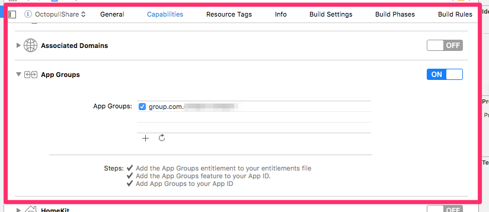

# Shared AppGroup

TODO：

* 【已解决】越狱iPhone中确定iOS的app的Shared AppGroup目录位置
* 【记录】iOS函数：NSFileManager的containerURLForSecurityApplicationGroupIdentifier:
* 【未解决】尝试改变包名去解决container_create_or_lookup_app_group_path_by_app_group_identifier

---

## 如何获取`Shared AppGroup`的路径

* Xcode正向开发
  * 正向的iOS的app开发时，开启了：`App Groups`
    * 
* 代码
  ```objc
  -[NSFileManager containerURLForSecurityApplicationGroupIdentifier:]
  ```
