# app卸载后仍残留数据

* 卸载APP的心得：
  * app完全卸载后仍有可能有app相关的数据
    * 除了标准的卸载APP加上数据，额外还有可能有APP相关的数据存在
      * 比如APP group 是同一个公司旗下的多个APP共享的数据

## 背景

iOS逆向调试期间，尝试模拟app首次初始化过程

而去卸载掉app，且用的是：

删除app，且同时删除数据

具体操作路径是：

* Settings->General->iPhone Storage->点击对应app->该app详情页：app版本号和数据大小->Delete App

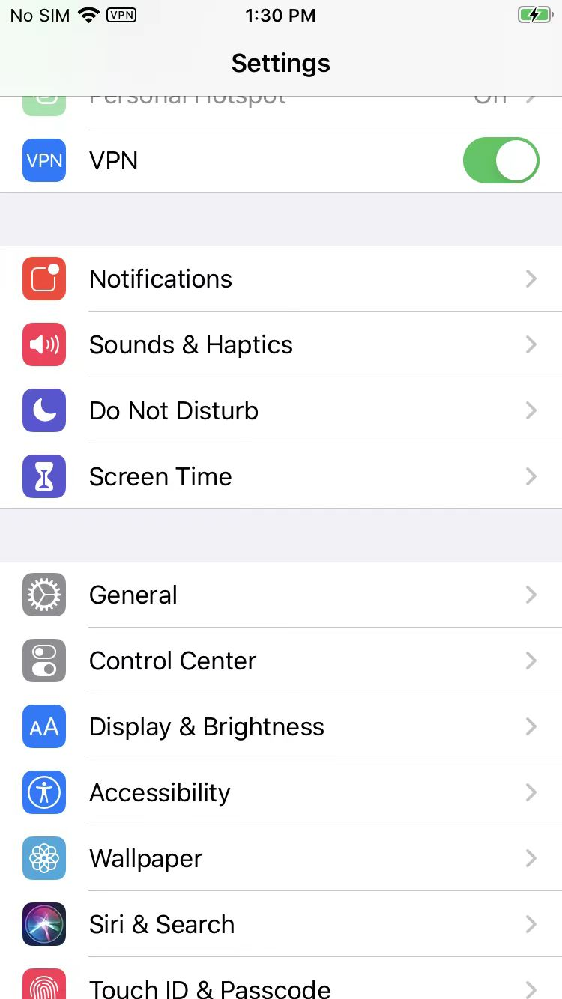

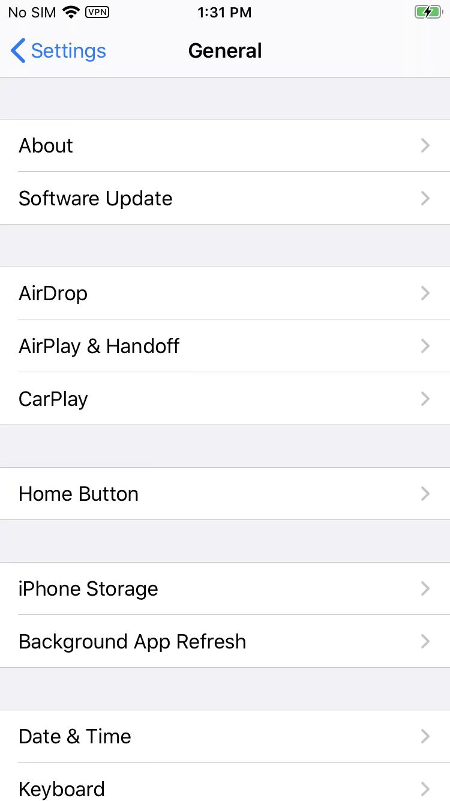

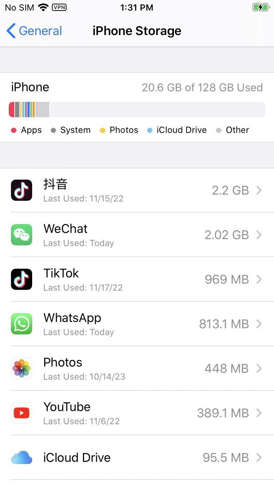

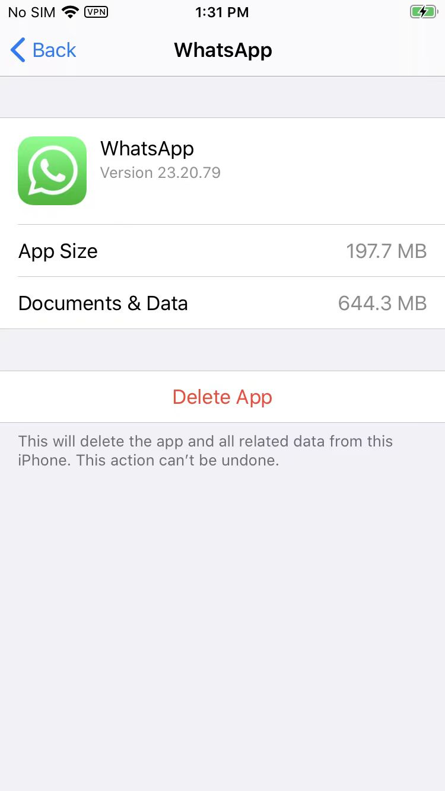

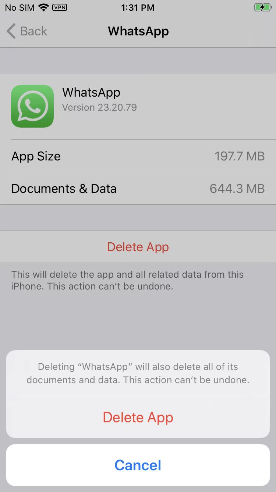

如此，可以彻底删除app，包括app和数据

注：

对比，相比之下，从桌面上，长按app去删除：

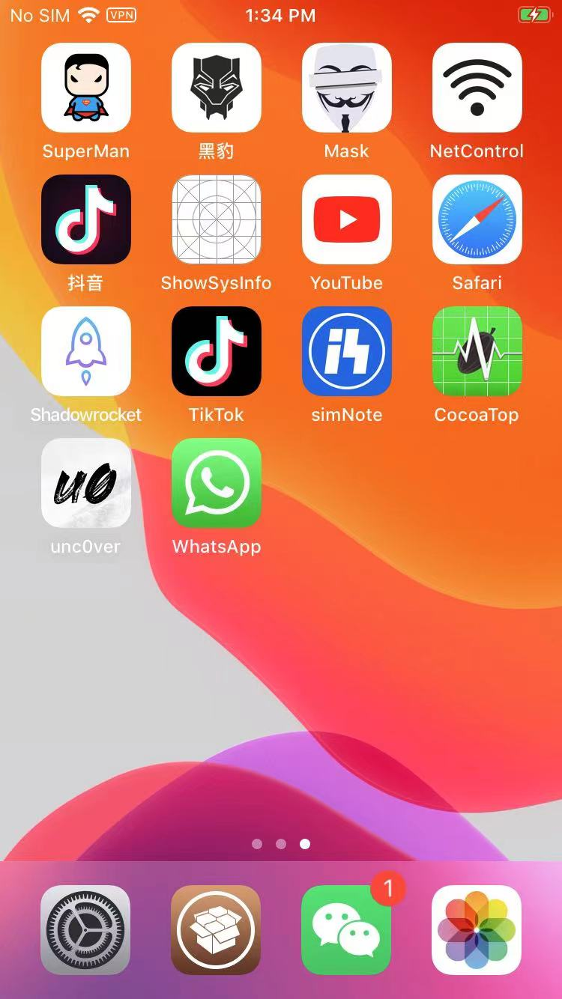

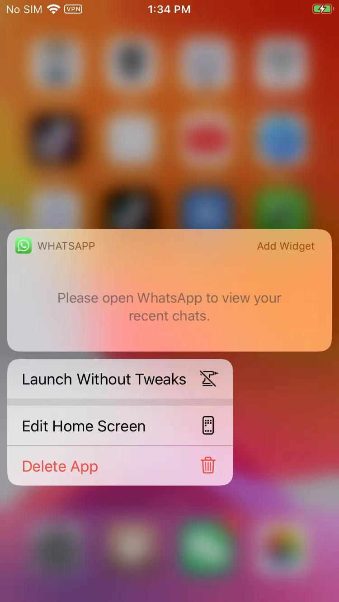

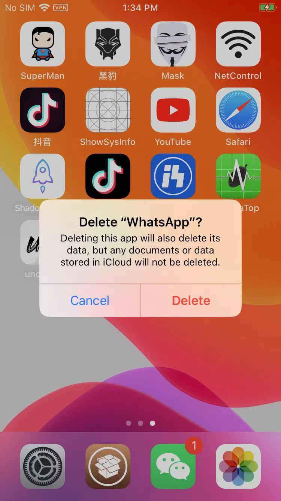

-》

记得是，好像是：只能删除app本身，无法删除Data数据的

但是后来的经验是：

其实，即使从iPhone Storage中，彻底删除app和data数据后，其实也还是有可能，存在app相关数据的

至少可能有2方面的数据：

* **AppGroup数据**
  * 同一家公司（该app的开发者或所属公司）其下的，多个app，所共享的数据（目录）
* **Keychain数据库中的数据**

## 举例

具体举例说明：

### WhatsApp

#### AppGroup数据

WhatsApp的话，独立于app本身，有个：AppGroup目录：

* WhatsApp的`AppGroup`目录
  * `/private/var/mobile/Containers/Shared/AppGroup/8E53137F-C414-4D05-85CD-88E6B16FCA85/`

其下就有很多子目录和文件：

```bash
➜  ~ ssh root@192.168.2.6
iPhone7-1331:~ root# uname -a
Darwin iPhone7-1331 19.3.0 Darwin Kernel Version 19.3.0: Thu Jan  9 21:10:55 PST 2020; root:xnu-6153.82.3~1/RELEASE_ARM64_T8010 iPhone9,1 arm64 D10AP Darwin
iPhone7-1331:~ root# ls -lh /private/var/mobile/Containers/Shared/AppGroup/8E53137F-C414-4D05-85CD-88E6B16FCA85/
total 6.8M
drwxr-xr-x 2 mobile mobile   64 Oct 17 14:04 AppState/
-rw-r--r-- 1 mobile mobile  76K Oct 17 08:57 AvatarSearchTags.sqlite
-rw-r--r-- 1 mobile mobile 336K Oct 19 16:33 Axolotl.sqlite
-rw-r--r-- 1 mobile mobile  32K Nov 23 14:01 Axolotl.sqlite-shm
-rw-r--r-- 1 mobile mobile    0 Nov 23 10:17 Axolotl.sqlite-wal
-rw-r--r-- 1 mobile mobile  36K Oct 19 10:10 BackedUpKeyValue.sqlite
-rw-r--r-- 1 mobile mobile  32K Oct 19 10:10 BackedUpKeyValue.sqlite-shm
-rw-r--r-- 1 mobile mobile    0 Oct 19 10:15 BackedUpKeyValue.sqlite-wal
drwxr-xr-x 5 mobile mobile  160 Nov 22 22:04 Biz/
-rw-r--r-- 1 mobile mobile  88K Oct 19 10:05 CallHistory.sqlite
-rw-r--r-- 1 mobile mobile  32K Oct 19 10:10 CallHistory.sqlite-shm
-rw-r--r-- 1 mobile mobile    0 Oct 19 10:15 CallHistory.sqlite-wal
-rw-r--r-- 1 mobile mobile 336K Oct 19 10:15 ChatStorage.sqlite
-rw-r--r-- 1 mobile mobile  32K Oct 19 10:10 ChatStorage.sqlite-shm
-rw-r--r-- 1 mobile mobile    0 Oct 19 10:15 ChatStorage.sqlite-wal
-rw-r--r-- 1 mobile mobile  60K Nov 22 22:04 ContactsV2.sqlite
-rw-r--r-- 1 mobile mobile  32K Nov 23 14:01 ContactsV2.sqlite-shm
-rw-r--r-- 1 mobile mobile    0 Nov 23 10:17 ContactsV2.sqlite-wal
-rw-r--r-- 1 mobile mobile  52K Oct 17 14:05 DeviceAgents.sqlite
-rw-r--r-- 1 mobile mobile  32K Oct 19 10:10 DeviceAgents.sqlite-shm
-rw-r--r-- 1 mobile mobile    0 Oct 19 10:15 DeviceAgents.sqlite-wal
drwxr-xr-x 3 mobile mobile   96 Oct 13 21:10 FieldStats2/
-rw-r--r-- 1 mobile mobile  68K Oct 17 14:04 LID.sqlite
-rw-r--r-- 1 mobile mobile  32K Oct 19 10:10 LID.sqlite-shm
-rw-r--r-- 1 mobile mobile  21K Oct 17 15:49 LID.sqlite-wal
drwxr-xr-x 4 mobile mobile  128 Oct 13 21:10 Library/
-rw-r--r-- 1 mobile mobile 1.3M Nov 23 10:17 LocalKeyValue.sqlite
-rw-r--r-- 1 mobile mobile  32K Nov 23 14:01 LocalKeyValue.sqlite-shm
-rw-r--r-- 1 mobile mobile  25K Nov 23 14:01 LocalKeyValue.sqlite-wal
-rw-r--r-- 1 mobile mobile  84K Oct 19 10:10 Location.sqlite
-rw-r--r-- 1 mobile mobile  32K Nov 23 14:01 Location.sqlite-shm
-rw-r--r-- 1 mobile mobile 8.1K Oct 19 10:18 Location.sqlite-wal
drwxr-xr-x 4 mobile mobile  128 Oct 19 10:06 Logs/
drwxr-xr-x 3 mobile mobile   96 Oct 16 15:50 Media/
drwxr-xr-x 3 mobile mobile   96 Oct 17 14:05 Message/
-rw-r--r-- 1 mobile mobile 204K Oct 19 10:10 Sticker.sqlite
-rw-r--r-- 1 mobile mobile  32K Oct 19 10:10 Sticker.sqlite-shm
-rw-r--r-- 1 mobile mobile    0 Oct 19 10:15 Sticker.sqlite-wal
-rw-r--r-- 1 mobile mobile   32 Oct 19 10:12 cck.dat
-rw-rw-rw- 1 mobile mobile  255 Oct 13 21:10 connection.dlock
-rw-r--r-- 1 mobile mobile    0 Oct 13 21:10 connection_setup.dlock
-rw-r--r-- 1 mobile mobile   10 Oct 13 21:10 consumer_version
-rw-r--r-- 1 mobile mobile 464K Oct 17 14:04 current_wallpaper.jpg
-rw-r--r-- 1 mobile mobile 464K Oct 17 14:04 current_wallpaper_dark.jpg
-rw-r--r-- 1 mobile mobile    0 Oct 13 21:10 drestore.mark
-rw-r--r-- 1 mobile mobile 1.3M Oct 16 15:50 emoji.sqlite
drwxr-xr-x 3 mobile mobile   96 Oct 19 10:12 fts/
-rw-r--r-- 1 mobile mobile    0 Oct 13 21:10 main_app.lock
-rw-r--r-- 1 mobile mobile    0 Oct 13 21:10 shared_storage.lock
-rw-r--r-- 1 mobile mobile    0 Oct 13 21:10 signal-key-store.lock
drwxr-xr-x 3 mobile mobile   96 Oct 17 15:49 stickers/
```

爱思助手查看的效果：

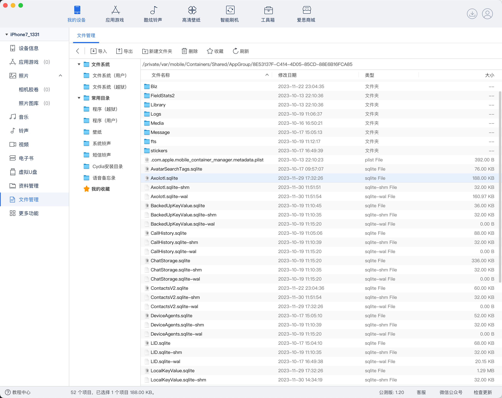

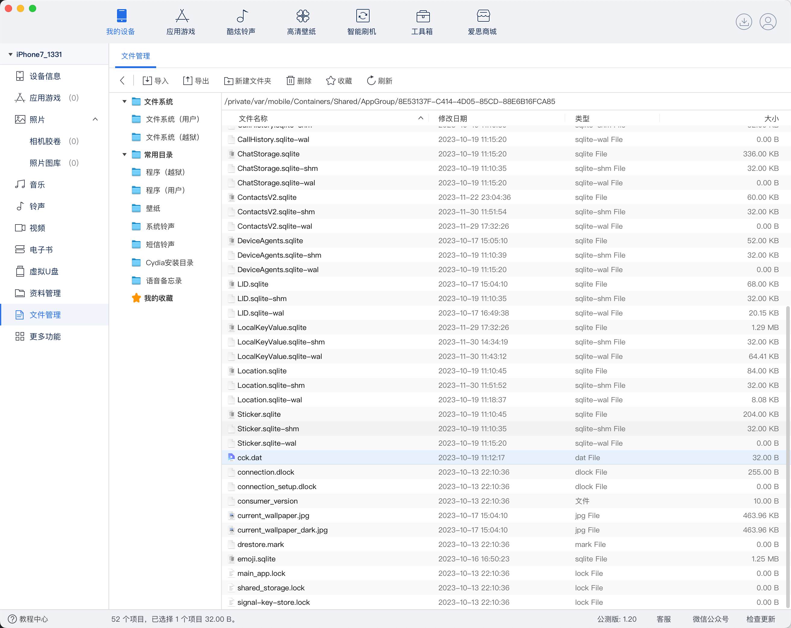

包括很多相关数据：

比如之前调试涉及到的：

注册相关参数authKey的最终来源：

* `/private/var/mobile/Containers/Shared/AppGroup/8E53137F-C414-4D05-85CD-88E6B16FCA85/cck.dat`

```bash
iPhone7-1331:~ root# ls -lh /private/var/mobile/Containers/Shared/AppGroup/8E53137F-C414-4D05-85CD-88E6B16FCA85/cck.dat
-rw-r--r-- 1 mobile mobile 32 Oct 19 10:12 /private/var/mobile/Containers/Shared/AppGroup/8E53137F-C414-4D05-85CD-88E6B16FCA85/cck.dat
```

详见：

* 【记录】iOS逆向WhatsApp：AppGroup中log日志内容
* 【记录】iOS逆向WhatsApp：导出并研究Shared/AppGroup目录中的内容
* 【未解决】iOS逆向WhatsApp：-[WAStaticPrivateKeyStore privateKey]

#### Keychain数据库中的数据

之前找`WhatsApp`中`gena`==`kSecAttrGeneric`的值`0x45534916`的来源是找到最终是：

`Keychain`数据库中，有保存了：

WhatsApp的最初写入Keychain数据库中数据：

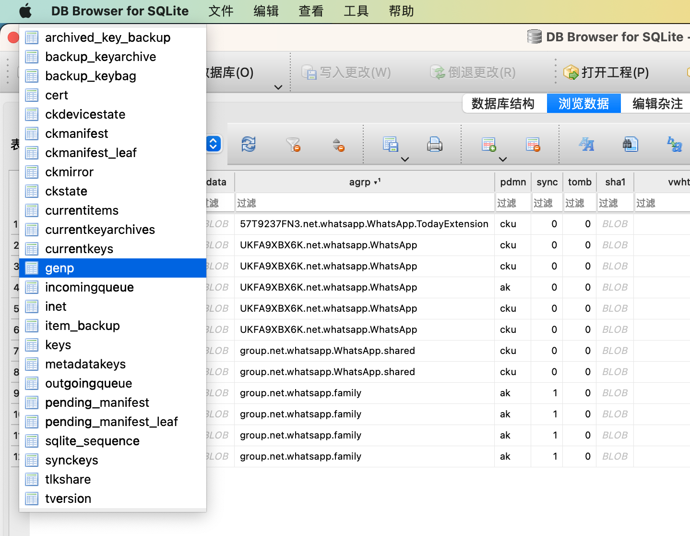

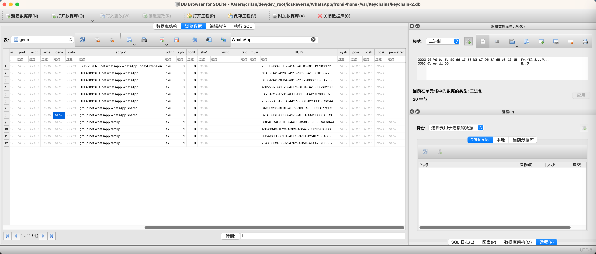

其中此处genp中就有WhatsApp相关的12条数据记录

其中的

`group.net.whatsapp.WhatsApp.shared`中的`gena`的值，就是：`0x45534916`通过`SHA1`加密后的数值

总之，是保存有WhatsApp相关数据的。

详见：

* 【未解决】iOS逆向WhatsApp：Keychain中genp中WhatsApp数据何时和如何被写入的
* 【未解决】iOS中的keychain保存位置路径
* 【记录】Mac中用DB Browser for SQLite查看keychain数据库文件：/var/Keychains/keychain-2.db
* 【已解决】Mac中如何打开iOS中的SQLite3格式的数据库.db文件
* 【记录】iOS逆向WhatsApp：查找keychain的数据库/var/Keychains/keychain-2.db中WhatsApp相关数据
* 【整理】iOS逆向：Keychain数据库字段含义

