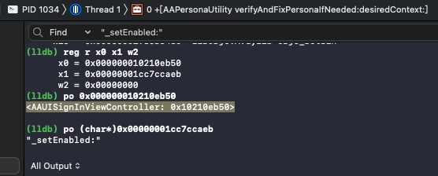
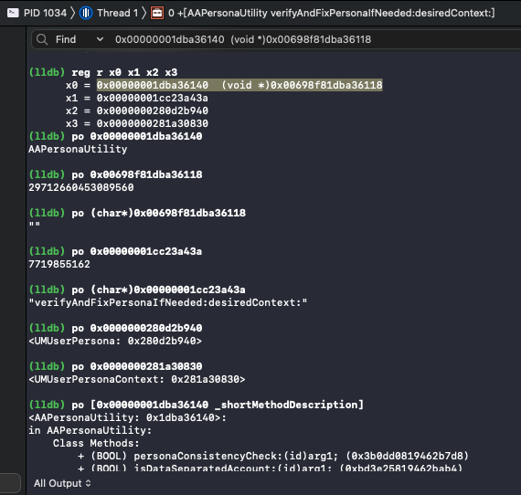

# 类、实例、状态

调试期间，**类**和**实例**的对比：

## 概述

* 普通的类的对象=类的实例是
  ```bash
  (lldb) reg r x0
        x0 = 0x0000000280f603f0
  (lldb) po 0x0000000280f603f0
  <UMUserManager: 0x280f603f0>
  ```
* 类本身是
  ```bash
  (lldb) reg r x0 x1
        x0 = 0x00000001db187788  (void *)0x002d8581db1877b0
        x1 = 0x00000001cc359b7e  
  (lldb) po 0x00000001db187788
  UMUserManager
  ```

## 详解

* 普通的：Instance=实例=对象=Object
  * 典型=多数情况
    * register read时：后面没有额外备注
      * 举例
      ```bash
      (lldb) reg r x0
      x0 = 0x000000010210eb50
      ```
    * po打印输出：类名加上地址
      * 举例
        * AAUISignInViewController的实例
          ```bash
          (lldb) po 0x000000010210eb50
          <AAUISignInViewController: 0x10210eb50>
          ```
          
        * UMUserManager的实例
          ```bash
          (lldb) po 0x0000000280f603f0
          <UMUserManager: 0x280f603f0>
          ```
    * -》对应后续函数调用，ObjC写法是：`-`开头
      * 举例
        * `-[AAUISignInViewController _setEnabled: 0]`
  * 少数=特殊情况
    * 已alloc，但还没init
      * 现象：po打印（内部调用类的description）时，会输出特殊的提示：object was not initialized
        ```bash
        (lldb) po 0x0000000281e79600
        *** -[NSURLComponents description]: <NSURLComponents 0x281e79600> object was not initialized
        ```
      * 后续会
        * 调用init去初始化
        * 最后才是，已初始化好的，普通的类的实例
          * po打印出description描述
* 特殊的：Class=类
  * register read时：后面会有备注
    * 举例
      ```bash
      (lldb) reg r x0
      x0 = 0x00000001dba36140 (void *)0x00698f81dba36118
      ```
      
  * po打印输出：只有类名，没有地址
    * 举例
      ```bash
      (lldb) po 0x00000001dba36140
      AAPersonaUtility
      ```
  * -》对应后续函数调用，ObjC写法是：`+`开头
    * 举例
      * `+[AAPersonaUtility verifyAndFixPersonaIfNeeded: <UMUserPersona: 0x280d2b940> desiredContext: <UMUserPersonaContext: 0x281a30830>]`

### 举例

#### 已alloc，但还没init的实例


汇编代码:

```asm
    0x19447a1b0 <+152>: adrp   x8, 279478
    0x19447a1b4 <+156>: ldr    x0, [x8, #0xfa0]
    0x19447a1b8 <+160>: bl     0x199f71380              ; objc_alloc
```

->

```bash
(lldb) reg r x0
      x0 = 0x00000001db033b48  (void *)0x003a0101db033bc0
(lldb) po 0x003a0101db033bc0
16326656130235328

(lldb) po 0x00000001db033b48
NSURLComponents
```

运行后，返回值：

```bash
(lldb) reg r x0
      x0 = 0x0000000281e79600
(lldb) po 0x0000000281e79600
*** -[NSURLComponents description]: <NSURLComponents 0x281e79600> object was not initialized
```

以及后续会有对应：调用init函数去初始化

```asm
    0x19447a1bc <+164>: adrp   x8, 227332
    0x19447a1c0 <+168>: add    x1, x8, #0xcfe            ; =0xcfe 
    0x19447a1c4 <+172>: adrp   x2, 300159
    0x19447a1c8 <+176>: add    x2, x2, #0x7a0            ; =0x7a0 
    0x19447a1cc <+180>: bl     0x199f6d5c0              ; objc_msgSend
```

-》

```bash
(lldb) reg r x0 x1 x2
      x0 = 0x0000000281e79600
      x1 = 0x00000001cbc7ecfe  
      x2 = 0x00000001dd8f97a0  @"https://setup.icloud.com"
(lldb) po 0x0000000281e79600
*** -[NSURLComponents description]: <NSURLComponents 0x281e79600> object was not initialized

(lldb) po (char*)0x00000001cbc7ecfe
"initWithString:"

(lldb) po 0x00000001dd8f97a0
https://setup.icloud.com
```

即：

`-[<NSURLComponents 0x281e79600> initWithString: @"https://setup.icloud.com"]`

返回值=初始化后，就是：

普通的，已初始化好的类，po打印其description描述了：

```bash
(lldb) reg r x0
      x0 = 0x0000000281e79600
(lldb) po 0x0000000281e79600
<NSURLComponents 0x281e79600> {scheme = https, user = (null), password = (null), host = setup.icloud.com, port = (null), path = , query = (null), fragment = (null)}
```
