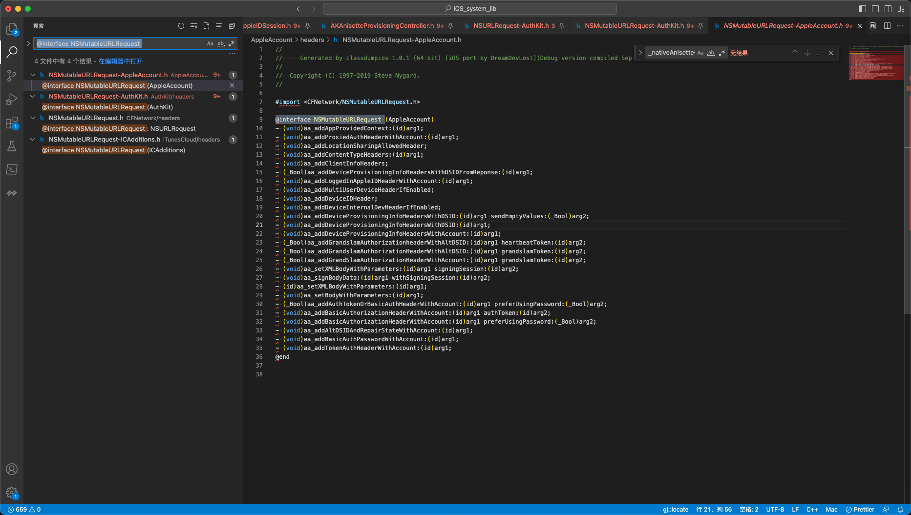

# 扩展属性

## NSMutableURLRequest

对于iOS中的某些类，比如此处的：

`NSMutableURLRequest`

在Xcode中lldb调试时，po查看类的描述

```bash
(lldb) reg r x0 x1
      x0 = 0x00000001db04bfe0  (void *)0x00505d81db04c008
      x1 = 0x00000001cc774915  
(lldb) po 0x00000001db04bfe0
NSMutableURLRequest

(lldb) po (char*)0x00000001cc774915
"ak_clientTimeHeader"

(lldb) po [0x00000001db04bfe0 _shortMethodDescription]
<NSMutableURLRequest: 0x1db04bfe0>:
in NSMutableURLRequest:
     Class Methods:
         + (int) hashForPlayerID:(id)arg1; (0x982eeb81a8c38638)
         + (id) _gkHTTPRequestWithURL:(id)arg1 method:(id)arg2 postData:(id)arg3; (0xc811b081a8c38318)
         + (id) ak_anisetteHeadersWithData:(id)arg1; (0xb535781943bb2e0)
         + (id) ak_proxiedAnisetteHeadersWithData:(id)arg1; (0xa045d901943e358c)
         + (id) ak_proxiedClientInfoHeadersWithDevice:(id)arg1; (0x3e20c581943e3724)
         + (id) ak_clientTimeHeader; (0xb290781943bb584)
         + (id) ak_localeHeader; (0x1d588101943bb678)
         + (id) ak_timeZoneHeader; (0x2149a981943c14e4)
         + (id) ak_clientInfoHeader; (0x126bfa81943e310c)
         + (id) ak_deviceUDIDHeader; (0x231e5601943e3204)
         + (id) ak_anisetteHeadersWithCompanionData:(id)arg1; (0xa4016481943e32f8)
         + (id) ak_proxiedHeadersForDevice:(id)arg1 anisetteData:(id)arg2; (0xc85f8181943e3490)
     Properties:
         @property (copy) NSString* HTTPMethod;
         @property (copy) NSDictionary* allHTTPHeaderFields;
...
        @property BOOL assumesHTTP3Capable;  (@dynamic assumesHTTP3Capable;)
         @property unsigned long attribution;  (@dynamic attribution;)
     Instance Methods:
         - (void) setInternal:(BOOL)arg1; (0x32274f81a8c39258)
...
        - (void) bindToCommand:(struct __CNPluginCommand*)arg1; (0xba0f0781c581b7c0)
         - (void) _web_setHTTPContentType:(id)arg1; (0xee176781a56b8d34)
         - (void) _web_setHTTPReferrer:(id)arg1; (0x58445c81a56b8d48)
         - (void) _web_setHTTPUserAgent:(id)arg1; (0xc61f5601a56b8dc8)
         - (void) bindToHotspotHelperCommand:(id)arg1; (0x531c418195a851fc)
...
        - (void) ams_addAuthorizationHeaderForAccount:(id)arg1; (0xfe0abb8185e587b0)
         - (void) ams_setBodyParameters:(id)arg1 encoding:(long)arg2 compressBody:(BOOL)arg3 error:(id*)arg4; (0x2124cd8185a8f370)
         - (void) ams_addSilentEnrollmentHeadersForAccount:(id)arg1; (0xf968a28185e589d4)
         - (void) ak_addDeviceUDIDHeader; (0xa76e8701943e1afc)
         - (void) ak_addClientTimeHeader; (0x93559101943e1ba8)
...
        - (void) ak_addPhoneNumberHeader; (0x1d7a0c81943e2e10)
...
        - (void) ak_addExecutionModeHeader:(BOOL)arg1; (0x4c3d4881943e3a70)
         - (void) ak_addPrivateEmailKeyHeader:(id)arg1; (0xb10af301943e3ae8)
         - (void) fam_addiTunesHeadersWithAccount:(id)arg1; (0xe86439818f8477ac)
         - (void) aa_addBasicAuthPasswordWithAccount:(id)arg1; (0x627c701944c6efc)
         - (void) aa_addTokenAuthHeaderWithAccount:(id)arg1; (0xff511601944c6d4c)
         - (void) aa_addDeviceProvisioningInfoHeadersWithDSID:(id)arg1 sendEmptyValues:(BOOL)arg2; (0x7b607b01944c7ce8)
...
        - (void) aa_addDeviceInternalDevHeaderIfEnabled; (0x2e3ed401944c7e1c)
         - (void) aa_addDeviceIDHeader; (0xb25bc301944c7ea4)
         - (void) ic_appendHTTPCookies:(id)arg1; (0xc330c00198eb270c)
         - (void) ic_appendHTTPCookieWithName:(id)arg1 value:(id)arg2; (0xe4498a8198eb2628)
         - (void) cdp_addAuthHeaderWithContext:(id)arg1; (0xb6048f01adf4e048)
         - (void) cdp_addClientInfoHeader; (0x3b77b181adf4e254)
         - (void) setTimeoutInterval:(double)arg1; (0x9926ad01820970bc)
         - (void) setAllowsExpensiveNetworkAccess:(BOOL)arg1; (0x950f2281820a0ac8)
         - (void) setHTTPMethod:(id)arg1; (0xfd389d0182094b08)
...
```

* 除了类本身自带的属性和函数
  * 属性
    * `@property (copy) NSString* HTTPMethod;`
  * 函数
    * `- (void) setTimeoutInterval:(double)arg1; (0x9926ad01820970bc)`
* 其他还有很多：某类字母开头的属性和函数
  * ak
    * `+ (id) ak_clientInfoHeader; (0x126bfa81943e310c)`
    * `- (void) ak_addPrivateEmailKeyHeader:(id)arg1; (0xb10af301943e3ae8)`
  * aa
    * `- (void) aa_addDeviceIDHeader; (0xb25bc301944c7ea4)`
  * ams
    * `- (void) ams_addAuthorizationHeaderForAccount:(id)arg1; (0xfe0abb8185e587b0)`

而之前不清楚：为何会有这些额外的属性和函数。

后来找到了：

ak相关的属性的来源的头文件：

【未解决】iOS逆向Apple账号：AuthKit的NSMutableURLRequest相关

-》

`/Users/crifan/dev/dev_root/iosReverse/AppleStore/iOS_system_lib/AuthKit/headers/NSMutableURLRequest-AuthKit.h`

```objc
//
//     Generated by classdumpios 1.0.1 (64 bit) (iOS port by DreamDevLost)(Debug version compiled Sep 26 2020 13:48:20).
//
//  Copyright (C) 1997-2019 Steve Nygard.
//

#import <CFNetwork/NSMutableURLRequest.h>

@interface NSMutableURLRequest (AuthKit)
...
+ (id)ak_anisetteHeadersWithCompanionData:(id)arg1;
+ (id)ak_anisetteHeadersWithData:(id)arg1;
+ (id)ak_deviceUDIDHeader;
+ (id)ak_clientInfoHeader;
+ (id)ak_timeZoneHeader;
+ (id)ak_localeHeader;
+ (id)ak_clientTimeHeader;
- (void)ak_addRequestUUIDHeader:(id)arg1;
...
- (void)ak_addPhoneNumberCertificateHeaderWithValue:(id)arg1;
- (void)ak_addPhoneNumberHeader;
- (void)ak_addProxiedDeviceSerialNumberHeader:(id)arg1;
...
- (void)ak_addInternalBuildHeader;
@end
```

即：

AuthKit 对于 NSMutableURLRequest 做了额外扩展（和继承）

添加了更多的：相关的属性和函数

且命名时，尽量都以`ak_`开头

对应的库`AuthKit`的首字母缩写

并且，去头文件中搜：

```objc
@interface NSMutableURLRequest
```

又找到更多的：

继承了 = 扩展了：NSMutableURLRequest

的一些类：



```bash
4 个结果 - 4 文件

AppleAccount/headers/NSMutableURLRequest-AppleAccount.h:
  8  
  9: @interface NSMutableURLRequest (AppleAccount)
  10  - (void)aa_addAppProvidedContext:(id)arg1;

AuthKit/headers/NSMutableURLRequest-AuthKit.h:
  8  
  9: @interface NSMutableURLRequest (AuthKit)
  10  + (id)ak_proxiedClientInfoHeadersWithDevice:(id)arg1;

CFNetwork/headers/NSMutableURLRequest.h:
  10  
  11: @interface NSMutableURLRequest : NSURLRequest
  12  {

iTunesCloud/headers/NSMutableURLRequest-ICAdditions.h:
  8  
  9: @interface NSMutableURLRequest (ICAdditions)
  10  - (void)ic_appendHTTPCookieWithName:(id)arg1 value:(id)arg2;
```

-》

`/Users/crifan/dev/dev_root/iosReverse/AppleStore/iOS_system_lib/AppleAccount/headers/NSMutableURLRequest-AppleAccount.h`

```objc
#import <CFNetwork/NSMutableURLRequest.h>


@interface NSMutableURLRequest (AppleAccount)
- (void)aa_addAppProvidedContext:(id)arg1;
...
- (void)aa_addTokenAuthHeaderWithAccount:(id)arg1;
@end
```

`/Users/crifan/dev/dev_root/iosReverse/AppleStore/iOS_system_lib/CFNetwork/headers/NSMutableURLRequest.h`

```objc
#import <CFNetwork/NSURLRequest.h>

@class NSData, NSDictionary, NSInputStream, NSString, NSURL;

@interface NSMutableURLRequest : NSURLRequest
{
}

- (void)setBoundInterfaceIdentifier:(id)arg1;
@property _Bool allowsCellularAccess; // @dynamic allowsCellularAccess;
@property unsigned long long networkServiceType; // @dynamic networkServiceType;
- (id)copyWithZone:(struct _NSZone *)arg1;
@property _Bool assumesHTTP3Capable; // @dynamic assumesHTTP3Capable;
@property _Bool allowsExpensiveNetworkAccess; // @dynamic allowsExpensiveNetworkAccess;
@property _Bool allowsConstrainedNetworkAccess; // @dynamic allowsConstrainedNetworkAccess;
@property(copy) NSURL *mainDocumentURL; // @dynamic mainDocumentURL;
@property double timeoutInterval; // @dynamic timeoutInterval;
@property unsigned long long cachePolicy; // @dynamic cachePolicy;
@property(copy) NSURL *URL; // @dynamic URL;
- (void)setContentDispositionEncodingFallbackArray:(id)arg1;
- (void)_setPayloadTransmissionTimeout:(double)arg1;
- (void)_setIgnoreHSTS:(_Bool)arg1;
- (void)_setPreventHSTSStorage:(_Bool)arg1;
- (void)_setRequiresShortConnectionTimeout:(_Bool)arg1;
- (void)_setStartTimeoutDate:(id)arg1;
- (void)_setTimeWindowDuration:(double)arg1;
- (void)_setTimeWindowDelay:(double)arg1;
- (void)setExpectedWorkload:(unsigned long long)arg1;
@property _Bool HTTPShouldUsePipelining;
- (unsigned long long)requestPriority;
- (void)setRequestPriority:(unsigned long long)arg1;
@property _Bool HTTPShouldHandleCookies;
- (void)setHTTPUserAgent:(id)arg1;
- (void)setHTTPReferrer:(id)arg1;
- (void)setHTTPExtraCookies:(id)arg1;
- (void)setHTTPContentType:(id)arg1;
@property(retain) NSInputStream *HTTPBodyStream;
@property(copy) NSData *HTTPBody;
- (void)addValue:(id)arg1 forHTTPHeaderField:(id)arg2;
- (void)setValue:(id)arg1 forHTTPHeaderField:(id)arg2;
@property(copy) NSDictionary *allHTTPHeaderFields;
@property(copy) NSString *HTTPMethod;

@end
```

-》看起来是本身的类。

`/Users/crifan/dev/dev_root/iosReverse/AppleStore/iOS_system_lib/iTunesCloud/headers/NSMutableURLRequest-ICAdditions.h`

```objc
#import <CFNetwork/NSMutableURLRequest.h>

@interface NSMutableURLRequest (ICAdditions)
- (void)ic_appendHTTPCookieWithName:(id)arg1 value:(id)arg2;
- (void)ic_appendHTTPCookies:(id)arg1;
@end
```

对应着：

* `ic`开头的属性和函数
  * 对应的库是：`ICAdditions`

至此，以后再遇到：

iOS其他的类，又有额外的，`xx_`等开头的内容

就大概能猜出，大概率是继承了iOS原先的类

然后可以去导出的头文件中去找，对应的类了。

且去搜索的字符串的格式，大概可以用：

* `@interface OrignalClassName`

或：

* `@interface OrignalClassName (`

-》就可以找到继承该类的，其他类了

估计就能看到加了哪些额外的属性和函数了。
