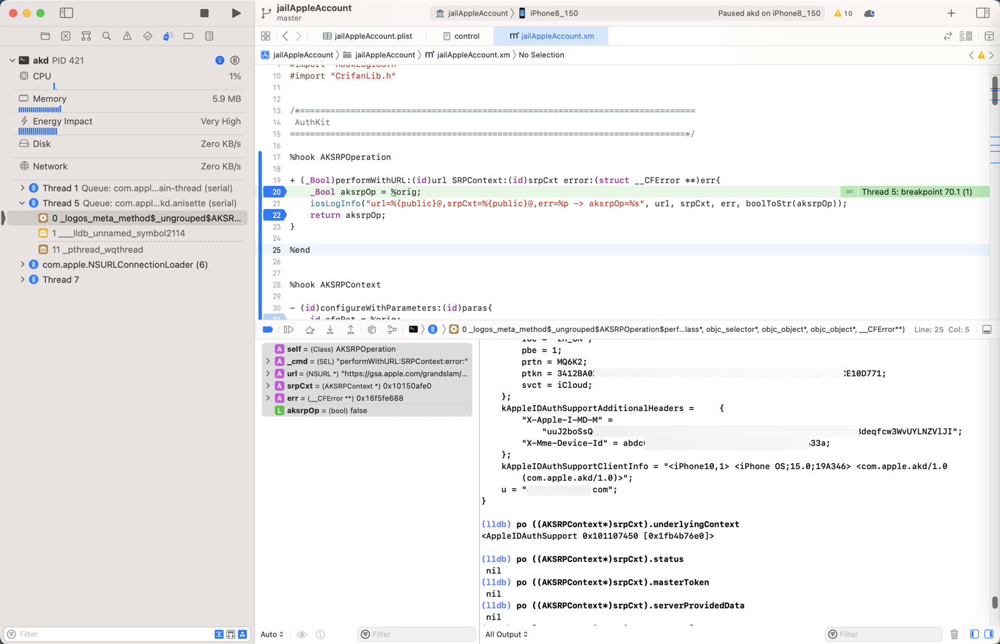

# 公开成员属性

iOS的ObjC的类，中，公开的成员属性，是那种：

比如用反编译出头文件中，类中带`@property`的哪些成员属性

## 举例

`AppleStore/AuthKit_akd/headers/AKSRPContext.h`

```objc
...
@interface AKSRPContext
{
    struct __AppleIDAuthSupportData *_underlyingContext;
    NSDictionary *_configurationParameters;
}
...
@property(readonly, nonatomic) NSDictionary *configurationParameters; // @synthesize configurationParameters=_configurationParameters;
@property(readonly, nonatomic) struct __AppleIDAuthSupportData *underlyingContext; // @synthesize underlyingContext=_underlyingContext;
@property(readonly, nonatomic) NSDictionary *status;
@property(readonly, nonatomic) AKMasterToken *masterToken;
@property(readonly, nonatomic) NSDictionary *serverProvidedData;
...
```

-》

* AKSRPContext 类，有**公开**成员属性
  * configurationParameters
  * underlyingContext
  * status
  * masterToken
  * serverProvidedData

## 查看公开属性值的方式

想要在iOS逆向期间=Xcode中lldb调试期间

当知道某个变量或地址或指针是某个类时：

```bash
(lldb) po srpCxt
<AKSRPContext: 0x10150afe0>
```

查看公开属性值，有多种方式：

### po直接加属性名

```bash
(lldb) po [srpCxt configurationParameters]
{
    Password = "xxxxxx";
...
    u = "xx@xx.xx";
}

(lldb) po [srpCxt underlyingContext]
<AppleIDAuthSupport 0x101107450 [0x1fb4b76e0]>

(lldb) po [srpCxt status]
nil
(lldb) po [srpCxt masterToken]
nil
(lldb) po [srpCxt serverProvidedData]
nil
```

### 通过`点`=`.`

此处可以去通过`点`=`.`去 `读取`=`引用`=`查看` 公开成员的属性值：

* 在变量强制转换后，也通过点.去获取属性的值

比如对于上面的公开成员属性：`configurationParameters`，可以用：

```bash
(lldb) po ((AKSRPContext*)srpCxt).configurationParameters
{
    Password = "xxxxxx";
...
    u = "xx@xx.xx";
}

(lldb) po ((AKSRPContext*)srpCxt).underlyingContext
<AppleIDAuthSupport 0x101107450 [0x1fb4b76e0]>

(lldb) po ((AKSRPContext*)srpCxt).status
nil
(lldb) po ((AKSRPContext*)srpCxt).masterToken
nil
(lldb) po ((AKSRPContext*)srpCxt).serverProvidedData
nil
```


