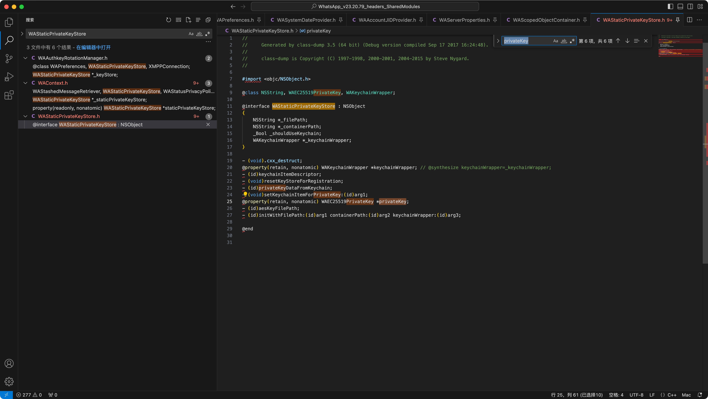
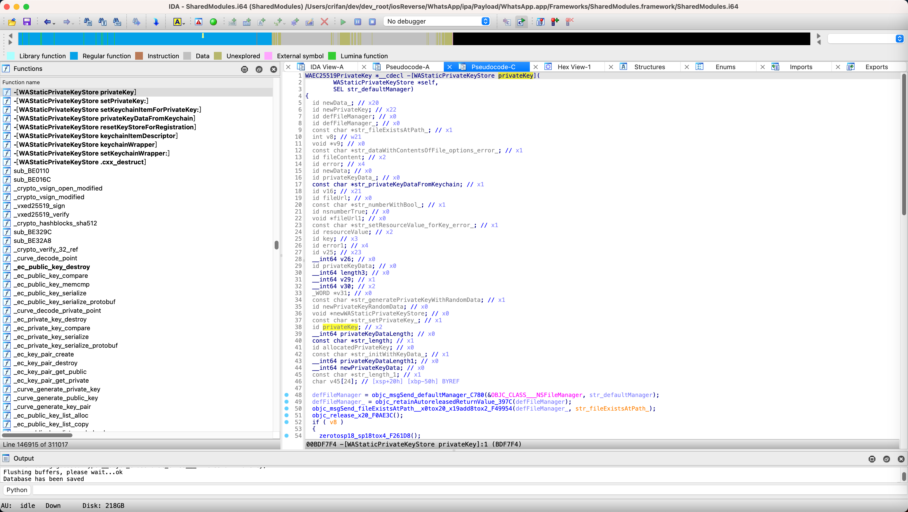
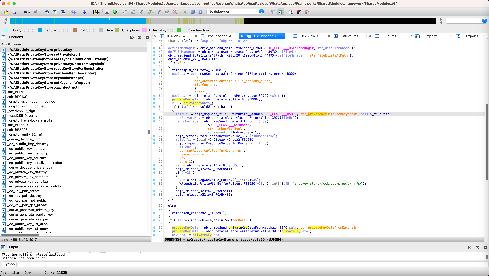
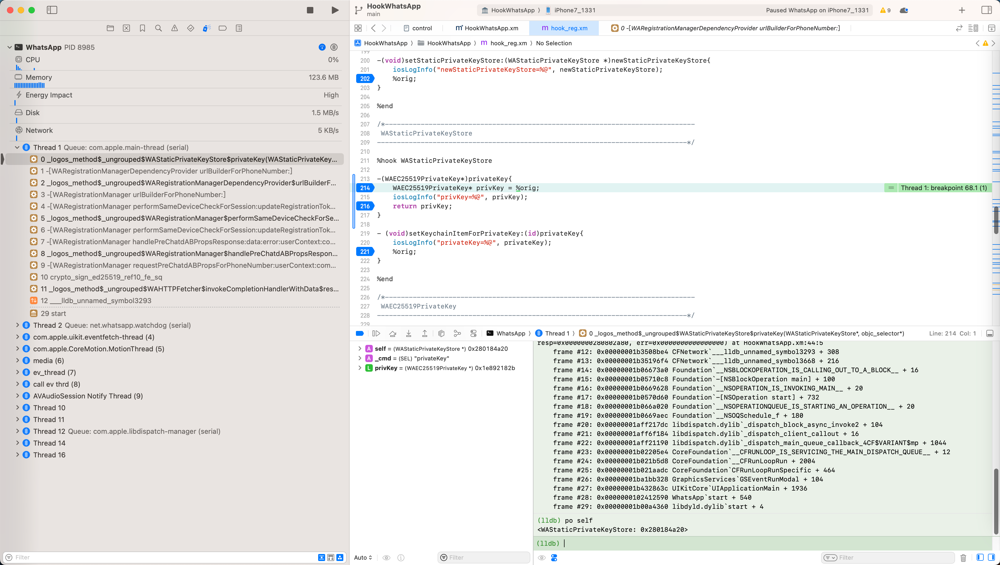
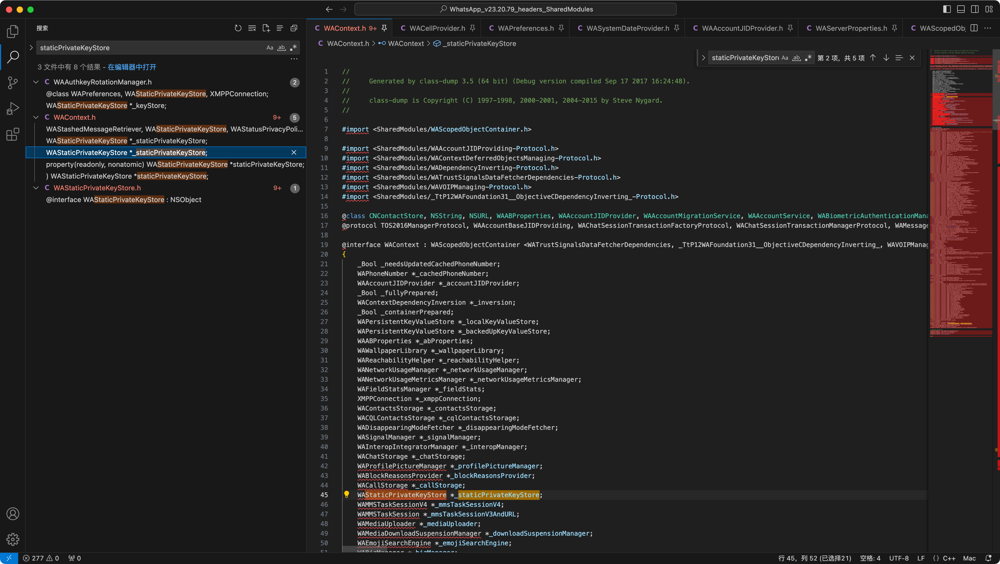
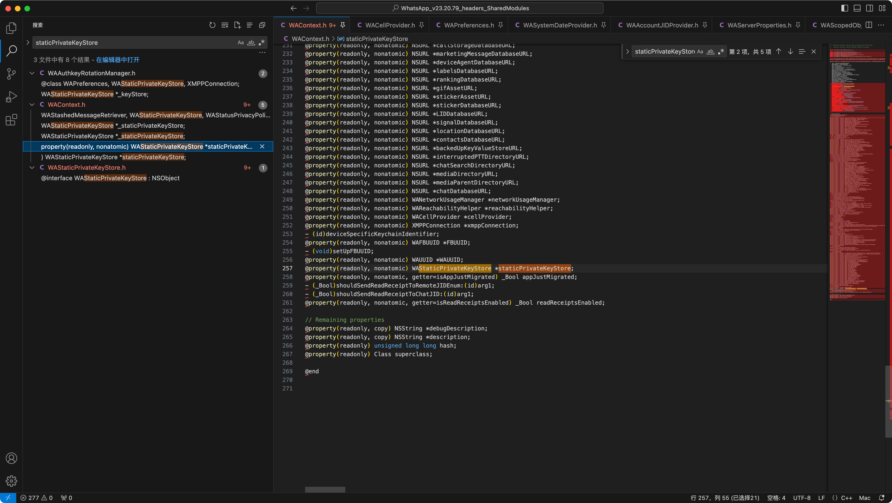
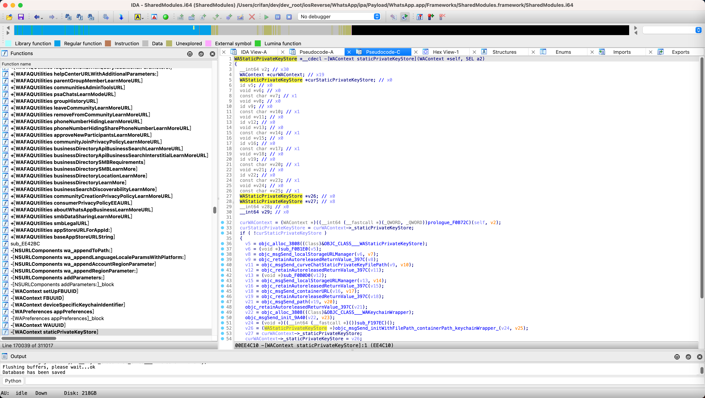
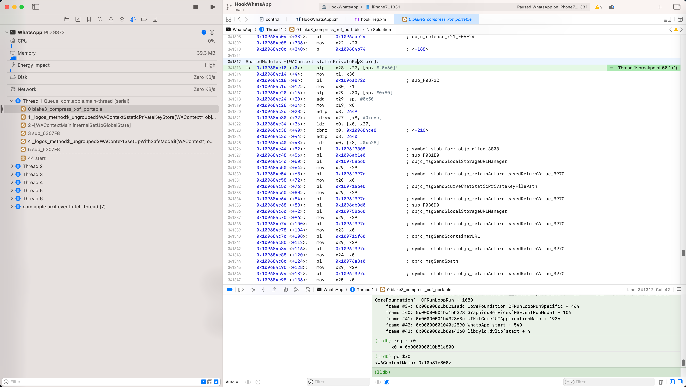

# 计算类的属性值

## 结论

* iOS的ObjC的类
  * 其导出头文件中，不论是否有内部的属性名_xxx和property的属性名xxx
    * 举例
      * `WAContext`
        * 内部属性名： `WAStaticPrivateKeyStore *_staticPrivateKeyStore;`
        * property属性：`@property(readonly, nonatomic) WAStaticPrivateKeyStore *staticPrivateKeyStore;`
      * `WAStaticPrivateKeyStore`
        * 内部属性：没有`_privateKey`
        * property属性：`@property(retain, nonatomic) WAEC25519PrivateKey *privateKey;`
  * 其都是有可能：是有额外代码处理逻辑的
    * 即：有`-[classObj xxx]`是个独立函数，其内部有处理逻辑，用于生成对应的值
      * 举例
        * `-[WAStaticPrivateKeyStore privateKey]`
        * `-[WAContext staticPrivateKeyStore]`
    * 即：万一想要研究某个属性值来源的话
      * 可以转去IDA中，搜搜，是否有：
        * `-[clasObjc propertyName]`
      * 的函数
        * 如果有：则说明是独立函数，内部有处理逻辑
          * 想要找变量值属性值的来源，可能就要研究这个函数了
            * 而不是去从其他地方找，则思路就错了，就会走弯路

## 背景细节

iOS逆向调试期间，遇到了一个现象：

本来以为的ObjC类的属性，只是获取属性值而已

但是其实内部是有额外的处理逻辑，用于生产对应的属性的值的

举例：

【未解决】iOS逆向WhatsApp：-[WAStaticPrivateKeyStore privateKey]

的：

`WhatsApp/headers/WhatsApp_v23.20.79_headers_SharedModules/WAStaticPrivateKeyStore.h`

```objc
@interface WAStaticPrivateKeyStore : NSObject
{
    NSString *_filePath;
    NSString *_containerPath;
    _Bool _shouldUseKeychain;
    WAKeychainWrapper *_keychainWrapper;
}

@property(retain, nonatomic) WAEC25519PrivateKey *privateKey;
```



-》之前以为：

WAStaticPrivateKeyStore的privateKey

只是：返回对应的属性值而已

后记：

此处是：没有内部属性叫做：_privateKey的

但是的确有：property属性叫做：privateKey的

```objc
@property(retain, nonatomic) WAEC25519PrivateKey *privateKey;
```

-》导致以为之前看到的：

WAStaticPrivateKeyStore的实例对象，去获取属性值：privateKey

```bash
(lldb) po [0x109019e00 staticPrivateKeyStore]
<WAStaticPrivateKeyStore: 0x280e19f80>

(lldb) po [0x280e19f80 privateKey]
<WAEC25519PrivateKey: 0x280208fd0>

(lldb) po [0x280208fd0 key]
<0821d44a 6718e72b 34219811 414b0f4b 57c4759d ddb468b8 cf9cb241 001e9f6c>
```

就只是：

获取了属性值而已

-》导致后续寻找此处的 WAEC25519PrivateKey 的key的来源，寻找方向错误，花了大量时间，也没找到

-》没想到内部还有额外处理逻辑：

即，有个单独的函数：

`-[WAStaticPrivateKeyStore privateKey]`

其内部是有代码逻辑的：

后续可以确认，的确有处理逻辑：

* IDA中能看到
  * 
  * 
* Xcode调试汇编代码也能看到
  * 

进入：

Xcode汇编代码：

```asm
SharedModules`-[WAStaticPrivateKeyStore privateKey]:
->  0x10756f7f4 <+0>:     sub    sp, sp, #0x80
    0x10756f7f8 <+4>:     stp    x24, x23, [sp, #0x40]
    0x10756f7fc <+8>:     stp    x22, x21, [sp, #0x50]
    0x10756f800 <+12>:    stp    x20, x19, [sp, #0x60]
    0x10756f804 <+16>:    stp    x29, x30, [sp, #0x70]
    0x10756f808 <+20>:    add    x29, sp, #0x70
    0x10756f80c <+24>:    mov    x19, x0
    0x10756f810 <+28>:    adrp   x8, 2323
    0x10756f814 <+32>:    ldr    x8, [x8, #0x970]
    0x10756f818 <+36>:    ldr    x8, [x8]
    0x10756f81c <+40>:    str    x8, [sp, #0x38]
    0x10756f820 <+44>:    adrp   x8, 3407
    0x10756f824 <+48>:    ldr    x0, [x8, #0x658]
    0x10756f828 <+52>:    bl     0x10790c780              ; objc_msgSend$defaultManager
    0x10756f82c <+56>:    mov    x29, x29
...
    0x10756f9f0 <+508>:   bl     0x1078b91c4              ; sub_F291C4
    0x10756f9f4 <+512>:   bl     0x10789c63c              ; objc_msgSend_length_x20_F0C63C
    0x10756f9f8 <+516>:   str    x0, [sp]
    0x10756f9fc <+520>:   adrp   x2, 1485
    0x10756fa00 <+524>:   add    x2, x2, #0xc39            ; "chatkey-store//cck/get/corrupted data %lu"
    0x10756fa04 <+528>:   b      0x10756f93c              ; <+328>
    0x10756fa08 <+532>:   bl     0x1078e2d40              ; symbol stub for: __stack_chk_fail
```

和：

【未解决】iOS逆向WhatsApp：-[WAContext staticPrivateKeyStore]

的：

`WhatsApp/headers/WhatsApp_v23.20.79_headers_SharedModules/WAContext.h`

```objc
@interface WAContext : WAScopedObjectContainer <WATrustSignalsDataFetcherDependencies, _TtP12WAFoundation31__ObjectiveCDependencyInverting_, WAVOIPManaging, WAAccountJIDProviding, WAContextDeferredObjectsManaging, WADependencyInverting>
{
...
    WAStaticPrivateKeyStore *_staticPrivateKeyStore;
...
@property(readonly, nonatomic) WAStaticPrivateKeyStore *staticPrivateKeyStore;
```





其中也是：

* `-[WAContext staticPrivateKeyStore]`
  * 是个独立的函数

其内部是有额外的处理逻辑的：

* IDA中
  * 
* Xcode中
  * 
