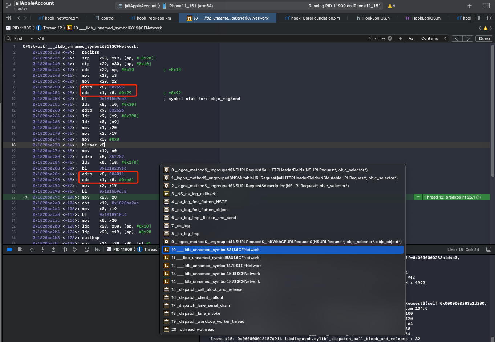

# 手动计算参数

此处，对于iOS逆向中，常见的：

内存中的字符串=objc_msgSend函数的第二个参数=SEL=selector=汇编中的x1寄存器

此处如果是adrp的话，可以用如下手动方式计算出来

即：

根据adrp，手动计算出当前的：

`char*` = `字符串` = `objc_msgSend的SEL`=`函数名`

举例说明：

对于：



```bash
    0x1820ba250 <+24>:  adrp   x8, 302695
    0x1820ba254 <+28>:  add    x1, x8, #0x99             ; =0x99 
    0x1820ba258 <+32>:  bl     0x1815b9dc8              ; symbol stub for: objc_msgSend
...
    0x1820ba28c <+84>:  adrp   x8, 304011
    0x1820ba290 <+88>:  add    x1, x8, #0xc61            ; =0xc61 
...
    0x1820ba298 <+96>:  bl     0x1815b9dc8              ; symbol stub for: objc_msgSend
```

其中的：

```bash
    0x1820ba28c <+84>:  adrp   x8, 304011
```

-》

* 当前PC地址 = adrp指令所在地址 = 0x1820ba28c
* PC地址去4KB对齐 = PC低12位清零：
  * 0x1820ba28c
    * 低12位清零=16进制最低3位设置为0 -》 0x1820ba000
* 立即数左移12位：
  * 304011 = 0x4A38B
    * 左移12位=16进制最低位加3个0 -》 0x4A38B000
* 两者相加 = PC被4KB对齐后的地址 + 立即数左移12位后的值
  * 0x1820ba000 + 0x4A38B000
  * = 0x1CC445000
* x8 = 0x1CC445000

```asm
    0x1820ba290 <+88>:  add    x1, x8, #0xc61            ; =0xc61
```

-》

* x1
  * = x8 + 0xc61
  * = 0x1CC445000 + 0xc61
  * = 0x1CC445C61

对应内存中的字符串的值：

```bash
(lldb) po (char*)0x1CC445C61
"_initWithCFURLRequest:"
```
