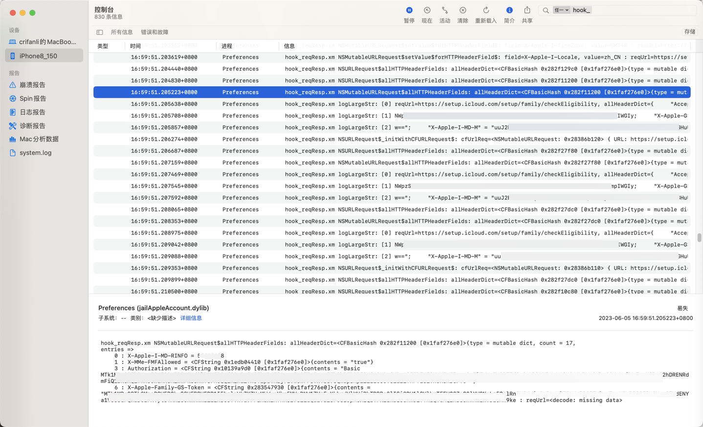
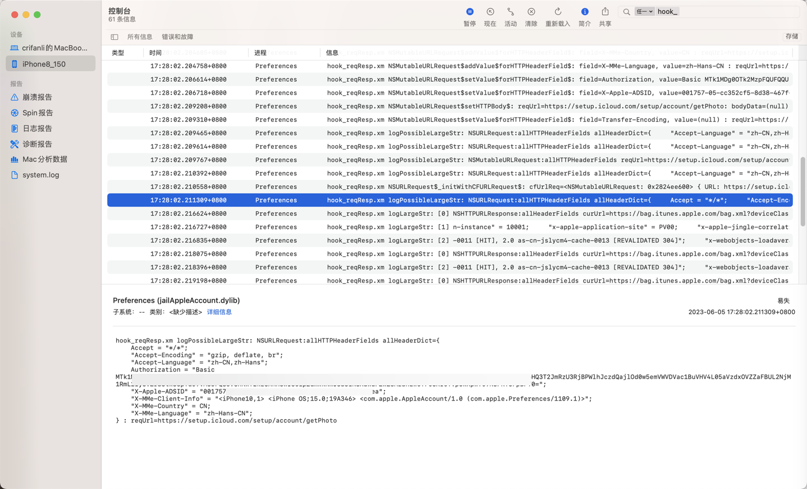
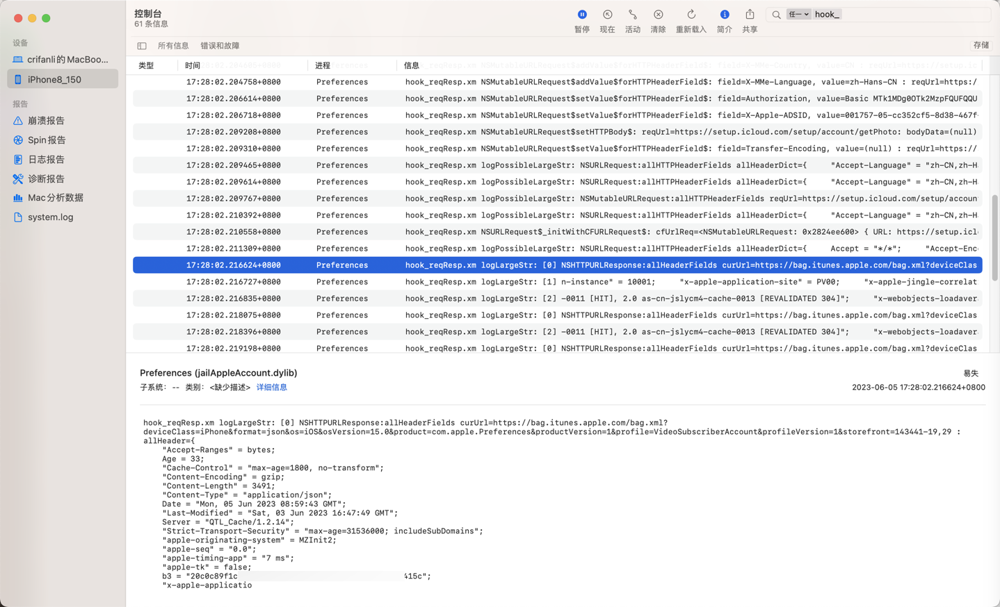
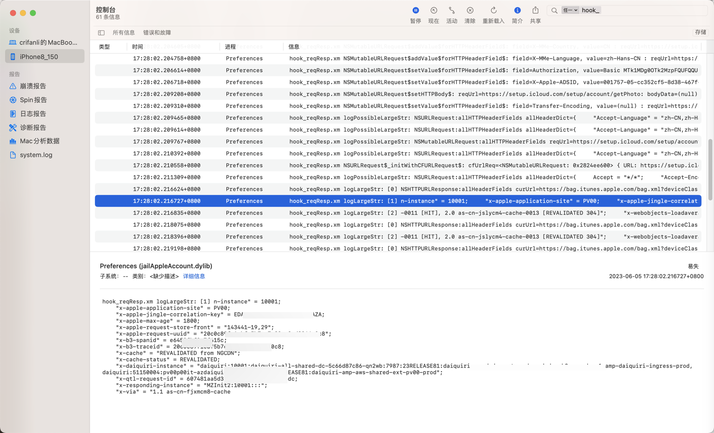
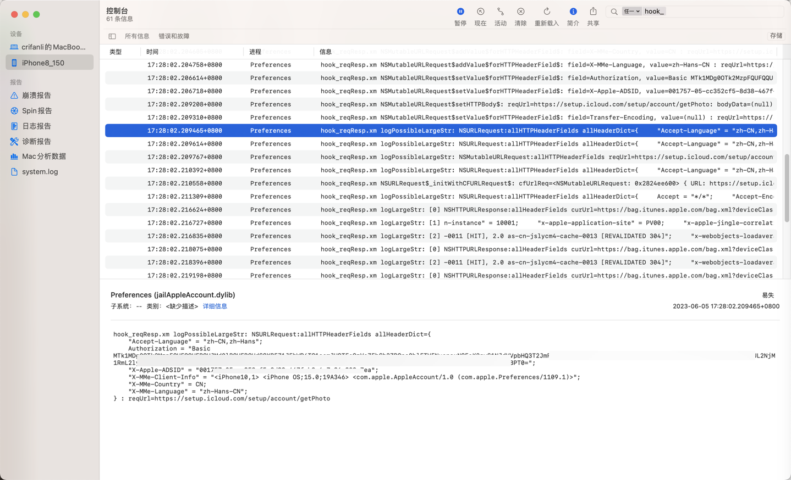

# 超过1K的日志打印

* os_log打印超过1K的长字符串会省略截断掉
  * 解决办法：
    * 输出到文件
      * 【未解决】iOS逆向Apple账号：通过插件hook去打印AADeviceInfo的类的相关信息
      * 【已解决】iOS中如何用ObjC保存数据到文件
    * 转成数组多次打印
      * 【已解决】iOS逆向：os_log日志字符串内容太长超过限制时拆分字符串多次打印
        * 【已解决】iOS的ObjC中NSString如何按照长度拆分
        * 【已解决】iOS的ObjC中如何初始化NSString多行字符串
        * 【已解决】iOS的ObjC的NSString多行字符串中如何包含换行符

## 转成数组多次打印

### 代码

```c
// os_log max length 1K=1024
//    int LOG_MAX_LEN_ONCE = 1024;
//int LOG_MAX_LEN_ONCE = 1024 - 20;
//int LOG_MAX_LEN_ONCE = 1024 - 50;
//int LOG_MAX_LEN_ONCE = 1024 - 100;
//int LOG_MAX_LEN_ONCE = 1024 - 200;
int LOG_MAX_LEN_ONCE = 1024 - 150;

void logLargeStr(NSString* largeStr);
void logPossibleLargeStr(NSString* possibleLargeStr);


// log for large (> 10124) string
void logLargeStr(NSString* largeStr){
//    NSMutableArray* splitedLineArr = splitToLines(largeStr, LOG_MAX_LEN_ONCE);
    NSMutableArray* splitedLineArr = [CrifanLibiOS splitToLines:largeStr maxLenPerLine:LOG_MAX_LEN_ONCE];
    for(int lineIdx = 0; lineIdx < splitedLineArr.count; lineIdx++){
        NSString* curLineStr = splitedLineArr[lineIdx];
//        os_log(OS_LOG_DEFAULT, "[%d] curLineStr=%@", lineIdx, curLineStr);
//        iosLogInfo("[%d] curLineStr=%{public}@", lineIdx, curLineStr);
        iosLogInfo("[%d] %{public}@", lineIdx, curLineStr);
    }
}

// log for possible large string
void logPossibleLargeStr(NSString* possibleLargeStr){
    if ([possibleLargeStr length] > LOG_MAX_LEN_ONCE){
//        iosLogInfo("%@", @"log_for_large_str:");
        logLargeStr(possibleLargeStr);
    } else {
//        iosLogInfo("%@", @"log_for_normal_str:");
        iosLogInfo("%{public}@", possibleLargeStr);
    }
}

...

%hook NSMutableURLRequest
...
-(id)allHTTPHeaderFields{
//    NSDictionary<NSString *,NSString *> allHeaderDict = %orig;
    id allHeaderDict = %orig;
    NSURL *reqUrl = [self URL];
//    if ((allHeaderDict != nil) && ([[allHeaderDict allKeys] count])) {
    if (nonEmptyHeader(allHeaderDict)){
        if( [allHeaderDict count] > 3){
//            iosLogInfo("allHeaderDict=%{public}@ : reqUrl=%{public}@", allHeaderDict, reqUrl);
//            NSString* headerUrlNSStr = [NSString initWithFormat:@"reqUrl=%{public}@, allHeaderDict=%{public}@", reqUrl, allHeaderDict]
//            NSString* headerUrlNSStr = [NSString stringWithFormat:@"reqUrl=%{public}@, allHeaderDict=%{public}@", reqUrl, allHeaderDict];
//            NSString* headerUrlNSStr = [NSString stringWithFormat:@"reqUrl=%@, allHeaderDict=%@", reqUrl, allHeaderDict];
            NSString* headerUrlNSStr = [NSString stringWithFormat:@"NSMutableURLRequest:allHTTPHeaderFields reqUrl=%@, allHeaderDict=%@", reqUrl, allHeaderDict];
            logPossibleLargeStr(headerUrlNSStr);
            gNoUse = 1;
        }
    }
    return allHeaderDict;
}

...
%hook NSURLRequest
...
//            iosLogInfo("allHeaderDict=%{public}@ : reqUrl=%{public}@", allHeaderDict, reqUrl);
            NSString* reqHeaderUrlStr = [NSString stringWithFormat:@"NSURLRequest:allHTTPHeaderFields allHeaderDict=%@ : reqUrl=%@", allHeaderDict, reqUrl];
            logPossibleLargeStr(reqHeaderUrlStr);
...
%hook NSHTTPURLResponse
...
-(NSDictionary *)allHeaderFields{
    NSURL* curUrl = [self URL];
    NSDictionary* allHeader = %orig;

    //    iosLogInfo("curUrl=%{public}@ : allHeader=%{public}@", curUrl, allHeader);
    NSString* respUrlHeaderStr = [NSString stringWithFormat:@"NSHTTPURLResponse:allHeaderFields curUrl=%@ : allHeader=%@", curUrl, allHeader];
    logPossibleLargeStr(respUrlHeaderStr);

    return allHeader;
}
...
```

最后实现：
之前没显示全的

* 最末尾
  * 如果是变量，有时候是显示：`<decode: missing data>`
  * 如果是字符串，往往显示：`<…>`
    * 举例
      * `"X-MMe-Client-Info" = "<iPhone10,1> <i<…>`

### 输出举例

之前是：

* reqUrl=<decode: missing data>

```bash
默认    16:59:51.205223+0800    Preferences    hook_reqResp.xm NSMutableURLRequest$allHTTPHeaderFields: allHeaderDict=<CFBasicHash 0x282f11200 [0x1faf276e0]>{type = mutable dict, count = 17,
entries =>
    0 : X-Apple-I-MD-RINFO = 50660608
    1 : X-MMe-FMFAllowed = <CFString 0x1edb04410 [0x1faf276e0]>{contents = "true"}
    3 : Authorization = <CFString 0x10139a9d0 [0x1faf276e0]>{contents = "Basic MTk1MDg0OTk2M...UHB3PT0="}
    6 : X-Apple-Family-GS-Token = <CFString 0x283547930 [0x1faf276e0]>{contents = "MTk1MDg...0Mm9ke : reqUrl=<decode: missing data>
```



现在可以：

显示出多行：

```bash
默认    17:28:02.211309+0800    Preferences    hook_reqResp.xm logPossibleLargeStr: NSURLRequest:allHTTPHeaderFields allHeaderDict={
    Accept = "*/*";
    "Accept-Encoding" = "gzip, deflate, br";
    "Accept-Language" = "zh-CN,zh-Hans";
    Authorization = "Basic MTk1M...BPT0=";
    "X-Apple-ADSID" = "001757-05-c...5-8..8-4..f-b..6-7e...ea";
    "X-MMe-Client-Info" = "<iPhone10,1> <iPhone OS;15.0;19A346> <com.apple.AppleAccount/1.0 (com.apple.Preferences/1109.1)>";
    "X-MMe-Country" = CN;
    "X-MMe-Language" = "zh-Hans-CN";
} : reqUrl=https://setup.icloud.com/setup/account/getPhoto
默认    17:28:02.216624+0800    Preferences    hook_reqResp.xm logLargeStr: [0] NSHTTPURLResponse:allHeaderFields curUrl=https://bag.itunes.apple.com/bag.xml?deviceClass=iPhone&format=json&os=iOS&osVersion=15.0&product=com.apple.Preferences&productVersion=1&profile=VideoSubscriberAccount&profileVersion=1&storefront=143441-19,29 : allHeader={
    "Accept-Ranges" = bytes;
    Age = 33;
    "Cache-Control" = "max-age=1800, no-transform";
    "Content-Encoding" = gzip;
    "Content-Length" = 3491;
    "Content-Type" = "application/json";
    Date = "Mon, 05 Jun 2023 08:59:43 GMT";
    "Last-Modified" = "Sat, 03 Jun 2023 16:47:49 GMT";
    Server = "QTL_Cache/1.2.14";
    "Strict-Transport-Security" = "max-age=31536000; includeSubDomains";
    "apple-originating-system" = MZInit2;
    "apple-seq" = "0.0";
    "apple-timing-app" = "7 ms";
    "apple-tk" = false;
    b3 = "20...8-e6...15c";
    "x-apple-applicatio
默认    17:28:02.216727+0800    Preferences    hook_reqResp.xm logLargeStr: [1] n-instance" = 10001;
    "x-apple-application-site" = PV00;
    "x-apple-jingle-correlation-key" = ED...A;
    "x-apple-max-age" = 1800;
    "x-apple-request-store-front" = "143441-19,29";
    "x-apple-request-uuid" = "2...f-1cbf-5b7c-7..2-a8...8";
    "x-b3-spanid" = e6...5c;
    "x-b3-traceid" = 20...c8;
    "x-cache" = "REVALIDATED from NGCDN";
    "x-cache-status" = REVALIDATED;
    "x-daiquiri-instance" = "daiquiri:10001:daiquiri-all-shared-dc-5..6-qn2wb:7..:23..81:daiquiri-amp-kubernetes-shared-dc-ak8s-prod-pv1-amp-daiquiri-ingress-prod, daiquiri:51..4:pv00p00it-az..ext003:7..:23..81:daiquiri-amp-aws-shared-ext-pv00-prod";
    "x-qtl-request-id" = 60...c;
    "x-responding-instance" = "MZInit2:10001:::";
    "x-via" = "1.1 as-cn-fjxmcm8-cache
```








而没有超过1K限制的，就只显示一行：

```bash
默认    17:28:02.209465+0800    Preferences    hook_reqResp.xm logPossibleLargeStr: NSURLRequest:allHTTPHeaderFields allHeaderDict={
    "Accept-Language" = "zh-CN,zh-Hans";
    Authorization = "Basic MTk...PT0=";
    "X-Apple-ADSID" = "0...7-05-c...5-8d38-467f-b2c6-7...ea";
    "X-MMe-Client-Info" = "<iPhone10,1> <iPhone OS;15.0;19A346> <com.apple.AppleAccount/1.0 (com.apple.Preferences/1109.1)>";
    "X-MMe-Country" = CN;
    "X-MMe-Language" = "zh-Hans-CN";
} : reqUrl=https://setup.icloud.com/setup/account/getPhoto
```


