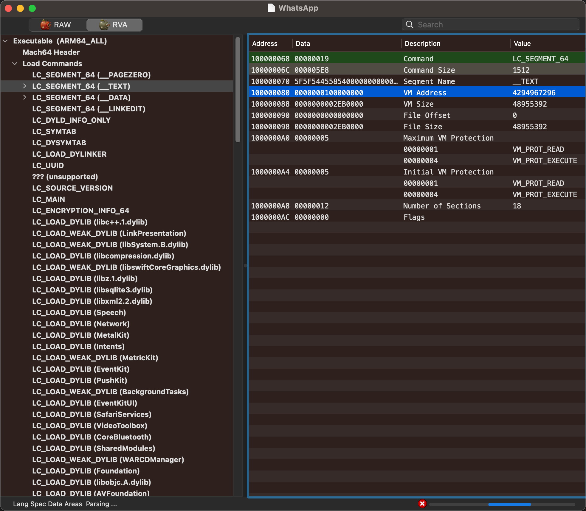
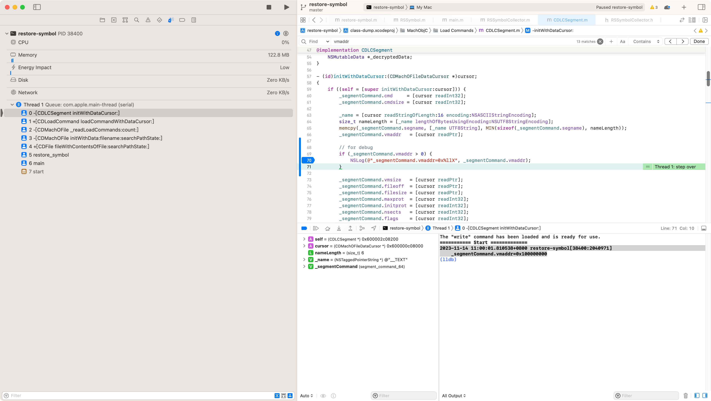
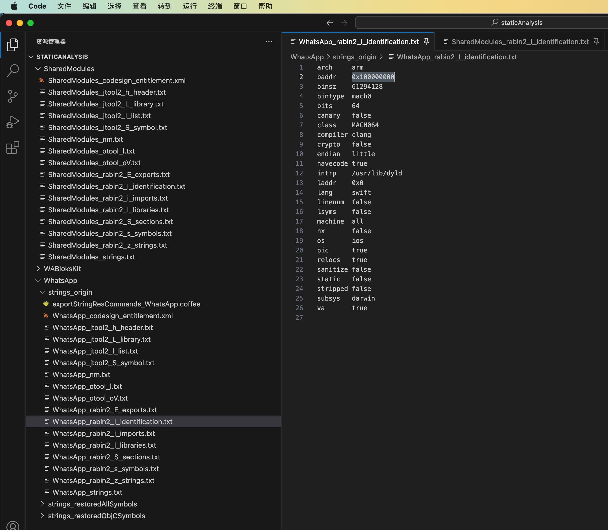
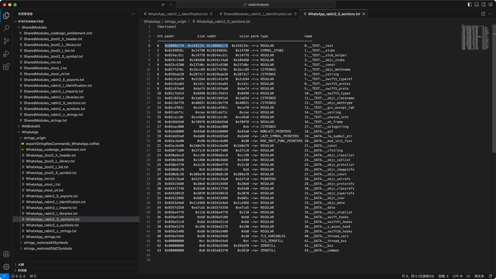
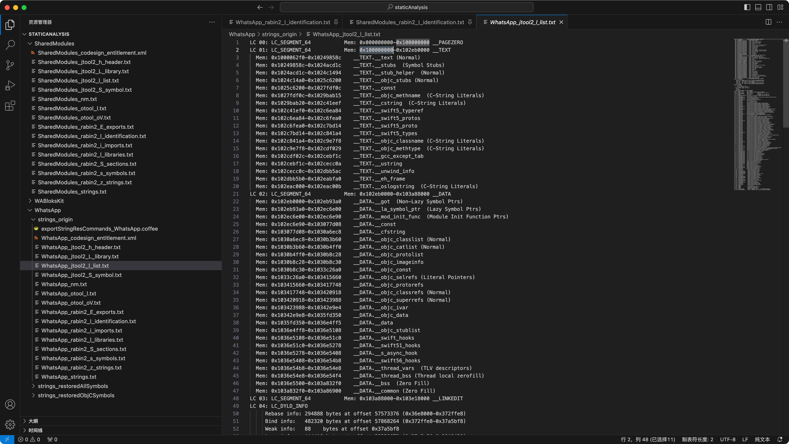
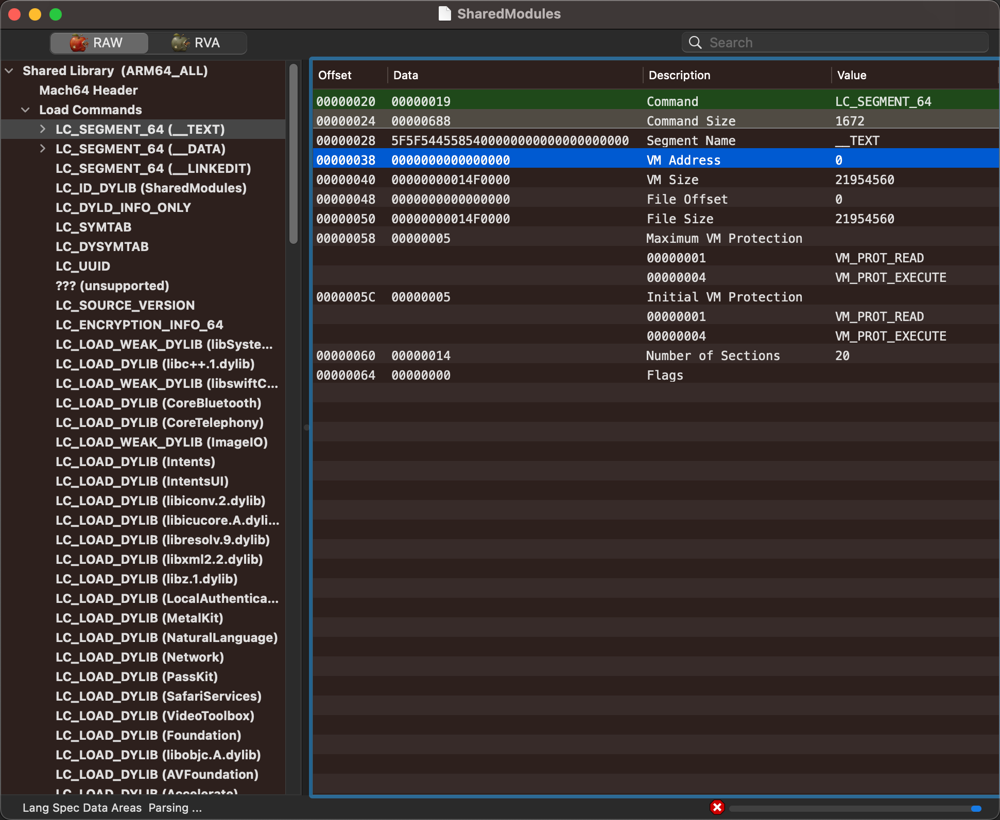

# Mach-O 虚拟地址基地址

* `Mach-O`的`vmaddr`=`image base`
  * 说明
    * `restore-symbol`调试时看到的：`vmaddr`=`虚拟地址`=`虚拟地址基地址`
    * `IDA`中的：`image base`=`镜像地址基地址`=`镜像基地址`
  * 多种查看方式
    * `MachOView`
    * `restore-symbol`调试时：`__TEXT`的`Segment`的`vmaddr`
    * `rabin2`
      ```bash
      rabin2 -I machoFile
      ```
        * `identification`信息中的：`baddr`
      ```bash
      rabin2 -S machoFile
      ```
        * `sections`信息中的：`__TEXT.__text`的`vaddr`减去`paddr`后的值
    * `jtool2`
      ```bash
      jtool2 -l macoFile
      ```
        * `list`中的：`__TEXT`中的`Mem`的起始地址
    * `otool`
      ```bash
      otool -l machoFile
      ```
        * 中的：`__TEXT`的`Segment`的`vmaddr`

## 举例

可以用相关工具，辅助验证基地址：

### WhatsApp

* WhatsApp的vmaddr=image base：0x100000000
  * MachOView
    * 
    * 
  * restore-symbol调试时：__TEXT的Segment的vmaddr
    * 
  * rabin2
    * rabin2 -I machoFile
      * identification信息中的：baddr
        * `baddr  0x100000000`
          * 
    * rabin2 -S machoFile
      * sections信息中的：__TEXT.__text的vaddr减去paddr后的值
        * `0  0x000062f0 0x249229c 0x1000062f0 0x249229c -r-x REGULAR        0.__TEXT.__text`
          * 
            * `0x1000062f0 - 0x000062f0` = `0x100000000`
  * jtool2
    * jtool2 -l macoFile
      * list中的：__TEXT中的Mem的起始地址
        * `LC 01: LC_SEGMENT_64       Mem: 0x100000000-0x102eb0000  __TEXT`
          * 
  * otool
    * otool -l machoFile
      * 中的：__TEXT的Segment的vmaddr
        *  segname __TEXT
        *  vmaddr 0x0000000100000000

### SharedModules

* SharedModules的vmaddr=image base：0x0
  * MachOView
    * 
  * rabin2
    * rabin2 -I machoFile
      * identification信息中的：baddr
        * `baddr  0x0`

